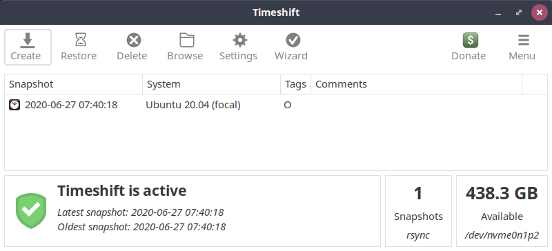
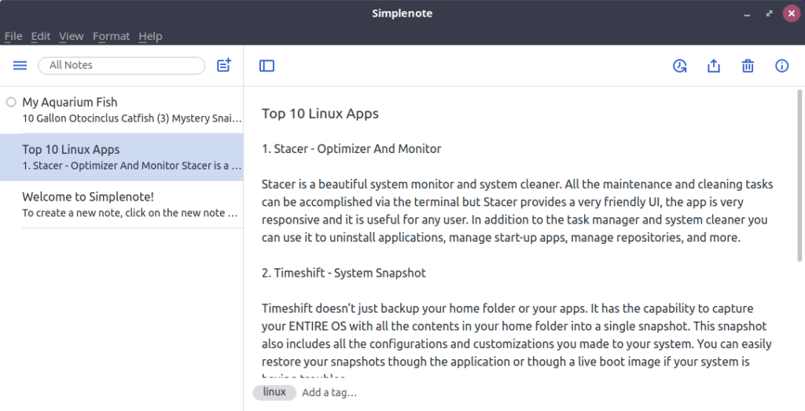

These are the top 10 Linux apps everyone should have on their computers. There is something here for everyone and items everyone should have. Watch the video below for an overview of everything in this article.

## 1\. Ulauncher – Application Launcher

Running Ulauncher will greatly increase your productivity. It allows you to search for applications, files, and the web with a simple hotkey. Once you have Ulauncher installed, you press CTRL + SPACE to launch the search bar. You can click the settings gear to change the [theme](https://gist.github.com/gornostal/02a232e6e560da7946c053555ced6cce?ref=techhut.tv) and other settings. They also have a wide variety of [extensions](https://ext.ulauncher.io/?ref=techhut.tv).


[Download Ulauncher](https://ulauncher.io/?ref=techhut.tv#Download) from their website.

## 2\. Stacer – Optimizer And Monitor

Stacer is a beautiful system monitor and cleaner. All maintenance and cleaning tasks can be accomplished via the terminal, but Stacer provides a very friendly UI. The app is very responsive, and it is useful for any user. In addition to the task manager and system cleaner, you can use it to uninstall applications, manage start-up apps, manage repositories, and more.


```
sudo apt install stacer
```

## 3\. Timeshift – System Snapshot

Timeshift doesn’t just back up your home folder or your apps. It has the capability to capture your ENTIRE OS with all the contents in your home folder into a single snapshot. This snapshot also includes all the configurations and customizations you made to your system. You can easily restore your snapshots through the application or through a live boot image if your system is having trouble.



```
sudo apt-add-repository -y ppa:teejee2008/ppa
sudo apt-get update
sudo apt-get install timeshift
```

Timeshift is the go-to way to back up your Linux system.

## 4\. Kdenlive – Best Non-linear editing

I’m actually quite new to Kdenlive. There has been a wide range of functionality and user experience improvements since the last time I tried this video editing software. A close second is…

> Kdenlive is an open source video editor. The project was started around 2003. Kdenlive is built on Qt and the KDE Frameworks libraries. Most of the video processing is done by the MLT Framework, which relies on many other open source projects like FFmpeg, frei0r, movit, ladspa, sox, etc… [https://kdenlive.org/en/features/](https://kdenlive.org/en/features/?ref=techhut.tv)

```
sudo add-apt-repository ppa:kdenlive/kdenlive-stable
sudo apt install kdenlive
```

## 5\. Simplenote – Clean Note Taking



The name of this application says it all. Simplenote is an easy and… simple note-taking tool that works across all platforms so you can take your notes anywhere. It has just enough features to stay organized without all the bloat some other applications have. The feature set includes tags and a strong search function. It was created by Automatic, the same folks behind WordPress.

```
sudo apt install snapd
sudo snap install simplenote
```

Simplenote is a great note-taking tool.

## 6\. VLC – Play anything!

Of all these top 10 Linux apps, VLC is my long-time favorite. It can play nearly any media file format. When it downloads, it also installs codecs for virtually every audio or video file, meaning you’re unlikely to ever have playback issues again. The software can also play DVDs, convert file formats, record your screen, download and stream videos, and much more.


```
sudo snap install VLC
```

VLC is a fully loaded multimedia suite for Linux.

## 7\. Gnome Tweak – Change Anything

GNOME Tweaks is a Swiss army knife for the modern Ubuntu desktop. It has toggles, sliders, and switches that control a host of behaviors and settings. Gnome Tweaks is featured in my 5 Things You MUST DO after Installing Pop!\_OS video because of the Window Titlebar controls.

https://youtu.be/LHj2ulIm7AQ

## 8\. Etcher – USB Image Writer

A simple way to create bootable USB drives. No more writing images on corrupted cards and wondering why your device isn’t booting. One of the best things about Linux is trying out all the different flavors it has to offer. This tool makes this super easy


Download from [https://www.balena.io/etcher/](https://www.balena.io/etcher/?ref=techhut.tv)

Etcher is a way to create bootable USB drives.

## 9\. GIMP – Professional Image Editing

GIMP is short for GNU IMAGEMANIPULATION PROGRAM. GIMP is a cross-platform image editor available for GNU/Linux, OS X, Windows and more operating systems. People who are use to Photoshop will appreciate the use of layers.

```
flatpak install https://flathub.org/repo/appstream/org.gimp.GIMP.flatpakref
```

## 10\. Notepadqq – Source Code Editor

Notepadqq is nearly a clone of the source code editor and Notepad replacement, Notepad++, on Windows. I use this application extensively for YML editing and opening up odd file types. Notepadqq is designed by developers, for developers. With over 100 supported languages, it is the ideal text editor for your daily tasks. The application has dark theme support!

https://youtu.be/hUZRQPlM9bU

## Bonus: Fastfetch – System Info (Updated from Neofetch, May 2024)

This is a fancy way to pull up some system information. Its most common purpose is to take screenshots of your desktop with this open to flex other people in Reddit. This is an alternative to the widely popular but recently discontinued [Neofetch](https://github.com/dylanaraps/neofetch).
