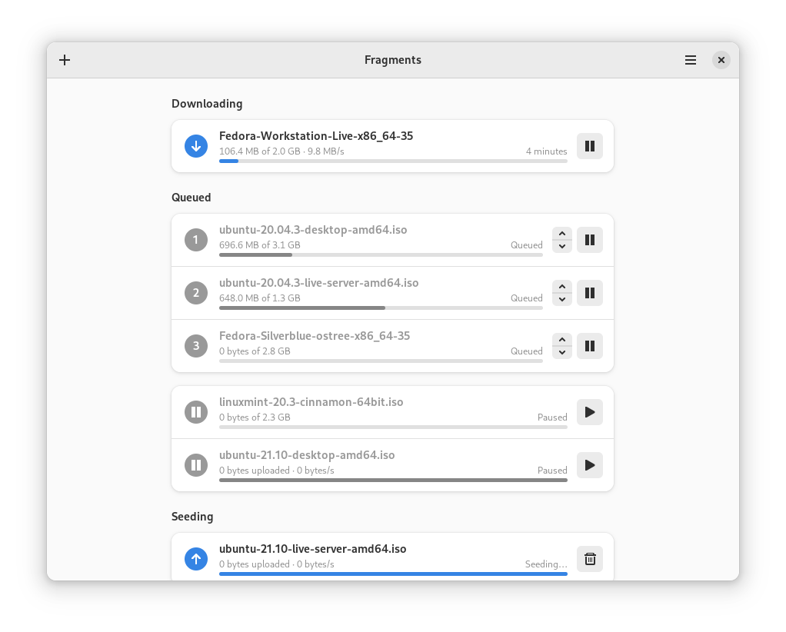
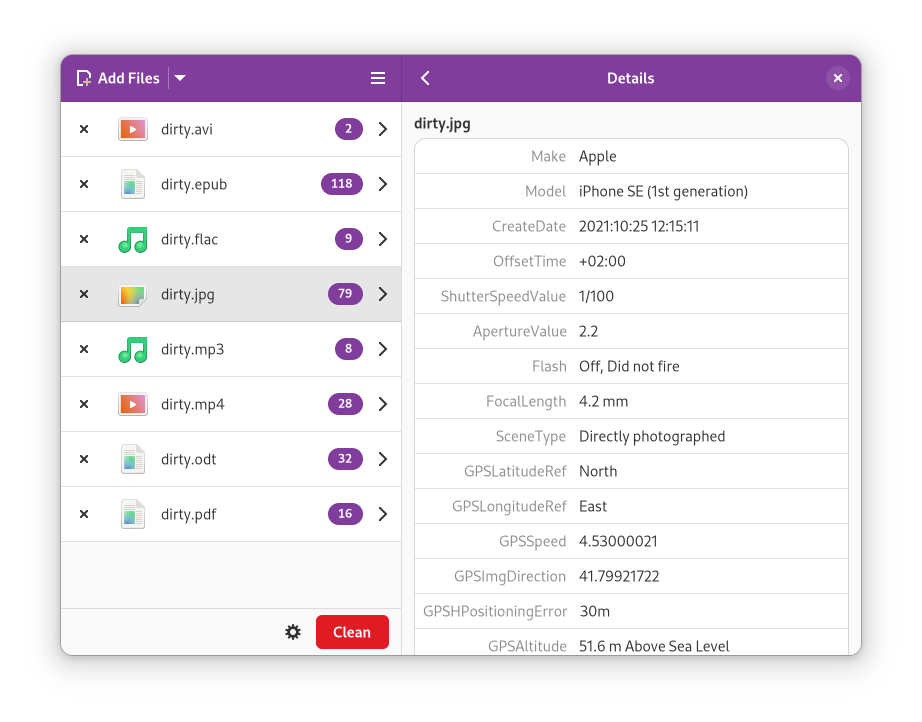

The GNOME Circle initiative aims to widen developer outreach and enhance the GNOME ecosystem overall. Developers whose applications are featured within the GNOME Circle have had to apply and meet a strong set of criteria. As a result, the majority of the applications featured are awesome. In this article, we will highlight 5 of my favorites.

> GNOME Circle champions the great software that is available for the GNOME platform. Not only do we showcase the best apps and libraries for GNOME, but we also support independent developers who are using GNOME technologies. [https://circle.gnome.org/](https://circle.gnome.org/?ref=techhut.tv)

https://youtu.be/aYlzSk7mB0Y

## 1\. Fragments – A BitTorrent Client

Fragments is an easy to use BitTorrent client for the GNOME desktop environment. It is usable for receiving files using the BitTorrent protocol, which enables you to transmit huge files, like videos or installation images for Linux distributions.

[https://apps.gnome.org/app/de.haeckerfelix.Fragments](https://apps.gnome.org/app/de.haeckerfelix.Fragments)

## 2\. Blanket – Listen to different sounds

Improve focus and increase your productivity by listening to different sounds. Or allows you to fall asleep in a noisy environment. Personally, I use this when I’m reading. It helps me stay focused on my work, mostly when my work environment is silent.

[https://apps.gnome.org/app/com.rafaelmardojai.Blanket](https://apps.gnome.org/app/com.rafaelmardojai.Blanket)

## 3\. Font Downloader

Have you ever wanted to change the font in your terminal, but didn’t want to go through the entire process of searching, downloading and installing a font? This simple-to-use and adaptive GTK application allows you to search and install fonts directly from Google Fonts’ website!

[https://apps.gnome.org/app/org.gustavoperedo.FontDownloader](https://apps.gnome.org/app/org.gustavoperedo.FontDownloader)

## 4\. Tangram – Browser for your pinned tabs

https://youtu.be/KmQRh-ekaYw

Tangram is a new kind of browser. It is designed to organize and run your Web applications. Each tab is persistent and independent. You can set multiple tabs with different accounts for the same application.

[https://apps.gnome.org/app/re.sonny.Tangram](https://apps.gnome.org/app/re.sonny.Tangram)

## 5\. Metadata Cleaner – View and clean metadata

Metadata within a file can tell a lot about you. Cameras record data about when and where a picture was taken and which camera was used. Office applications automatically add author and company information to documents and spreadsheets. This is sensitive information and you may not want to disclose it.

This tool allows you to view metadata in your files and to get rid of it, as much as possible.

[https://apps.gnome.org/app/fr.romainvigier.MetadataCleaner](https://apps.gnome.org/app/fr.romainvigier.MetadataCleaner)
