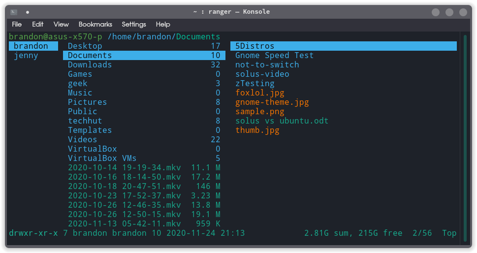
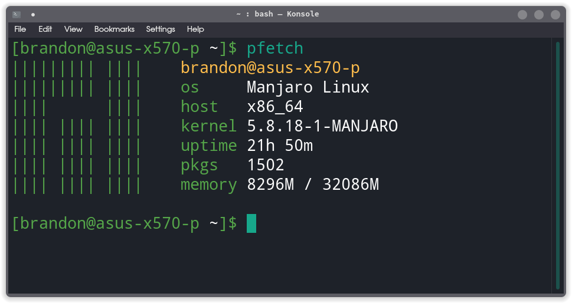
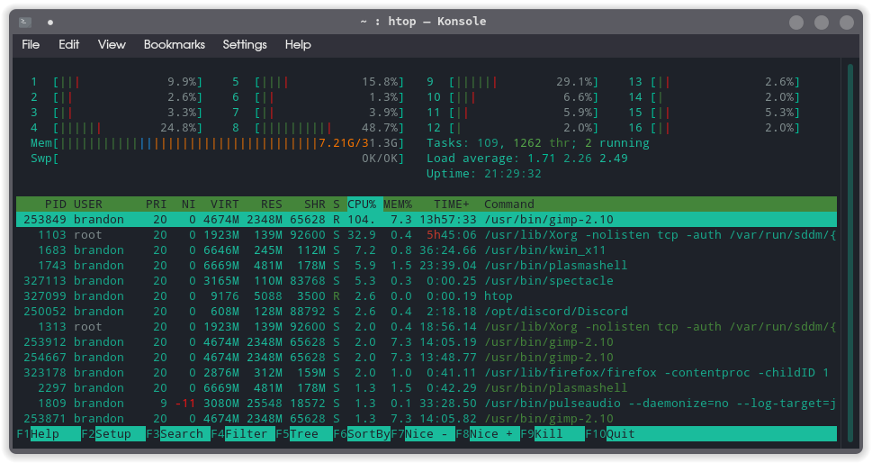
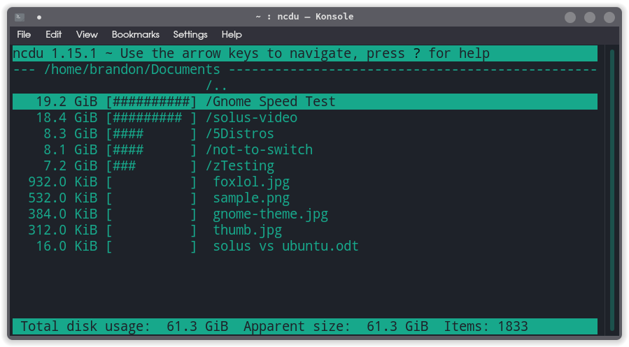

The terminal comes loaded with tons of great tools you can use to help you manage your system and workflow. In the article we will list 7 tools you can add to your terminal to improve your workflow.

## Trash-cli

Command line trash bin interface.


```
trash-put         trash files and directories.
trash-empty       empty the trashcan(s).
trash-list        list trashed files.
trash-restore     restore a trashed file.
trash-rm          remove individual files from the trashcan.
```

## Youtube-dl

Command-line program to download videos from [YouTube.com](http://youtube.com/?ref=techhut.tv) and other video sites.


EDIT: Now, I would recommend yt-dlp.

## Ranger

A VIM-inspired file manager for the console.



## Pfetch

Pfetch is a beautiful lightweight system information tool written in POSIX sh.



## Htop

Terminal system monitor tool.



## ncdu (NCurses Disk Usage)

Wonderful disk usage analyzing tool.



## Speedread

A simple terminal-based open-source per-word speed reading utility.


