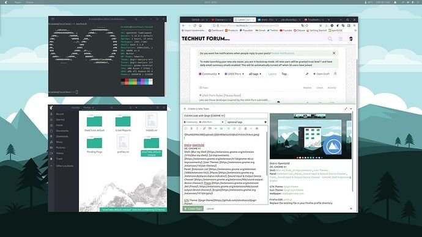
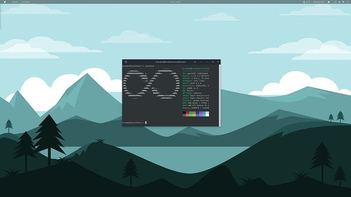
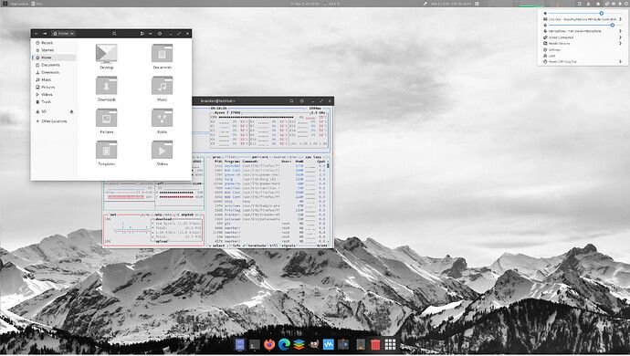

This is a list of my favorite GNOME themes, which combine the perfect combination of wallpaper, icons, and extensions. This article is a work in progress.

## CLEAN Look with Qogir

Distro: OpenSUSE
DE: GNOME 41
Shell: [Blur my Shell](https://extensions.gnome.org/extension/3193/blur-my-shell/?ref=techhut.tv), [UI Improvements](https://extensions.gnome.org/extension/4158/gnome-40-ui-improvements/?ref=techhut.tv), [User Themes](https://extensions.gnome.org/extension/19/user-themes/?ref=techhut.tv)
Panel: [Extension List](https://extensions.gnome.org/extension/3088/extension-list/?ref=techhut.tv), [Places](https://extensions.gnome.org/extension/8/places-status-indicator/?ref=techhut.tv), [Sound Input & Output Device Chooser](https://extensions.gnome.org/extension/906/sound-output-device-chooser/?ref=techhut.tv), [freon](https://extensions.gnome.org/extension/841/freon/?ref=techhut.tv), [krypto](https://extensions.gnome.org/extension/1913/krypto/?ref=techhut.tv)

GTK Theme: [Qogir-theme 361](https://github.com/vinceliuice/Qogir-theme?ref=techhut.tv)
Icon Theme: [Qogir-icon-theme](https://github.com/vinceliuice/Qogir-icon-theme?ref=techhut.tv)
Wallpaper: [wallpapercave.com](https://wallpapercave.com/w/wp7160109?ref=techhut.tv)

## Fluent GTK Experience

My current GNOME GTK theming icons and more! My favorite thing about the GNOME desktop environment in Linux is how awesome you can make it look. In this video we highlight the Fluent GTK theme, Flatery icons, and quickly overview my current extension set.

Distro: EndeavourOS
DE: GNOME 40
Shell: [Blur my Shell](https://extensions.gnome.org/extension/3193/blur-my-shell/?ref=techhut.tv), [UI Improvements](https://extensions.gnome.org/extension/4158/gnome-40-ui-improvements/?ref=techhut.tv), [User Themes](https://extensions.gnome.org/extension/19/user-themes/?ref=techhut.tv)
Panel: [Clipboard Indicator](https://extensions.gnome.org/extension/779/clipboard-indicator/?ref=techhut.tv), [Extension List](https://extensions.gnome.org/extension/3088/extension-list/?ref=techhut.tv), [OpenWeather](https://extensions.gnome.org/extension/750/openweather/?ref=techhut.tv), [Places](https://extensions.gnome.org/extension/8/places-status-indicator/?ref=techhut.tv), [Screenshot Tool](https://extensions.gnome.org/extension/1112/screenshot-tool/?ref=techhut.tv), [Sound Input & Output Device Chooser](https://extensions.gnome.org/extension/906/sound-output-device-chooser/?ref=techhut.tv), [system-monitor](https://extensions.gnome.org/extension/120/system-monitor/?ref=techhut.tv), [Removable Drive Menu](https://extensions.gnome.org/extension/7/removable-drive-menu/?ref=techhut.tv), [krypto](https://extensions.gnome.org/extension/1913/krypto/?ref=techhut.tv), [GSConnect](https://extensions.gnome.org/extension/1319/gsconnect/?ref=techhut.tv), [Applications Menu](https://extensions.gnome.org/extension/6/applications-menu/?ref=techhut.tv)
Dock: [gnome-shell-extension-dash-to-dock-gnome40-git](https://aur.archlinux.org/packages/gnome-shell-extension-dash-to-dock-gnome40-git/?ref=techhut.tv)
GTK Theme: [Fluent-gtk-theme](https://github.com/vinceliuice/Fluent-gtk-theme?ref=techhut.tv)
Icon Theme: [Flatery-icon-theme](https://github.com/cbrnix/Flatery?ref=techhut.tv)
Wallpaper: [adventure-alpine](https://www.pexels.com/photo/adventure-alpine-background-black-and-white-355770/?ref=techhut.tv)

Compact Firefox Guide

1. In the navigation bar, type `about:config`

3. Search for `broswer.compactmode.show`

5. Change this setting to **True**

7. Right-click on the toolbar and select ‘Customize Toolbar…’

9. You will find the setting at the bottom of the under under the ‘Density’ drop-down menu.

## Elegance with Vimix

Distro: EndeavourOS
DE: GNOME 40
Shell: [Blur my Shell](https://extensions.gnome.org/extension/3193/blur-my-shell/?ref=techhut.tv), [UI Improvements](https://extensions.gnome.org/extension/4158/gnome-40-ui-improvements/?ref=techhut.tv), [Google Search](https://extensions.gnome.org/extension/4132/google-search-provider/?ref=techhut.tv), [User Themes](https://extensions.gnome.org/extension/19/user-themes/?ref=techhut.tv)
Panel: [Clipboard Indicator](https://extensions.gnome.org/extension/779/clipboard-indicator/?ref=techhut.tv), [Extension List](https://extensions.gnome.org/extension/3088/extension-list/?ref=techhut.tv), [OpenWeather](https://extensions.gnome.org/extension/750/openweather/?ref=techhut.tv), Pamac Updates Indicator, [Places](https://extensions.gnome.org/extension/8/places-status-indicator/?ref=techhut.tv), [Screenshot Tool](https://extensions.gnome.org/extension/1112/screenshot-tool/?ref=techhut.tv), [Sound Input & Output Device Chooser](https://extensions.gnome.org/extension/906/sound-output-device-chooser/?ref=techhut.tv), [system-monitor](https://extensions.gnome.org/extension/120/system-monitor/?ref=techhut.tv)
Dock: [gnome-shell-extension-dash-to-dock-gnome40-git](https://aur.archlinux.org/packages/gnome-shell-extension-dash-to-dock-gnome40-git/?ref=techhut.tv)
GTK Theme: [Vimix-Gtk-Theme](https://vinceliuice.github.io/theme-vimix?ref=techhut.tv)
Icon Theme: [Vimix-icon-theme](https://www.opendesktop.org/p/1273372?ref=techhut.tv)
Wallpaper: [Endy\_vector\_satelliet](https://github.com/EndeavourOS-Community-Editions/Community-wallpapers/blob/main/eos_wallpapers_community/Endy_vector_satelliet.png?ref=techhut.tv)

Extra info: Dash to Dock on GNOME 40 may give you some minor graphical glitches and issues. If you’re interested in installing it check the commands below.

Before installing the fork [check to see if it has been updated.](https://extensions.gnome.org/extension/307/dash-to-dock/?ref=techhut.tv)

Fedora: `dnf gnome-shell-extension-dash-to-dock`
Arch Linux `yay gnome-shell-extension-dash-to-dock-gnome40-git`
