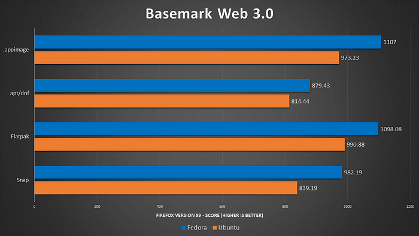
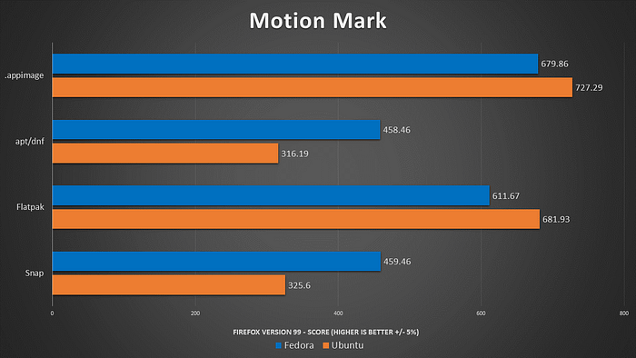
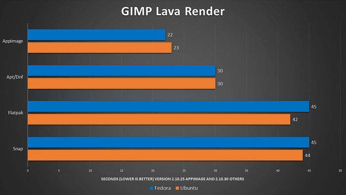

We will check out some of the more popular Linux packaging formats and run some benchmarks to see if there are any clear winners between them. But before we get into the actual benchmarking, we must first discuss these different packaging formats and some of their key differences.

We're going to focus on Flatpaks, Snaps, and AppImages. All of these have the benefit of being independent of your Linux distribution, meaning that you can run all of these packaging formats no matter what version or distribution of Linux we're running. This differs from something like APT, Pacman, DNF, or whatever it may be, because those are distribution-specific package management systems.

## Flatpak

So now, to cover some of the differences. First up, I'm going to talk about flatpaks. This is a decentralized system where you can pull applications from various sources. Flathub is the most popular currently; the actual Flatpak applications run in a sandboxed environment. So, it will be completely separate from your system's runtime. These sandbox applications include everything you will need to run the application, including all of the dependencies. Generally, this also makes Flatpaks secure because it won't interfere with your system unless you give it explicit permission to do so.

A negative aspect of Flatpaks (and other sandboxed packages) compared to your distribution's native package management system is that file sizes will generally be larger because of all those included dependencies.

## Snaps

Now, this is definitely the most controversial of the bunch. Snap packages are a packaging system developed by Canonical, the parent company of Ubuntu. One of the big issues that many people have with the Snap packages is that the Snap store itself is proprietary and controlled by Canonical. Recently, they’ve started replacing some of the packages on the Ubuntu system with snaps by default. Another “feature” of snaps is their auto-updating nature. Now, like flatpacks, snaps are also going to contain all of the dependencies needed to run the actual application. And generally, it will be isolated from the rest of your system.

## AppImages

These AppImages are the most interesting and unique as they are individual executable files containing everything you need to run an entire application. So there's just one file per AppImage. This makes appimages incredibly portable and makes it very easy to manage various versions of one application on your system. For those of you who are running Windows, a really good way to compare this is that these are very similar to portable .exe files that you may open and run on Windows.

Appimages are really easy to run. Within permissions, make sure it is executable, and then click on the file to open it, or you can launch it through the terminal. AppImageHub is a huge repository and a great resource for finding various app images and applications. Many developers who opt to provide this format for their applications usually have direct downloads on their websites.

Now, the main issue with the app image format is that these applications are not directly installed on your system. So, this will require more manual intervention to create desktop entries that will appear in your menus. And, of course, to update them, you'll just have to download the new version and replace it, depending on how your system is set up.



_This video is sponsored by SurfShark. If you go to_ [_SurfShark._](https://surfshark.deals/TECHHUT?ref=techhut.tv)_deals/TECHHUT, you can get 83% off your subscription and an extra three months for free!_

# Browser Benchmarks

So, I was browsing around on our r/Linux on Reddit, and I stumbled across this post showing a substantial difference in internet speeds between the actual snap packages and a direct Firefox download. That got me thinking: What else can we do to see the performance differences of the same application but in different packaging formats?

So, first, let’s take a closer look at Firefox. Now, I wasn’t able to do the same internet speed test that I saw on Reddit, mostly because my internet speed varies widely. However, I could run a suite of browser benchmarks, and the very first one we ran was BaseMark Web 3.0.

## Basemark Web 3.0

This benchmark includes various system and graphics tests that use web-recommended features and gives us a comprehensive performance benchmark as a score so we can see the differences. Now, for all of these tests, I did it on both Ubuntu and Fedora using the APT and DNF installations in addition to these various packaging formats.

We can see some substantial differences between the packaging formats and between Fedora and Ubuntu. So, it’s kind of a distribution comparison, if you’re interested in that. This was done on Firefox version 99 across all platforms and distributions. We can see AppImages and Flatpaks are neck and neck, with AppImages performing slightly better on Fedora and Flatpaks performing slightly better on Ubuntu.

## MotionMark

From there, we went ahead and ran a MotionMark, which specifically focuses on graphic rendering. Again, these are scores, so the higher, the better. Overall, we saw very similar results.

In this case, Ubuntu actually had an edge in these scores, with AppImages generally performing better than flatpaks. The native package installation through APT or DNF was slightly behind the snap package performance.

## Speedometer

Next, we went ahead and ran Speedometer, which is just a very general test for browser responsiveness. This one was a lot tighter again. We’re seeing a lot of similar results across these browser benchmarks, which, generally, I think is really good. The fact that these are consistent between various tests basically tells me that these results are fairly accurate.

Again, AppImages and Flatpaks are neck to neck. And with this variation of 2%, it’s basically a tie between AppImages and Flatpaks. And with general browser responsiveness, the DNF installation on Fedora did perform substantially better than the snap package. And then with Ubuntu, the snap had a very slight advantage in comparison to the APT installation.

# Rendering Benchmarks

Now, going forward from Firefox, there aren’t too many benchmarking tools that we could use to actually measure this. So, I had to come up with some of my own benchmarking techniques for some of these.

## Kdenlive Render

First, I ran a simple Kdenlive render. Then, I added about an eight-minute video and one effect to the entire thing. So, some extra work was needed with the rendering.

Now, this will be flipped from what we saw with Firefox. This is in time (seconds), so the lower the score, the better. APT and DNF did substantially better than all of the cross-platform package systems. And this was by a wide margin. If you’re going to be rendering things in Kdenlive, by the looks of this anyway, you should probably install it with your system package management software. Appimage was behind by about a 30m second difference, but then Flatpaks and Snaps, lagged behind everything by 20–50 seconds.

## GIMP Lava Render

For the next step, we ran one of my favorite little benchmarks, which is the GIMP at Lava render. I opened up GIMP, created a 5000 by 5000 canvas, and rendered out the lava texture, which is a slightly intensive process. Now I will note the AppImage version of gimp isn’t kept as up to date as all the other versions as it’s behind about six months.

Even with this, AppImage performed the best and beat out the native installation by just about eight seconds. Both Flatpaks and Snap packages fell behind the native installation by a considerable margin. So just considering this graph, I’m going to be switching my GIMP installation to simply using an AppImage.

## Blender Image Render

Now, there is actually a [Blender benchmarking utility](https://www.blender.org/news/introducing-blender-benchmark/?ref=techhut.tv). Unfortunately, there’s not a Flatpak or any other sandboxed package. So, I had to download some project files directly from Blender and then render those out as a single image. My computer’s not very good, so rendering out the entire animation would have taken hours.

As we can see here, rendering out a single image took over 400 seconds no matter what I ran. For some reason, the native installation on Ubuntu and Fedora did not work with the files I downloaded. So, we only ran this benchmark with Flatpak and the Snap package. This is one of the few cases in which the Snap package performed slightly better than Flatpak.

This is arguable, but part of the reason for this might be that our Snap package is one of the download options directly from Blender, so it’s one of their main supported formats.

# Thoughts

Running something where you’re rendering out files doing creative work, it’s probably better to use the native application from your distribution package manager. But for everything else, Flatpak, AppImage, might be better. Snaps, in general, suck.

But this is just speaking in general; every application can have major differences. If you are looking for specific benchmarks, these were incredibly easy to run; you could run them yourself. Just get your latest project for whatever application you want to know runs a better time for the render process or whatever it may be, and figure out what works best for you.
