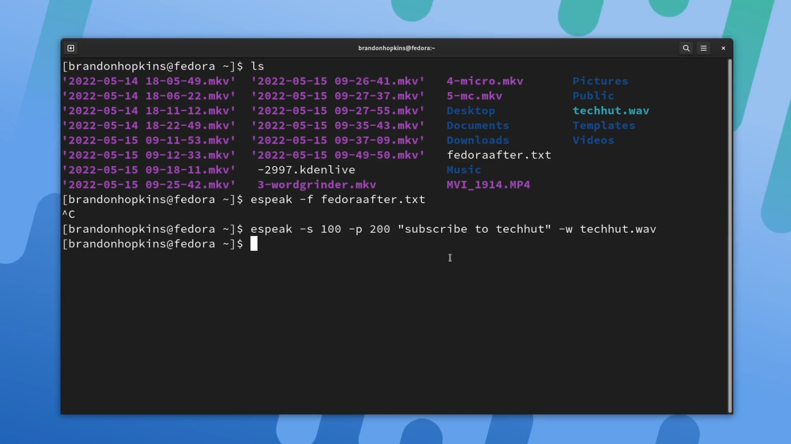

One of my favorite things to do when playing around with my Linux system is try out CLI applications. They’re just so functional and simple and provide tools to improve your computing experience. Recently I took to Twitter to ask you all what some of your favorites are. I compiled the list from all the submissions. I’ll post the Tweet below so you can browse all the replies if you’d like to.

https://twitter.com/TechHutTV/status/1515344404608806914

I won't be diving into the installation steps for this article for these applications. Please refer to the GitHub repositories and official documentation for these applications

## toipe — a terminal based typing test written in Rust

This is the perfect little tool for those who enjoy typing speed tests. This is a trusty terminal typing tester written in the Rust programing language. You can run this application directly from the binary downloaded from GitHub or install it via cargo.

[ttps://github.com/Samyak2/toipe](https://github.com/Samyak2/toipe?ref=techhut.tv)

## bottom— graphical process/system monitor for the terminal

If one thing is certain, we have a ton of options for monitoring our systems through the terminal. You’re probably familiar with tools like top, htop, and btop, but this is bottom! Like all monitors, you can see your CPU, RAM, network usage, and more. In addition, there are many customization options, including pre-built color themes, changing the default behavior and layout of widgets, and filtering out entries in disk and temperature widgets.

[https://github.com/clementtsang/bottom](https://github.com/clementtsang/bottom)

## wordgrinder — simple, Unicode-aware word processor

wordgrinder is a simple character cell word processor that runs on the console. It is primarily designed for text entry. It’s designed to get the hell out of your way and let you write; it does very little, but what it does it does well.

It supports Unicode, basic paragraph styles, basic character styles, basic screen markup, a menu interface that means you don’t have to remember complex key sequences, HTML import and export, and some other useful features.

[https://github.com/davidgiven/wordgrinder](https://github.com/davidgiven/wordgrinder)

## micro — simple terminal text editor

If you use Nano often, you would probably most likely enjoy using the micro text editor. This is a highly customizable text editor that allows you to set color themes, it has syntax highlighting, and even a virtual terminal built right into the text editor, similar to IDEs that let you run a terminal at the bottom for testing. It also has common keybinds similar to editors like Gedit and Notepad++, so you won’t have to look up how to exit the text editor if you open it like you might with Vim. Once in it can hit CTRL-T to open a new tab, and then you can ALT+ and ALT+. To switch between tabs, hit CTRL+E to run a command, and you can run “split” or “split” to split your terminal into two files and CTRL+W to switch between them. Let’s hit CTRL-E again and run “term,” which gives us a terminal within the text editor, and then if we exit micro, we can install plugins just by running “micro install plugin-name”. Another cool feature is that you can use your mouse to do basically anything through Micro, including switching tabs and selecting text. So, if you need a decent text editor for an old craptop, this is a very good option.

[https://micro-editor.github.io](https://micro-editor.github.io)

## Midnight Command (mc) – terminal file manager

Next up, we have Midnight Commander, or MC for short. This is a full file manager for you terminal that lets you navigate around files and as well as view files, edit files, easily copy and move them, and even create zip files and run commands without leaving midnight commander. Type MC to open it, and it should open up two panes full of files that you can switch between with a tab. If you need to run a terminal command in a file pane, start typing and run your choice command. You can also use the function keys, including F3 to view a file, F4 to edit a file, F5 to copy a file, and more listed at the bottom. F2 opens a menu that allows you to do things like zip up a file. The mouse also works for people who aren’t too comfortable on a terminal, although things like drag and drop won’t work properly.

[midnight-commander.org/](https://midnight-commander.org/?ref=techhut.tv)

## espeak – text to speech generator

espeak is a command line tool for text-to-speech. It will pronounce those words if we type speak and then some words in quotes. We can also use command line arguments to change things about the speech. -f,, for example,, will make it read an entire file;- p changes the pitch of the voice; -s changes the speed of the voice;- v allows you to set the voice depending on different languages, and -w allows you to save it as a wave file easily. So running “espeak -s 100 -p 200 “subscribe to TechHut” -w techhut.wav” allows us to make a funny voice "saying subscribe to TechHut" and exports it as a .wav file.

[https://github.com/espeak-ng/espeak-ng](https://github.com/espeak-ng/espeak-ng)

## asciiquarium — aquarium/sea animation in ASCII art

Asciiquarium is an aquarium/sea animation in ASCII art. This doesn’t give us much use or functionality, but it’s definitionally cool. I have a small monitor hooked up to my home lab and it switch back and forth between this and bottom to be continuously displayed.

[https://github.com/cmatsuoka/asciiquarium](https://github.com/cmatsuoka/asciiquarium?ref=techhut.tv)
