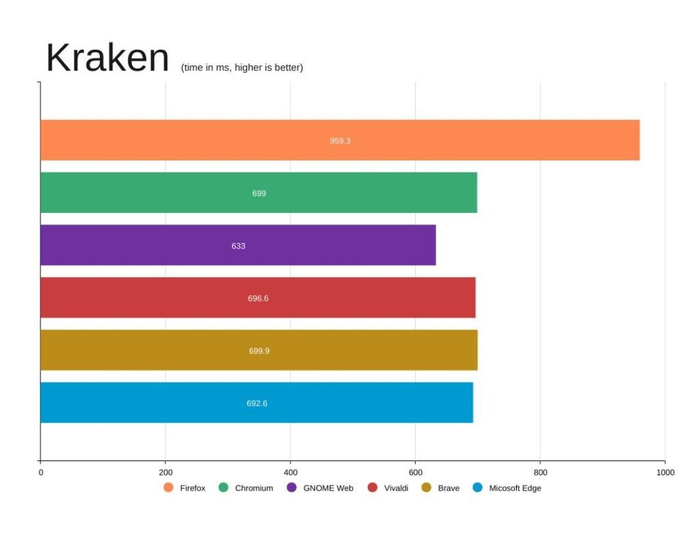
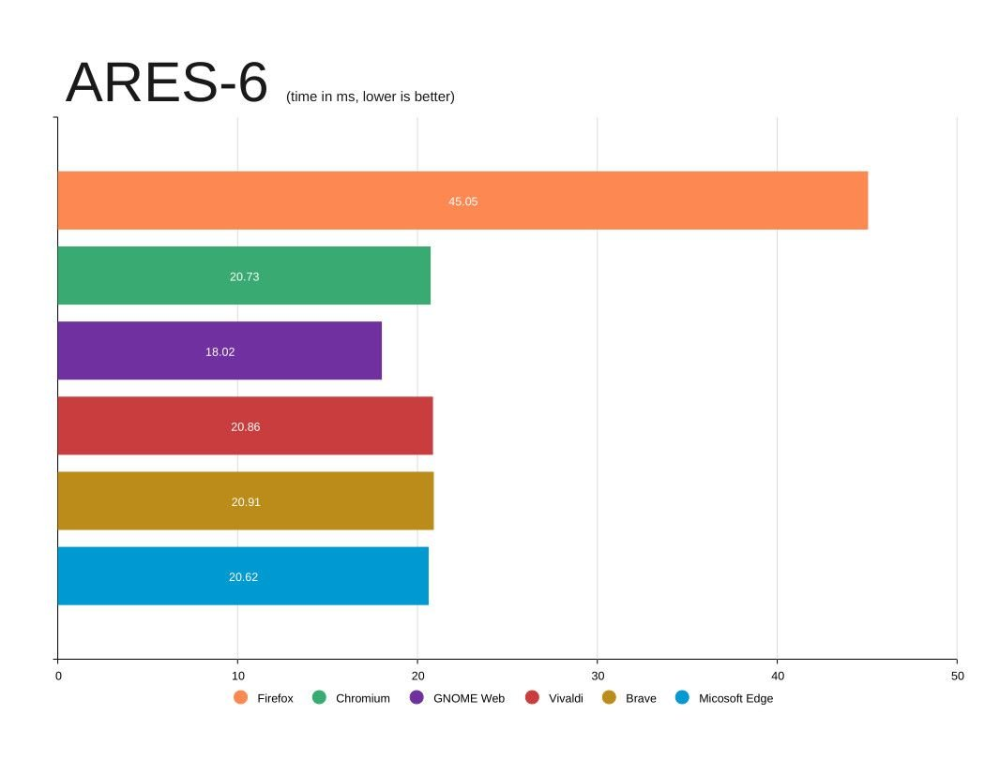

The time is here! A stable version of Microsoft’s Edge web browser is now available for Linux. There have been beta and developer versions for some time, but the stable release was recently spotted in the [yum repository](https://packages.microsoft.com/yumrepos/edge/?ref=techhut.tv) hosted by Microsoft. If you want to try it out, you can download the rpm package in Fedora or use the command line to upgrade to Ubuntu.

The stable version is not yet an option on the official page, but there are other ways to get the package.




**Fedora Downloads:** [http://packages.microsoft.com/yumrepos/edge/](http://packages.microsoft.com/yumrepos/edge/?ref=techhut.tv)
**Ubuntu Downloads:**
```
curl https://packages.microsoft.com/keys/microsoft.asc | gpg --dearmor > microsoft.gpg
sudo install -o root -g root -m 644 microsoft.gpg /etc/apt/trusted.gpg.d/
sudo sh -c 'echo "deb [arch=amd64] https://packages.microsoft.com/repos/edge stable main" > /etc/apt/sources.list.d/microsoft-edge-dev.list'
sudo rm microsoft.gpg
sudo apt update && sudo apt install microsoft-edge-stable
```
# Benchmarking

**Fedora 35 .rpm packages**
Firefox 93.0
Chromium 94.0.4606.81
Microsoft Edge 95.0.1020.40
GNOME Web 41.0
Brave 1.31.88
Vivaldi 4.3

_To see the graphs better. Right Click > Open in New Tab…_

**Javascript Testing**
**[Kraken JavaScript Benchmark](https://mozilla.github.io/krakenbenchmark.mozilla.org/index.html?ref=techhut.tv) (time, lower is better)**
Firefox: 959.3ms ±1.2%
Chromium: 699.0ms ±0.6%
GNOME Web: 633.0ms ±0.7%
Vivaldi: 696.6ms ±0.5%
Brave: 699.9ms ±0.8%
Edge: 692.6ms ±0.6%



**[JetStream 2](https://browserbench.org/JetStream/?ref=techhut.tv) (score, higher is better)**
Firefox: 86.848
Chromium: 145.737
GNOME Web: 152.809
Vivaldi: 146.212
Brave: 147.310
Edge: 149.908


**[ARES-6](https://browserbench.org/ARES-6/?ref=techhut.tv) (time, lower is better)**
Firefox: 45.05ms ±1.45
Chromium: 20.73 ±0.92ms
GNOME Web: 18.02 ±1.42ms
Vivaldi: 20.86 ±1.18ms
Brave: 20.91 ±1.03ms
Edge: 20.62 ±0.82ms



**Graphics Testing**
**[MotionMark](https://browserbench.org/MotionMark/?ref=techhut.tv) (score, higher is better)**
Firefox: 605.66 ±3.77%
Chromium: 609.23 ±11.19%
GNOME Web: 365.45 ±4.88%
Vivaldi: 727.09 ±7.52%
Brave: 628.79 ±17.35%
Edge: 780.51 ±12.10%


_Graphics Winner: Microsoft Edge_

**Responsiveness Testing**
**[Speedometer](https://browserbench.org/Speedometer2.0/?ref=techhut.tv) (runs/min, higher is better)**
Firefox: 132 ±2.3
Chromium: 132 ±3.3
GNOME Web: 127 ±2.0
Vivaldi: 136 ±1.6
Brave: 137 ±3.8
Edge: 139 ±2.5


_Responsiveness Winner: Microsoft Edge_

**Generalized Testing**
**[WebXPRT 3](https://www.principledtechnologies.com/benchmarkxprt/webxprt/2018/3_v5/?ref=techhut.tv) (score, higher is better)**
Firefox: 213
Chromium: 179
GNOME Web: 222
Vivaldi: 228
Brave: 214
Edge: 230


_Generalized Winner: Microsoft Edge_

**Overall Winner: Microsoft Edge**
