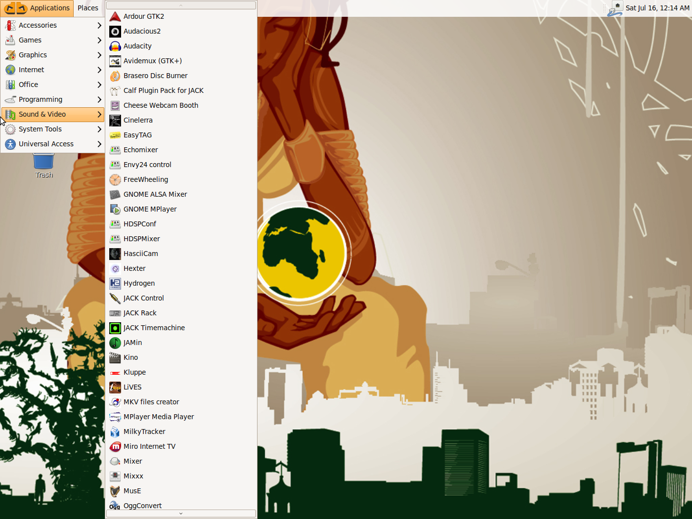
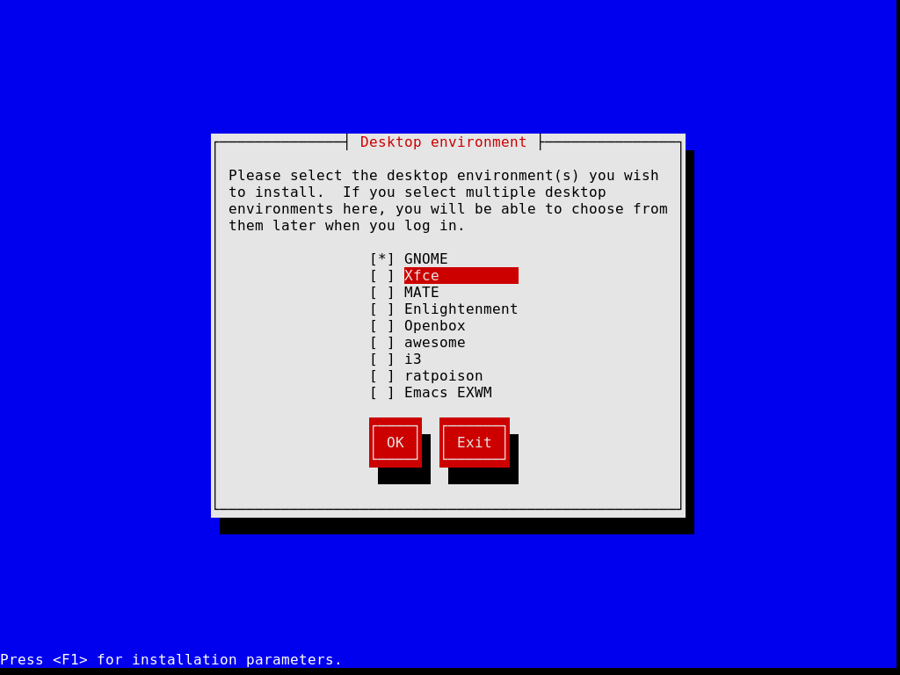
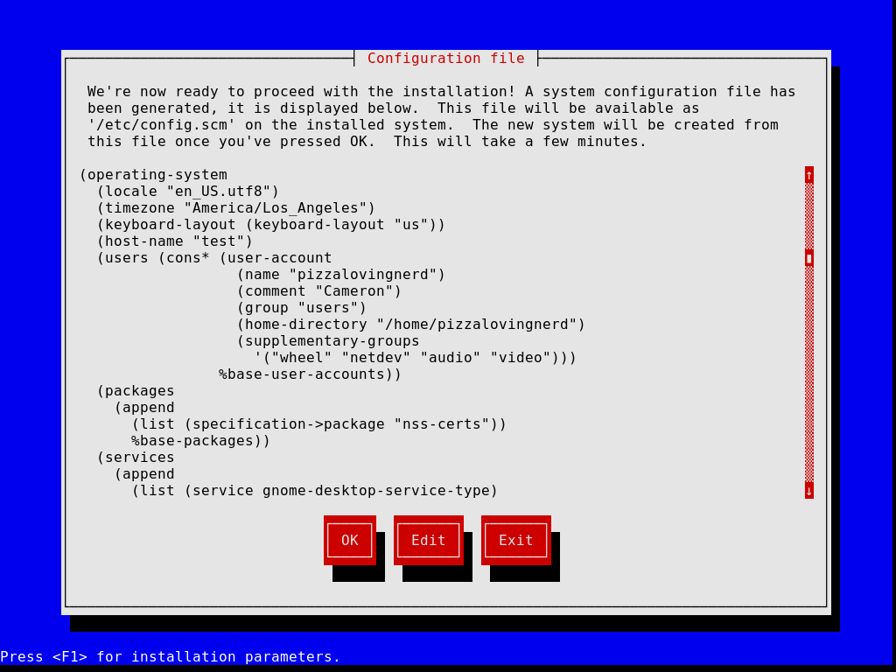
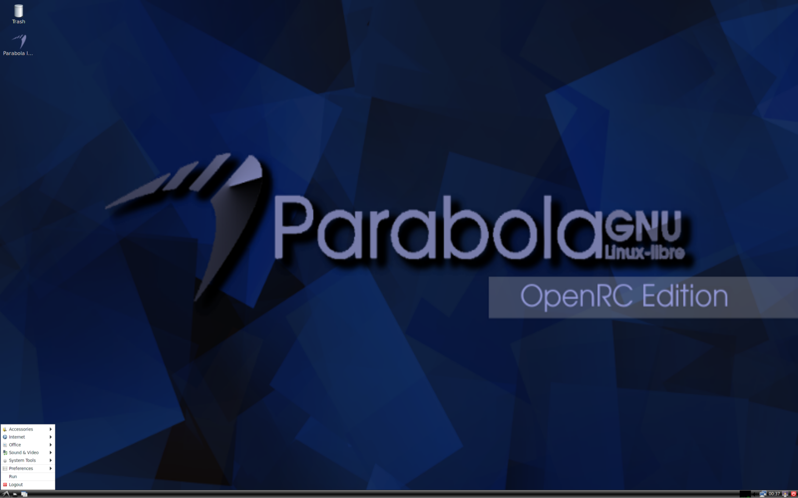
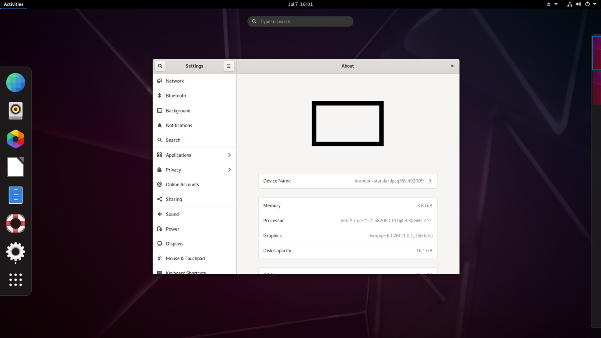
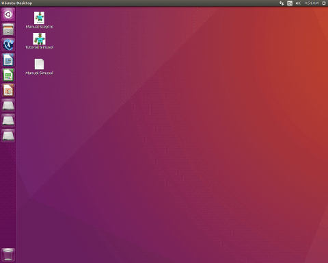

Linux is open-source software; however, most Linux distributions usually include some non-free software. Whether it’s proprietary blobs or drivers for running certain types of hardware, or it’s a distribution that ships Google Chrome by default for some reason… While the core of a distribution is usually FOSS software, there are still proprietary elements on most Linux distributions. So, let’s see what running a fully open-source system is like and look at the distributions that the Free Software Foundation recommends.

The Free Software Foundation is a non-profit that fights to promote digital rights and free software. Free as in freedom, not as in free beer. They are the main sponsor of the GNU project, which makes most of the core utilities that most Linux distributions use. Many basic commands you might use like chmod, mkdir, and even bare basic commands like ls, ln, pwd, and cp are all GNU core utilities. They also publish all the GNU licenses, including the GPL, LGPL, AGPL, and the FDL, and they campaign to promote Free Software against things that “violate” user freedom like DRM, Software Patents, and “Treacherous Computing”. 

Unsurprisingly, they don’t endorse many Linux distributions, some for annoying reasons. Some distributions make sense not to be endorsed, like any distributions that ship non-free applications out of the box, like distributions that ship Google Chrome. Even distributions like Ubuntu make sense not to get an FSF endorsement because they have a shady history with things like the [Amazon “spyware” controversy](https://arstechnica.com/information-technology/2012/12/richard-stallman-calls-ubuntu-spyware-because-it-tracks-searches/?ref=techhut.tv) and the more recent [Snap Store controversy](https://linuxmint-user-guide.readthedocs.io/en/latest/snap.html?ref=techhut.tv). However, the FSF ignores these things and instead avoids recommending Ubuntu because of the patients. Any distribution with non-free apps in its main repository is not endorsed, taking out Linux Mint and even Arch. Distributions that have only free software in their main repository but have a separate repository for non-free software aren’t allowed. This removes Debian and OpenSUSE from the list. Fedora isn’t included despite their non-free repos being fully separate and community-driven because its repos allow non-free hardware firmware. Even using the stock Linux kernel isn’t because it contains binary blobs, so that takes out Tails.

To be Free Software Foundation endorsed, it must be a complete package (unless it’s an embedded distribution), it must be entirely free software down to the kernel and firmware level, it can’t steer users into installing non-free software, it must commit into correcting mistakes, it can’t have any name confusion (calling yourself “Linux” instead of “GNU/Linux”), among other things. Because of the strict requirements, it is extremely hard to get onto the list of FSF-certified distributions. So, let’s look at the distributions that are on the list.

## Dragora GNU/Linux-libre

[Screenshot from Distrowatch](https://distrowatch.com/table.php?distribution=dragora&ref=techhut.tv)

We are starting with [Dragora GNU/Linux-Libre](https://www.dragora.org/en/index.html?ref=techhut.tv). This distribution is “a complete and reliable distribution of the GNU/Linux operating system that is entirely free software.” Well, in my experience, it’s not reliable because I couldn’t get the live ISO to boot in either VirtualBox or GNOME Boxes. If you can get it installed, it uses Runit as the init system, [qi as its package manager (custom for this distro)](https://www.dragora.org/manual/en/html_node/pkgmanagement.html?ref=techhut.tv#5_3), and it uses the Linux-Libre kernel instead of the regular Linux kernel.

## Dyne:bolic

Next up is Dyne:bolic. This is made by the people who now make [Devuan](https://www.devuan.org/?ref=techhut.tv), which is Debian without SystemD. This is a distribution designed specifically for audio and video production, and it’s made to be run on a Live CD and to not update. Because of this, the FSF recommends not running it on the internet. The latest release is from 2011, and the ISO hosting says “1 decade ago” for the upload date. It’s also 32-bit only. Booting into it is a blast from the past. It’s based on Ubuntu 9.10, meaning it has the ancient Ubuntu theme built on top of GNOME 2. This distro also has plenty of default applications installed, in fact this one ISO has almost everything you would ever need for anything multimedia related. The main issue with this distro is that all these applications preinstalled are almost 12 years old and have limited (unrecommended) internet access, which seems like too much of a downside. If you don’t care about non-free software, you are much better off using [Ubuntu Studio](https://ubuntustudio.org/?ref=techhut.tv) or [Fedora Labs Jam](https://labs.fedoraproject.org/en/jam/?ref=techhut.tv).

## Guix

[Guix](https://guix.gnu.org/?ref=techhut.tv) is a GNU/Linux-Libre distribution developed by the GNU Project with its own custom package manager and init system. This distro has a declarative operating system configuration, making it like distributions like Fedora Silverblue and NixOS. Guix’s main appeal is that you can build an entire system from a config file. This distribution also comes with a TUI installer, like some Arch installation scripts, and allows you to choose what desktop you want (except Plasma, for some reason). The stable version has somewhat old packages. It ships with GNOME 3.34, an even older version of GNOME than Debian 11 and RHEL 9. It’s the “latest” version, which is slightly newer but still not bleeding edge. It ships GNOME 40 instead of 3.34 which is only 1 GNOME version ahead of Debian 10 and still two versions behind the current version of GNOME at the time of writing this. Guix’s main feature is its package manager, which allows things like rollbacks, installing packages without root, and many other features. This is an incredibly unique distribution, and this brief overview doesn’t do it full service, so check this one out if you are even remotely interested. 

## Hyperbola and Parabola

[Screenshot from DistroWatch](https://distrowatch.com/table.php?distribution=parabola&ref=techhut.tv)

The next two distributions are very similar, so I’ll group them into one. Hyperbola and Parabola. [Parabola](https://www.parabola.nu/?ref=techhut.tv) is essentially Arch Linux but without non-free software. It also uses Linux-Libre instead of the stock Linux kernel and [installs very similarly to Arch](https://wiki.parabola.nu/Installation_Guide?ref=techhut.tv). It supports OpenRC alongside SystemD and still has 32-bit support despite Arch dropping it officially. But there’s not much to say about Parabola other than that, it’s just Arch, but with more Freedom. [Hyperbola](https://www.hyperbola.info/?ref=techhut.tv) is another Arch-based product, but it holds back packages for stability. This makes Hyperbola essentially an LTS version of Parabola. It uses the LTS version of Linux Libre and still has GNOME 3.38-based GNOME apps. It also doesn’t package SystemD at all due to not following “their social contract,” and it removes Java and D-Bus. Unless you really care about free software, I’d recommend Arch over Parabola just because of more community support and more packages available, and Hyperbola takes it too far, putting their philosophy over functionality. 

# PureOS

Next, we have [PureOS](https://pureos.net/?ref=techhut.tv). This is the first distro on this list that feels fully complete. It’s based on Debian Testing and features a very vanilla GNOME experience, although it has slightly older packages because it uses GNOME 3.38. Notably, this distro is funded by Purism and supports the Librem 5 Linux Smartphone, so a few mobile-specific features are included in this distro. PureOS doesn’t use Linux-Libre but removes binary blobs from the stock kernel. It also has some weird defaults, like GNOME Web being the default browser, but it is a very polished distribution and doesn’t feel like a hacked-together Debian respin. PureOS is the first FSF distro we can recommend for a day-to-day experience, but it’s more of an intermediate-beginner distro regarding the experience you need.

# Trisquel

Next up is [Trisquel](https://trisquel.info/?ref=techhut.tv). This is an Ubuntu-based distro, making it slightly easier for beginners to pick up. The latest 10.0 release from February is based on Ubuntu 20.04, so it’s about 2 years behind the current Ubuntu version, but that flaw aside, it’s a solid distro. By default, it uses MATE and, impressively, only runs 750 megabytes of RAM out of the box. This distro also has editions running Plasma, LXDE, and Sugar. It has a modified version of Firefox called Abrowser, which has an add-on store with only free software, adds fingerprint resistance, disables location sharing, and removes Pocket. Overall, this is decent, but like most other distros on this list, this is solid but also not unique enough to use if you don’t care about non-free software.

# Utoto

Utoto 2017 ([Screenshot from DistroWatch)](https://distrowatch.com/table.php?distribution=ututo&ref=techhut.tv)

Now for the last desktop distro, [Utoto](http://www.ututo.org/?ref=techhut.tv). This was the first distro to be FSF certified, and it was based on Gentoo until 2017, when they switched to an Ubuntu base. I don’t know much about this distro because the entire website is in Spanish, and the translated versions have many dead links; I also couldn’t get this installed in GNOME Boxes or VirtualBox. [The latest video I could find on this distribution was from 2013](https://www.youtube.com/watch?v=bIFt44JB7Q8&ref=techhut.tv), and back then, this distribution was an old macOS clone. However, for the 2017 version, the screenshot from Distrowatch is just Ubuntu with some desktop icons for manuals and Icecat instead of Firefox. Distrowatch also marks this as discontinued, so I’m not sure why this is still endorsed by the FSF.

# Other OSes

Finally, let’s quickly review some specialized distributions we cannot test. LibreCMC is a fully free embedded operating system designed for routers and single-board computers. It also uses Linux-Libre and the Opkg package manager. ProteanOS is another embedded distribution using the prokit package manager, allowing packages to be built at run time for different hardware use cases.

Finally, the last operating system is a non-GNU Linux distribution called Replicant. This fully free version of Android replaces all non-free libraries and apps with free software. However, it is only fully maintained and supported on ancient phones such as Samsung Galaxy S2s or S3s and the Galaxy Nexus, so if you just want something Degoogled, I’d recommend Lineage or CalyxOS over this, or even something like iodeOS or /e/OS. However, if you really want a fully free phone, this does exist. 

Overall, FSF-certified distros vary in quality. Several of them are straight-up unmaintained, a couple of them wouldn’t even boot for me (at least in VMs), and many of them are just a base distro with non-free software removed. The only two distros I would use over another distro on which it might be based are GNU/Guix and PureOS. Every other distro is just a base distro with non-free software removed, and at that point, you are only running them to flex on people still using proprietary software. Most people are going to want to stick with another distro.
