One of the biggest difficulties of switching over to Linux is getting used to a completely different ecosystem for applications and trying to switch away from many proprietary applications that are Windows only. Ideally, we should try to convince new users to learn how to use open-source software instead of proprietary software, but there are some cases where that is not an option.

https://youtu.be/gpsmHI7oPas

# Main Solutions

The Wine compatibility layer is the solution to getting these Windows applications onto our Linux system, which essentially converts all the Windows libraries and system calls over to open-source alternatives. Steam’s Proton is built on this, [allowing many Windows games to have full Steam Deck compatibility](https://www.protondb.com/?ref=techhut.tv). The main problem with Wine is that it can be a huge pain to set up and configure. Several applications aim to solve this problem, but most aren’t great. 

## Winetricks

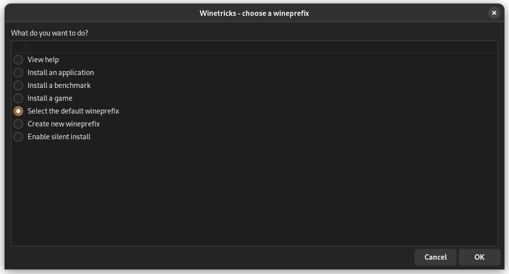

The oldest solution to this is Winetricks, a simple Wine system config tool built around Zenity. If you don’t know, Zenity is a tool for generating dialogs from a bash script. Because of this, the UI is a bunch of dialogs that connect to scripts or commands to configure Wine. This is a very hacky system and just does not provide a good user experience.

## PlayOnLinux

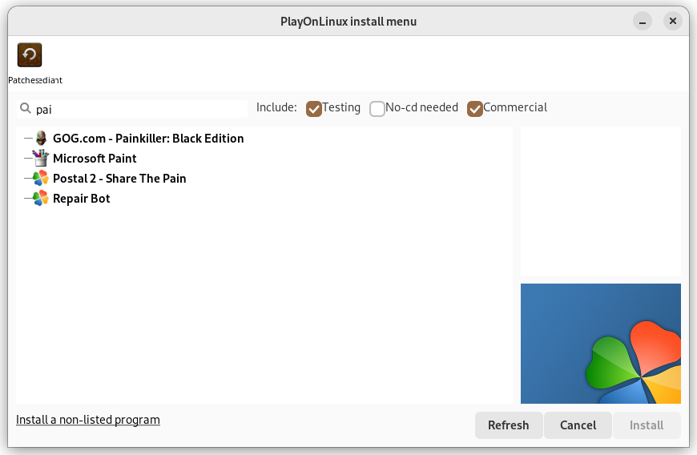

PlayOnLinux was another popular tool for running Windows games on Linux. Still, the version everybody actually uses hasn’t been maintained for a long time and has a ton of graphical bugs and glitches that make it extremely hard to use. Just try opening it on any dark theme.

It does have a newer version with a full redesign, and it [promotes the Flatpak of it on its GitHub repo that is relatively active](https://github.com/PhoenicisOrg/phoenicis/commits/master?ref=techhut.tv), but this [Flatpak is 2 years out of date and riddled with bugs](https://github.com/flathub/org.phoenicis.playonlinux/commits/master?ref=techhut.tv). This can, however, still be a good option if you compile it from source.

## Q4wine

Q4wine is another popular tool for this job. But, like the other apps, it has a very confusing user interface that I don’t want to spend time trying to figure out. [The lead developer is Ukrainian, and development has been halted because of the ongoing conflict in that region](https://q4wine.brezblock.org.ua/?ref=techhut.tv). 

## CrossOver

CrossOver is one of the best solutions; it has a clean user interface and loads of specific patches for certain apps, making many of them easy to install. In addition, [they have a database like ProtonDB with all the applications they support with ratings](https://www.codeweavers.com/compatibility?ref=techhut.tv). However, [CrossOver is a paid app that currently costs $60 for a year of updates and $500 for a lifetime license](https://www.codeweavers.com/crossover?ref=techhut.tv). This, however, does support the development of [Wine](https://www.codeweavers.com/wine?ref=techhut.tv) and [Proton](https://www.codeweavers.com/about/news/press/20220225?ref=techhut.tv), so it’s not just a company profiting from the hard work of the Wine team.

https://youtu.be/ZH5JYshhtYg

## Lutris

Finally, you can find various games working on Linux, thanks to Steam and Lutris. Lutris is extremely popular and makes it very easy to run a game by leveraging and combining existing emulators, engine re-implementations and compatibility layers. It gives you a central interface to launch all your games, and the client can connect with existing services like Humble Bundle, GOG, and Steam to make your game libraries easily available.

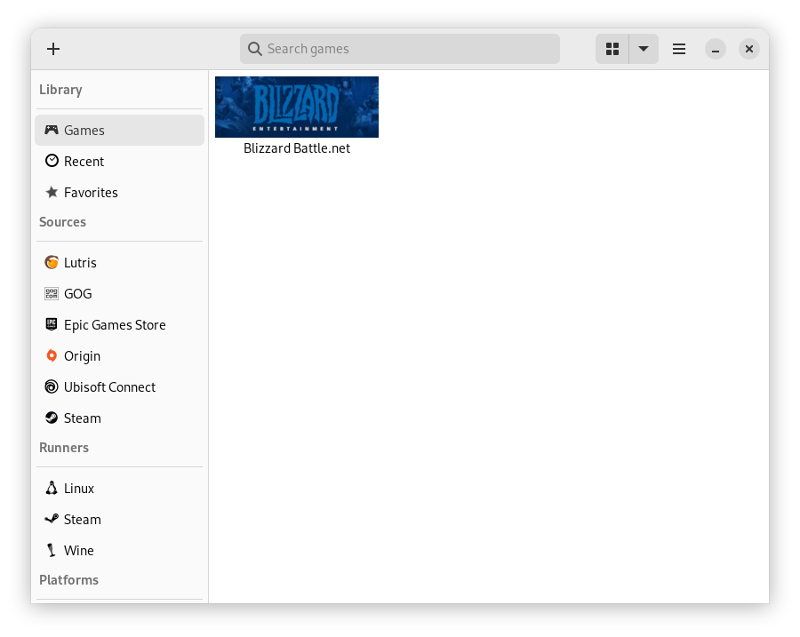

# Bottles (Our Favorite Solution)

From here, we will discuss my favorite solution for managing Wine: Bottles. This app, a GNOME app, has a good-looking and easy-to-understand UI and many options for configuring Wine. On launch, you can create your first “bottle,” which is an isolated Wine instance. This can be useful if multiple apps need different versions of a dependency.

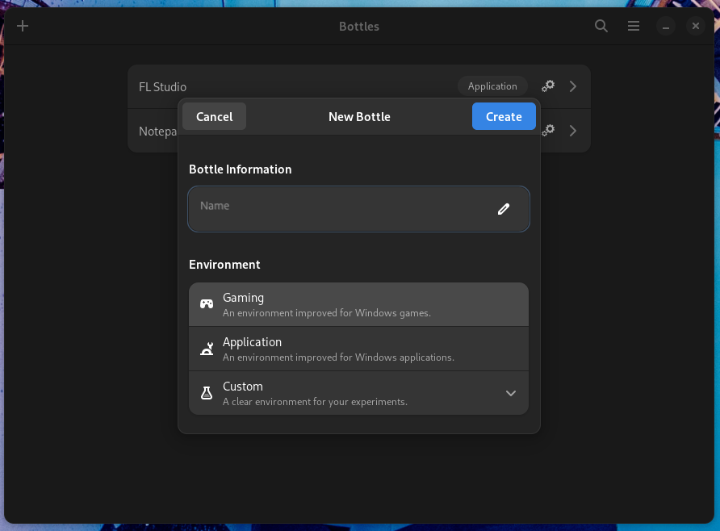

Once in a bottle, you have many options, including preferences, dependencies, programs, versioning, installers, and a task manager. Details & Usage is where you can run executable files such as program installers and do basic program management like adding a program to your application launcher, adding it to Steam, or uninstalling it. You can also access tools within the bottle like CMD, Regedit, and other built-in Wine tools.

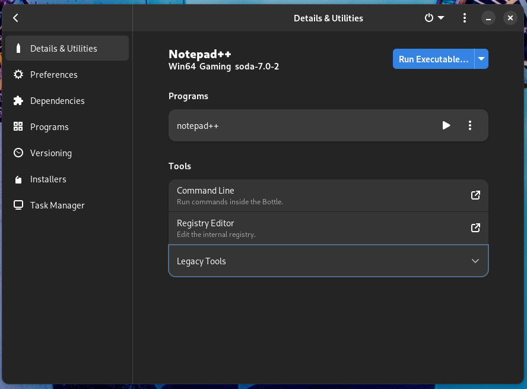

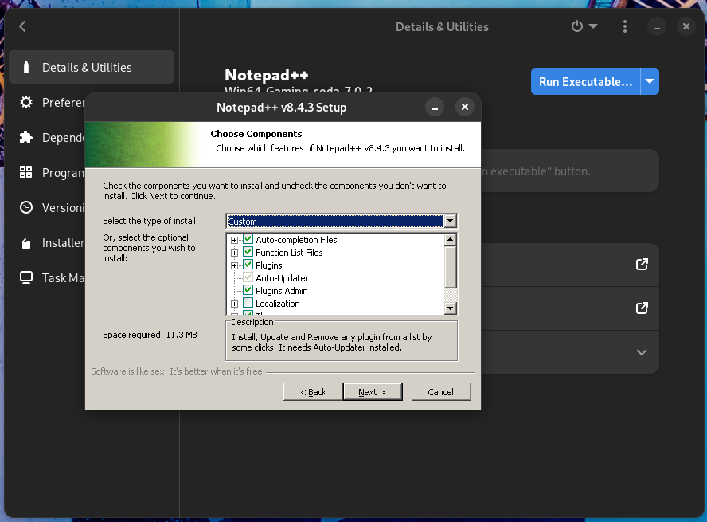

There are other tabs built into Bottles for managing your bottles, including “Preferences”, which allows you to customize certain Wine and system settings for your bottle. “Dependencies” allows you to install dependencies that may be required by a certain application. “Installers” lets you easily install some applications you may want, such as Ableton Live, Battle.net, FL Studio, GOG Galaxy, and Origin.

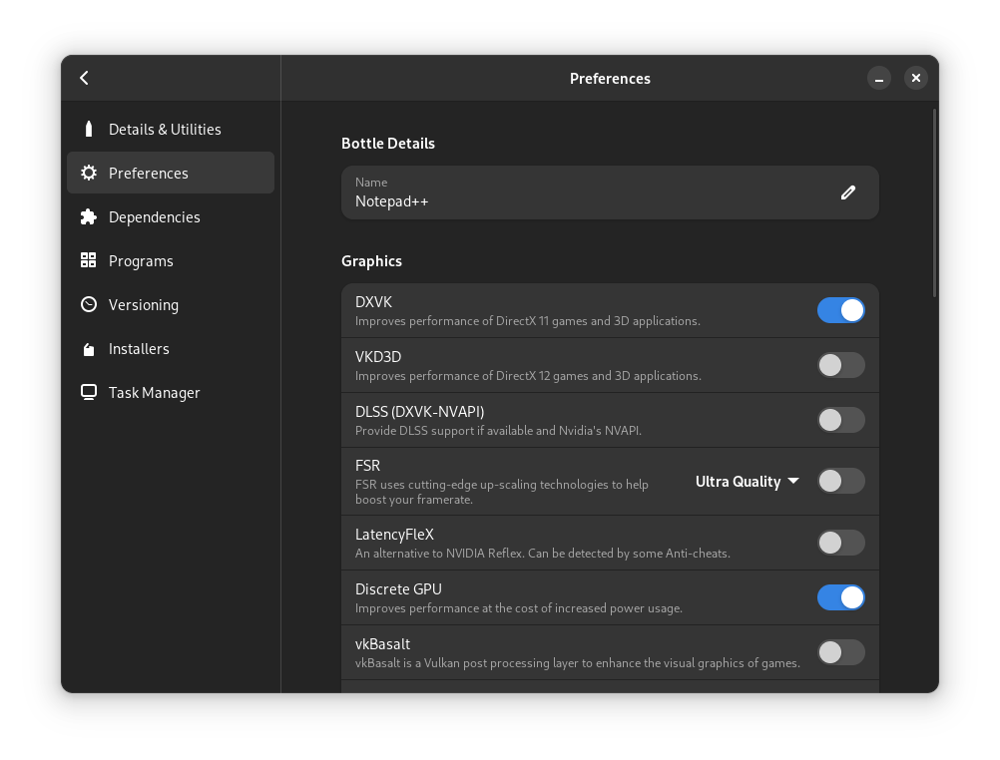

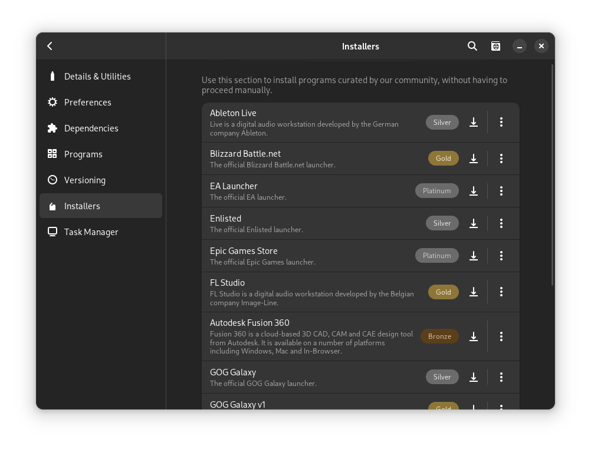

There are also some built-in tools, such as a “Task Manager” for managing processes inside a bottle, similar to Windows Task Manager, and “Versioning,” which allows you to take snapshots of your Wine bottle and restore them to earlier snapshots. These snapshots can be useful if you are trying to test out a patch or change to your bottle that may break it.

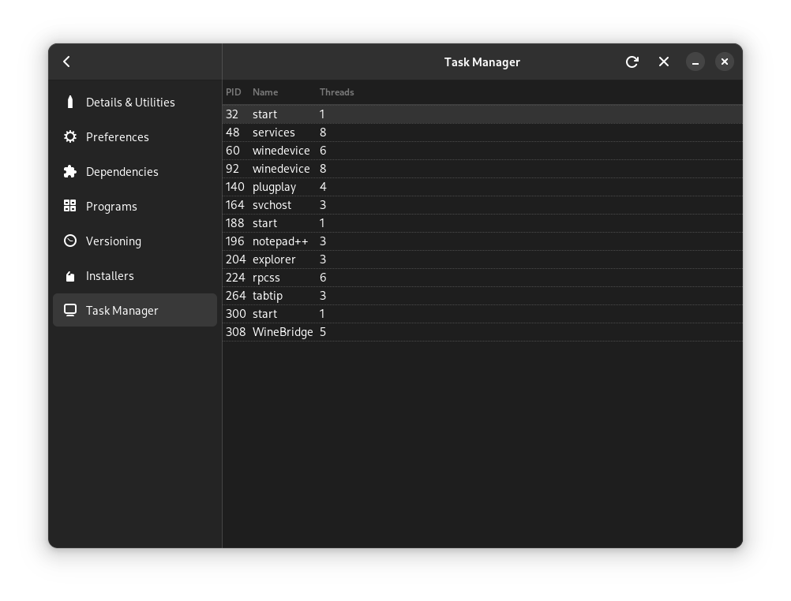

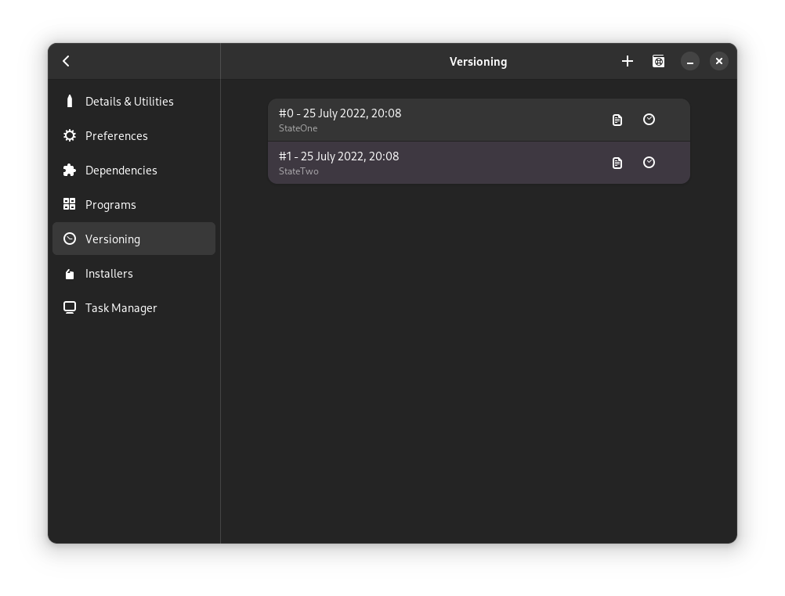

Finally, let's leave the Bottle and head over to app preferences. You can set up different Wine runners, such as installing different Wine forks or a specific pre-release or older version of a runner. This can be useful if you are trying to run a picky app that only works on a type of Wine runner. It also lets you install different DLL Components, such as different versions of DXVK.

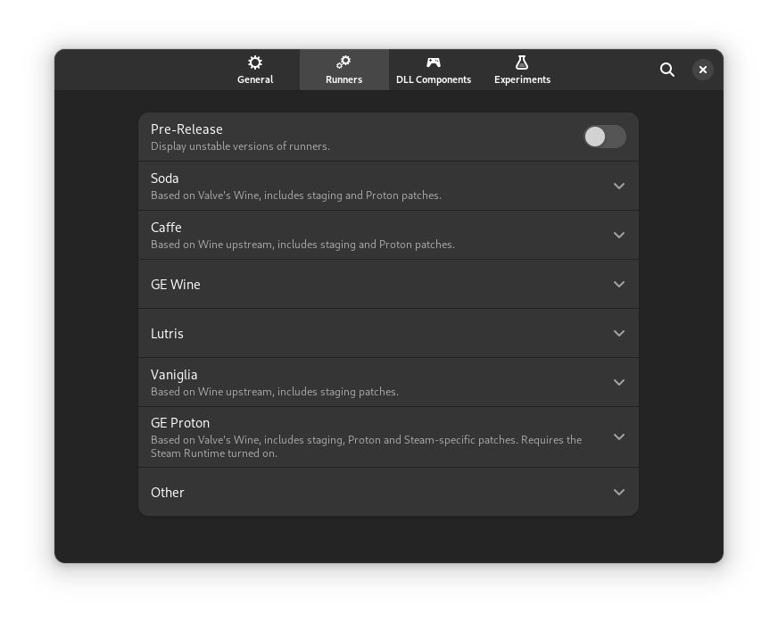

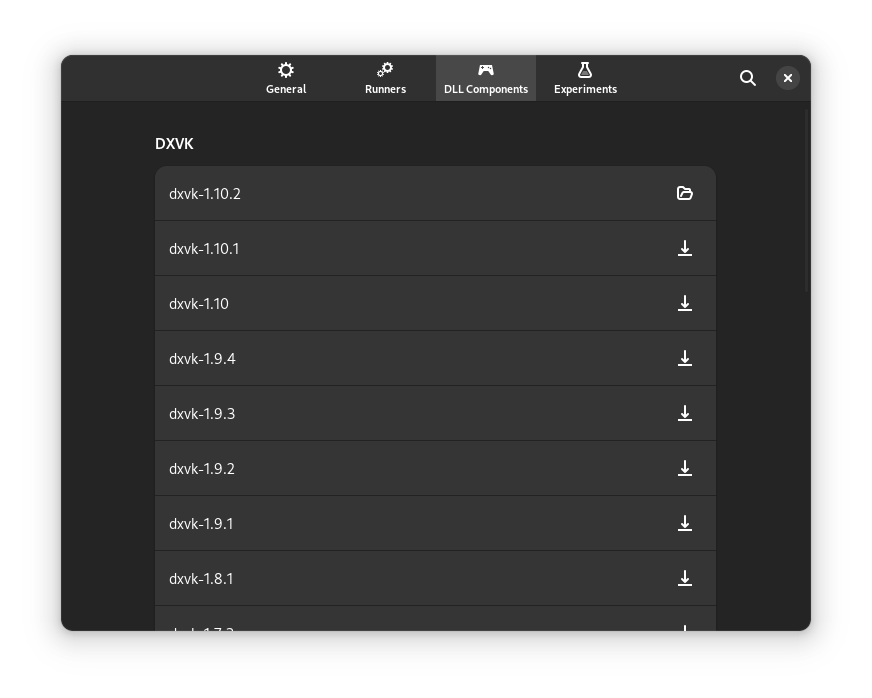

Finally, my favorite feature of this application is that you can export your bottles. I used this to help my non-technical friend run FL Studio on Linux. I just created a new bottle, installed FL Studio through it, added his license key to it for him, and set up some plugins he uses. Then, I was able to send him a .tar.gz file with all the FL Studio configurations he needed, and he was able to install it with a few clicks through Bottles. This is great considering that Bottles is available as a Flatpak, so this can work across any Linux distros without worrying about dependency issues resulting from distro repositories shipping a different version of Wine.

Steam and Lutris are likely better options if you are a complete Wine noob and you need to get a few games running; however, for those who know what they are doing when it comes to Wine, Bottles are the best option. This completely removes the reason that tools like Winetricks even exist and makes this a great thing to try if you are trying to run a game or app that you just can’t get working.
