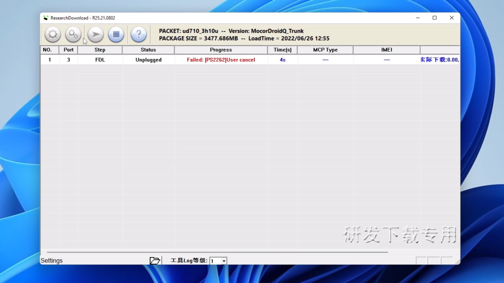
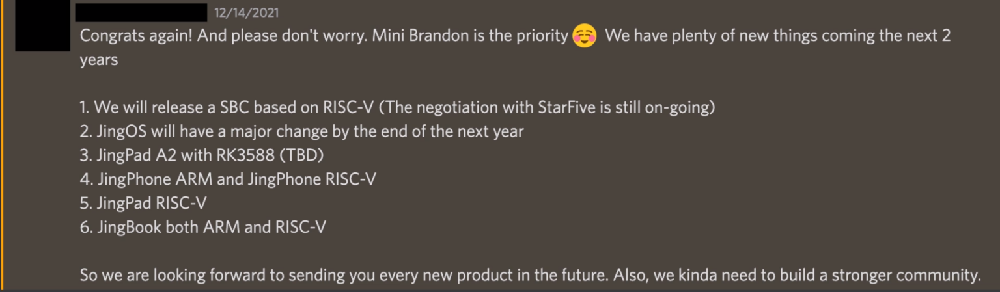

The entire Linux community was hyped about the JingPad. It was the first Linux tablet with amazing build quality, and its own flagship iPad OS-inspired distro helped, too. We could have had one of the best pieces of Linux hardware, complete with features such as [Android app support](https://forum.jingos.com/t/guide-how-to-run-android-app-on-jingpad-a1/2423?ref=techhut.tv). However, this never came to be, and the company behind it seems to be completely dead.

[Jingling was founded in June of 2020 and quickly assembled a staff of around 80 people](https://www.crunchbase.com/organization/jingling-tech?ref=techhut.tv). Most of these people focused on their operating system, JingOS. This operating system aimed to be a consumer-friendly mobile operating system with a Linux base and Android application support. The hardware and software teams were separated, with the JingOS team being in Beijing and the rest of the hardware development team in Shenzhen (where the rest of its supply chain was located).

Their flagship hardware is their flagship JingPad A1. Funding for it was launched on [Indiegogo](https://www.indiegogo.com/projects/jingpad-world-s-first-consumer-level-linux-tablet?ref=techhut.tv), and the suspiciously low goal of $20,000 was achieved in about 15 minutes. The total crowd funding they got for their A1 device was just under $220,000. This was a drop in the bucket because they also received ten million dollars of investment from capital venture firms, including Trustbridge Partners and Sinovation Ventures. [Peter Fang, a partner at Sinovation Ventures, told TechCrunch “We’ve seen the best product iteration for work and entertainment through the combination of iPad Pro and Magic Keyboard, but no tablet maker has delivered a superior user experience for the Android system so far, so they decided to back JingOS”](https://techcrunch.com/2021/06/15/jingos-10-million-linux-tablets-laptops/?ref=techhut.tv). These investors really thought this could be a competitor to the iPad.

This JingPad A1 also had an optional keyboard and pencil to match to compete long-term with Apple. From a hardware perspective, the JingPad was awesome. It has an AMOLED 2k display, an 8-core ARM CPU at just under 2GHZ, 8GB of RAM, 256GB of internal storage, an 8000mAh battery, and a camera that can take some great shots. Overall, it’s sleek and powerful, and the accessories are halfway decent.

So, what went wrong?

## Software

The capabilities were good for alpha-level software when I had my initial lock on the device. It was missing a ton of features that you’d need for everyday use, and the JingOS could not deliver on many of the things they promised. To their credit, they improved some things like the virtual keyboard, adding auto-rotation functionality and settings additions such as VPN and peripheral control. But there were also some issues that I couldn’t get around. First, the copy and paste function didn’t work, and their app store barely anything on it (and it doesn’t load at all anymore).

## Price

$699 was the starting price of the JingPad A1, and the keyboard/trackpad combo, which is basically required to use it, cost $200 more. This alienated a lot of the people that would have been interested in purchasing it as a tinkering toy. It would have been a good move to have an introductory device with lower specifications and a lower price while they worked on the operating system and perfected it. This would be like what Pine64 is doing with their PinePhone line. To be frank, the PinePhone sucks as an actual smartphone but it’s intended for tinkers and developers to work on software. Now Pine64 sells the much better and much more powerful PinePhone Pro to go alongside the original PinePhone, and that’s likely what’d you want to actual use as a smartphone. Instead, Jingling’s approach was to dive in headfirst by making both software and hardware and they just did everything far too fast.

## Lack of Communication

Initially, communication was decent. They were always posting things to Twitter and their forum as well as sending out review units to practically anyone who’d ask for one. However, things did go downhill. The first time I noticed issues with communication was when I needed to restore my JingPad to factory settings. I messaged my contact about this because I couldn’t find any resources on their website. I ended up being forwarded through several different people and then added to a group chat to try to get my device formatted. This is something that should have just been up available somewhere as a guide, but instead I had to use my press contact and even they still struggled to help me out.

## The Flashing Process

Speaking of restoring the JingPad, another major red flag was with this flashing and recovery process. First, the software they use requires Windows which is odd for a Linux centric company. The software doesn’t really give off the best vibes going through the process and half the time it just didn’t even work. [They didn’t even post a tutorial on how to flash JingOS or Android on the tablet until mid-June](https://forum.jingos.com/t/how-to-flash-jingos-rom-on-jingpad-c1-a1/2779?ref=techhut.tv), only a couple of weeks before they disappeared. These guides were the last bit of communication from the company on their official forums.

[On top of that the bootloader is locked by default and locking the bootloader is not easy](https://forum.jingos.com/t/tutorial-how-to-unlock-bootloader-of-jingpad-a1/2718?ref=techhut.tv). You must get the device ID from fastboot, Email them your order number, shopping channel, and device ID, agree to weave your warranty, get a unlock.bin file, and run a fastboot command to unlock the bootloader. [On top of that this forum post is filled with comments of people complaining they never even got their tablet.](https://forum.jingos.com/t/tutorial-how-to-unlock-bootloader-of-jingpad-a1/2718?ref=techhut.tv)

Part of the joy of Linux is being able to switch operating systems and software with ease. This joy was stripped away with the device’s flashing process for the OS. It should have an unlocked bootloader and we should have been able to just boot into an image and install that image onto the internal storage. It’s one thing to have difficulties unlocking a Samsung or LG device, but to have these kinds of struggles on a Linux device is just silly.

## The Vanishing

I’ve tried to reach out to a few people on the team, one person replied a few months back confirming initial layoffs and one of the main people in charge and my primary contact left me on read. This is after he told me not to hold off on making a video on the review unit that they just sent me. [Soon after this, there were some major discounts available for the device](https://liliputing.com/makers-of-the-jingpad-a1-are-selling-the-linux-tablet-for-45-percent-off-following-staffing-cuts/?ref=techhut.tv) presumably to get rid of the final stock/inventory.

The worst thing this company did was just vanish right after. There was no official announcement; they did not care about the longevity of their devices, and they didn’t say anything to anybody. It had to be a moderator on their Discord server to say something regarding this, and they weren’t even a part of the JingLing staff. This moderator was hopeful they could make a comeback, but most of the people I was messaging were on the executive level, and they haven’t been online on Discord in a long time.

I really do wish that this company had succeeded because the hardware is fantastic. Their main problem was diving in headfirst too early and trying to compete at a level they weren’t ready for. Even in Discord a while back, they were telling me about very ambitious plans, including a JingPhone, JingBook, and more.

In hindsight, they should have put more resources into the hardware instead of the software and used the community to get themselves up and moving. It’s companies in the Linux ecosystem, like Pine64, that take advantage of the community support to end up succeeding. This could have been wonderful, and I still hope that there’s a small team that can turn this operation around, but more likely I hope that I future company can learn from what JingLing did right and wrong.
