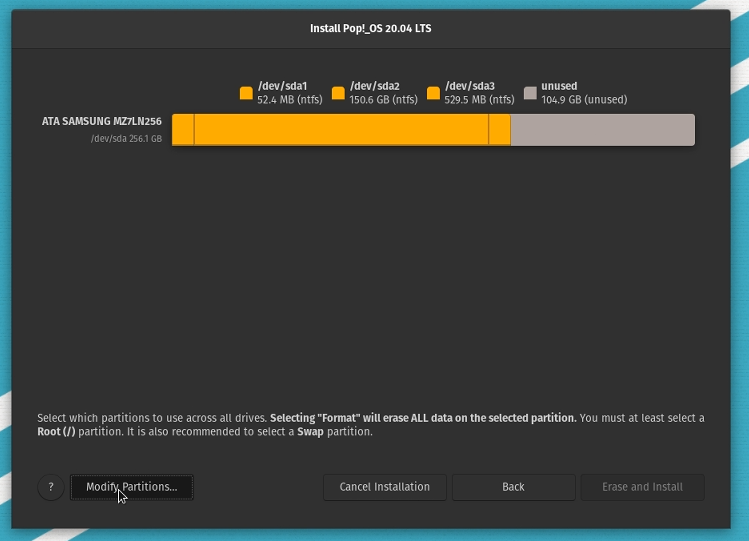
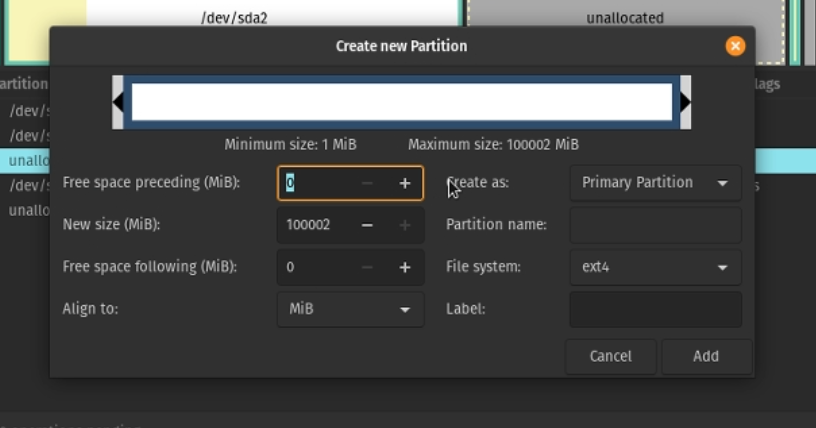

Pop!\_OS is one of, if not the best, distributions based on Ubuntu to date. It has sparked the interest of the dedicated Linux community and new users alike. Dual-booting has helped with this! One major hesitation of the new Linux user is wiping Windows from their life completely. Luckily, this is not a necessity. In this guide, we will go over step-by-step instructions on how to install Pop!\_OS alongside Windows and update the bootloader.

**WARNING: This is an old method that uses legacy bios. I'd highly recommend checkout the updated article here: [https://youtu.be/VaIgbTOvAd0](https://youtu.be/VaIgbTOvAd0?ref=techhut.tv).**

## Getting Ready

First, we will need to gather some resources. These instructions assume you’re doing this from a Windows machine. We will start by downloading Pop!\_OS and installing a USB flashing tool.

### 1\. Download Pop!\_OS

##### [Pop!\_OS by System76](https://pop.system76.com/?ref=techhut.tv)

Imagine an OS for the software developer, maker, and computer science professional who uses their computer as a tool to discover and create. Welcome to Pop!\_OS.

When you download Pop!\_OS make sure you download the right version. You can check your system to see if you need the version pre-loaded with the proper NIVIDA drivers. You can check by going into Device Manager and looking under ‘Display adapters’.

### 2\. Download and Install Etcher

Download and Install the balenaEtcher tool. We will use this to flash the Pop!\_OS ISO image to the USB to ensure that it is bootable.

Once Etcher is installed, select the ISO file from the directory that you downloaded it. Insert a blank USB with at least 4gb of free space. Click on ‘Select target’ and pick the USB drive you’d like to use to install Pop!\_OS.

Once everything is selected click on ‘Flash!’ and it will begin to burn the image onto the USB. Once it is done it will validate and give the finished prompt.

### 3\. Free Up Some Space

This can be done though the live disk image, but doing this on the Windows side will prevent some issues from arising later.

**Important: Ensure everything in your system that is important is completely backed by before performing any system changes.**

1. Open the ‘Disk management’ tool

3. Right click on your main boot partition that holds your Windows 10 operating system. Click on ‘Shrink Volume’

5. Here is where you will select the amount of free space to make available for the new Pop!\_OS installation. Make sure you leave enough space for Windows depending on the work you need to do within the operating system.

7. Click on ‘Shrink’ and you’ll see the the new Unallocated space. This is where we will be installing the new Linux distro.

Once you have everything backed up and all of your active programs are shut down run the command in the Windows terminal below. This will ensure your entire system is not in hibernation and ensures the system completely shuts down.

`shutdown /s /f /t 0`

All the prep work is done! Lets install Pop!\_OS

## Installing Pop!\_OS

Now we get to the fun part. Lets boot into the live disk image we burnt on the the USB drive. See some tips below if you run into any issues booting.

- Enable Legacy Boot Sources. If you are installing on an older computer using BIOS, selecting the option under Legacy Boot Sources or Legacy USB will let you start Windows setup from a USB or CD drive.

- Disable Secure Boot. Security technologies included in UEFI such as Secure Boot can be a blocker and prevent the system from booting external storage sources. Disabling Secure Boot, temporarily—normally accessible under the security menu or tab—will often resolve this.

### 1\. Boot to the USB

Enter your systems screen to boot to a temporary device. When you turn on your computer there will be an option to either enter BIOS or select a start-up device. Depending on your system this may be different. Checkout this article from Lifewire if you’re having issues finding the temp boot menu.

Select your USB HDD or Removable devices from the boot menu and it should boot into Pop!\_OS.

### 2\. Install Pop!\_OS

Once you successfully boot to the new Pop!\_OS USB you’ve created, run through the setup process selecting your language and keyboard layouts. When you arrive at the option for a clean or custom install, select custom.

From the custom installation menu, you should be able to see a preview of the partitions on the system, including the space you freed up. This will be called “unused” space. Click on ‘Modify Partitions…’ near the bottom.

A GParted window will open. Right click on the unallocated space and select ‘New’.

Now a window will come up allowing you to format the partition to the Linux file system. Ensure the the free space remaining is set to 0 and the file system will be formatted as ext4. Click Add.

Now click the green check and click apply. Once the operation is done you can close out GParted.

Click on the new partition and make sure ‘Use partition’ is selected. Select it to format and ensure it is being used as the ‘Root (/)’ with the ext4 file system.

Now click on ‘Erase and Install’. Pop!\_OS will install on your system alongside Windows. Once it is done restart your computer.

> **Important! Windows uses it’s /boot partition as a part of its update process. Your boot partitions available space may eventually be filled with Linux Kernels, this will prevent Windows from updating correctly. To fix this occasionally run the following commands after rebooting Linux, this will clean out older Kernels, freeing up space.**
>
> **`sudo apt autoremove sudo apt auto clean`**

## Updating GRUB

You may have noticed your system booted directly into the Linux partition without the Windows 10 option. Now we will update our system and help GRUB recognize the Windows partition.

### 1\. Update Your System

Open a terminal and run the following commands:

`sudo apt update sudo apt upgrade`

### 2\. Installing OS-Prober

Now we will install a tool to help Pop!\_OS recognize the Windows partition.

Run the following commands:

`sudo apt install os-prober sudo os-prober`

You should see something similar to /dev/sda#:Windows 10:Windows;chain

Run this command so GRUB can update with the new partition data:

`sudo update-grub`

**Dual Boot Complete!**

Now when you restart your computer you will be greeted with the GRUB boot loader on start-up. You will be able to select the partition to boot into. By default it will be set to Pop!\_OS so you will have a few seconds to select Windows before it automatically boots into Pop!\_OS.
