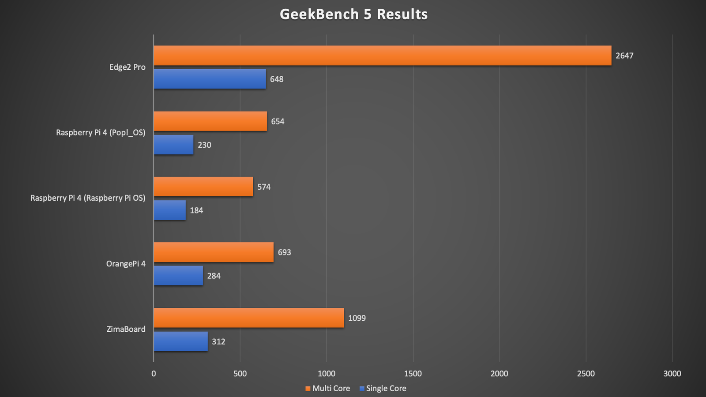

When I first looked at the [Edge2 Pro by Khadas](https://www.khadas.com/edge2?ref=techhut.tv), the price was shocking. $300 for a single-board computer? Then I read a little further and realized that this is the most powerful SBC I have ever had the opportunity to examine. In this article, we will examine the specs and see how the device actually performs.

## Hardware

This board is surprisingly powerful. It features a Rockchip RK3588S. This is an 8-core ARM CPU (up to 2.25GHz clock speed). x4 2.25GHz Cortex-A76 performance cores are paired with x4 1.8GHz Cortex-A55 efficiency cores. Also, depending on your configuration, it will have 32/64 GB of EMMC storage and 8/16GB of LPDDR4X RAM.

Graphics rendering and performance will also benefit from the integrated ARM Mali-G610 MP4 quad-core GPU clocked up to 1GHz. On its website, it says it supports up to 8k encoding up to 30fps and decoding up to 60fps.

The board also has a good number of options for the device's connectivity. Below is an image from their website of the I/O, but the most important things to note are that there are x2 USB-C, x1 USB 2, x1 USB 3, HDMI, and plugins for the Bluetooth and Wi-Fi 6 antennas found in the box. One important note is that no Ethernet option is shipped with the device, but you can add your own later.

These are shipping with a CPU fan to help keep it cool, as it will get quite hot. Do note that the wires on the fan are weak, so be careful when plugging them in. I broke mine by mistake and will need to repair them.

## Software

This board does not ship with an operating system pre-installed, but rather a user interface for downloading and installing various ARM operating systems from the cloud. The interface is called OOWOW. OOWOW is an embedded service (integrated into your device)—it can be run at any time if you need to perform essential maintenance services on your device.

No matter what you install on the EMMC storage, you can access this embedded system by holding the function button and pressing restart. You will be greeted with a menu that looks similar to a legacy bios. This will allow you to connect to Wi-Fi, install and reinstall your operating system, download images, backup and restore, configure your device, access a rescue shell, and more.

At the time of writing and recording, there are only a few operating system choices: Ubuntu 22.04, both the GNOME and Server views, and Android. I wish there were more to pick from, for example, Fedora, Arch, and other popular ARM systems. Just because there is not an easy option in this menu to install other systems does not mean this isn't possible. Here is a [guide on their forums](https://forum.khadas.com/t/how-to-install-fedora-linux-for-any-khadas-sbc/13323?ref=techhut.tv) for installing Fedora Linux on their hardware.

## Review

This computer is the most powerful ARM SBC I have ever used. It could replace many people's desktop computers. It is great for web browsing, media playback, and light gaming. Additionally, the specs make it a great option for a small home server. The benchmarks speak for themselves.

Check out the video below for the full rundown of the hardware and the experience using the device.

https://youtu.be/SUfRDDgwW8U
