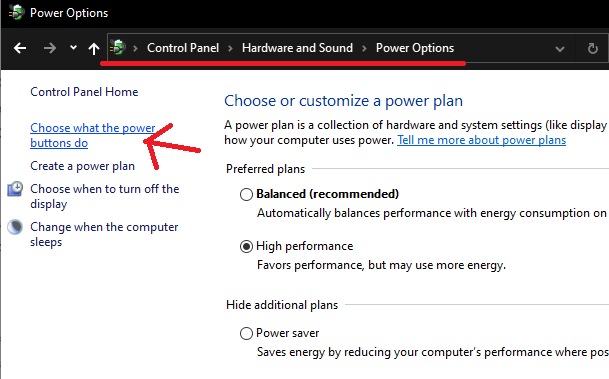
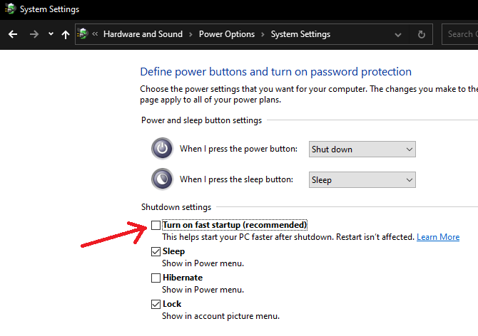
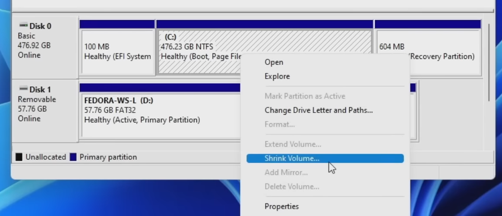
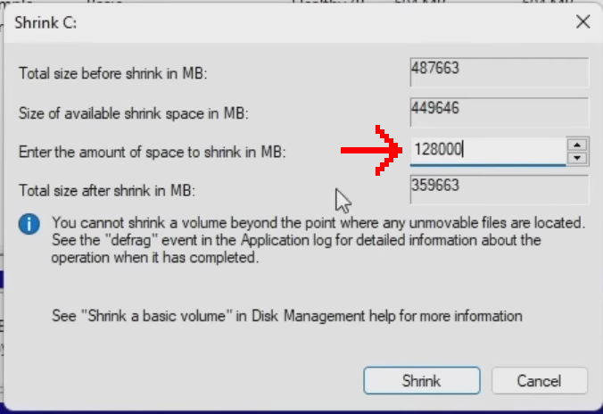
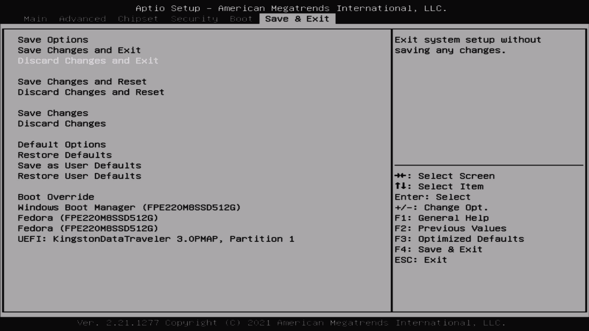
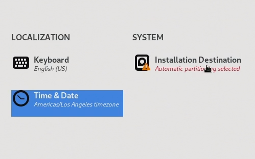
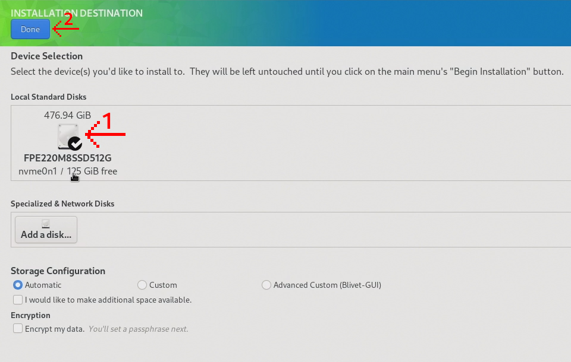
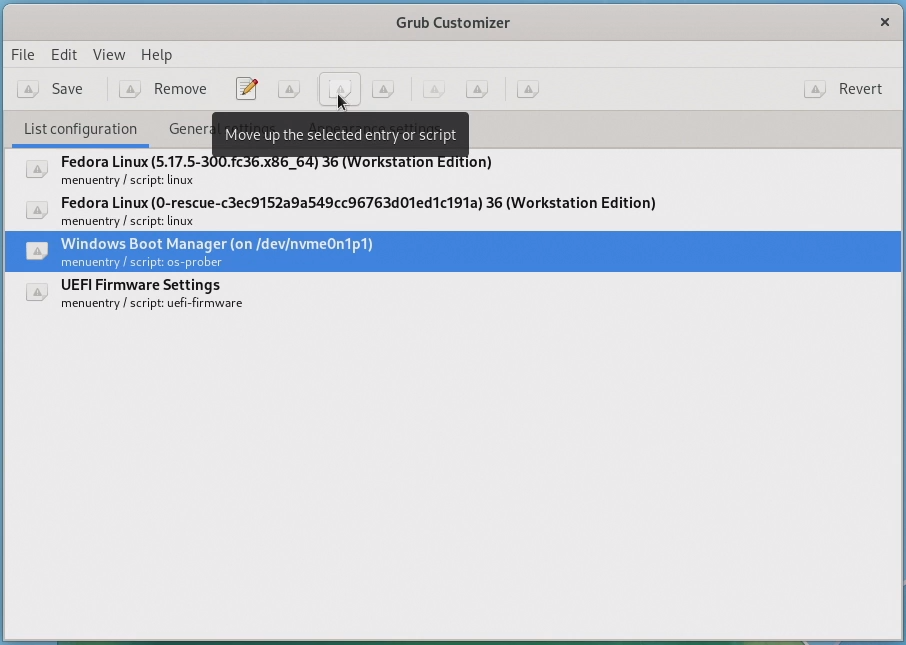

So, you run Windows, which does everything you need. But you’re done with relying on something so limited and _corporate_. But you aren’t ready to switch to Linux fully yet. There may be some application or game that you want to keep running. But now it is time to move your primary workflow to Linux. So, let’s dual-boot the worst with the best (in my opinion).

## **Please backup all important data before continuing!**

We highly recommend doing this on two different drives instead of just one; however, this guide still covers it on one drive. If you are using one drive, note that Windows may not play well on Linux and has been known to wipe Linux partitions during updates. Also, before you do anything, we highly recommend backing up your data. Below is a video guide that will go through everything step-by-step with additional detail.

https://youtu.be/VaIgbTOvAd0

# Configuring Windows

Before starting this whole process, we will first want to turn off fast startup in Windows to prevent it from loading in the Windows Kernel from your hard drive. This will increase boot save (it’s like a mix between a regular shutdown and Hibernation). However, this can cause instability on a dual boot.



To turn it off, head over to Control Panel -> Hardware and Sound -> Power Options and then System Settings, and disable Fast Startup.



# Partitioning Windows

With that, the next thing on the docket is to give Fedora a place to install. **If you are dual-booting with more than one drive, skip this section.** Otherwise, to do this, first, open the Disk Management app in Windows, and you should see a screen that looks something like this:


Next, we will figure out which drive we want to resize. It is most likely going to be Disk 0, but make sure to double-check if you have multiple drives. Next, we are going to right-click the C drive (or whatever drive Windows is on) and shrink the partition to make room for a Linux partition. To do that, right-click your C: partition and go to shrink volume.



Now enter the amount of space you want to give Linux (in MB) into the “Enter the amount of space to shrink in MB”. Make sure not to shrink it to have less than what Windows currently uses, and make sure that Windows has at least some free space left (maybe 30-40 GB or so) to give Windows some leeway after the dual boot. Do note that 1000 MB is equal to 1 GB.





Now, to apply the changes, click on Shrink. But **VERY IMPORTANT: BEFORE DOING ANYTHING TO YOUR DRIVES, DO MAKE SURE TO BACK UP.**

# Creating a Fedora USB

Now, we need to burn Fedora onto a USB. Make sure that your USB has at least 4 GB of space. My recommended tool for flashing Fedora is [Rufus](http://refus.ie/?ref=techhut.tv), so make sure to download it along with a [Fedora ISO](https://getfedora.org/en/workstation/download/?ref=techhut.tv). Open up Rufus, select the USB you want to put Fedora on, select the Fedora ISO for boot selection, set the partition scheme to MBR, and target the system to BIOS or UEFI. You can set the Volume label to whatever you want, set the File system to Large FAT32, and set the cluster size to 32 kilobytes.

Before flashing Fedora onto the USB, **DO NOTE THAT THIS WILL WIPE EVERYTHING ON THE USB.** However, now click start (and select ISO mode if it asks). Once it flashes, we’re good to go.

# Jumping into the BIOS

The next thing we need to do is enter the bios settings. Doing this is a different process depending on who the OEM of your machine/motherboard is. Still, generally you will want to spam a certain key while booting (Usually a function key or something like DELETE or INSERT). Every bios is different, so different options may be in different spots, but the things we need to change should be somewhat similar. The first thing we need to do is disable Secure Boot. For me, this is in the security tab, and you can disable it by heading over to it and pressing enter.


**Do note that Secure Boot is a security feature, and disabling it may leave your system vulnerable.** It is possible to install Fedora with Secure Boot. However, this process may not work because it’s hardware-dependent and involves certificates. Also, Secure Boot may prevent the system from booting if you run a custom kernel or mess with Grub.

Now head over to your boot options and change the boot order to prioritize the UEFI partition on your USB over the rest of your drives.


Finally, we can save and exit the bios settings.



After this your system should boot off the Fedora USB and we can continue with the installation.

# Installing

Once on the Fedora USB, boot the installer and select “Installation Destination.”



Next, select the disk you want to install Linux on, then click Done on the top right. This will automatically detect the free space on your disk and install Fedora into it. If you want to double-check, you can set the storage configuration to “Custom,” when you click done, it will prompt partitioning, in which case you can click on “Click here to create them automatically.” Then, you can see what changes Fedora is making to your driving.



Also note if you are dual booting with 2 drives and you select a drive that is already filled with another OS partition, it may ask you to reclaim space. Other than that, from here, you can begin the installation and it will take 3-10 minutes roughly depending on your hardware. **AGAIN, WE CANNOT STRESS THIS ENOUGH, BACKUP YOUR FILES BEFORE CONTINUING.**

Now, we have successfully installed Fedora alongside Windows on our system. However, before enjoying the system, there is an extra **optional but highly recommended extra step** to increase system stability. We will be doing this within Fedora, so do not boot back into Windows again just yet.

# Fixing Clock Issues

When you boot into Fedora for the first time, it will prompt you to follow a first-time setup guide. Just go through all these steps real quick.


Once you run through the quick setup, open up a terminal and run the following command:

`timedatectl set-local-rtc 1 --adjust-system-clock`

This sets the real-time clock to use “local time” instead of UTC. We need to do this because, out of the box, Windows uses local time to manage the system time, and Linux uses UTC. So, not changing this will cause time to be out of sync whenever you switch between the two operating systems.


# Changing Windows to be the primary

If you would like to make Windows the primary operating system instead of Fedora, we can do this by installing Grub Customizer and modifying the Grub config to allow Grub Customizer to edit Grub. You can do this with the following commands:

```
sudo sed -i 's/GRUB_ENABLE_BLSCFG=true/GRUB_ENABLE_BLSCFG=false/g' /etc/default/grub
sudo grub2-mkconfig -o /boot/efi/EFI/fedora/grub.cfg
sudo dnf install -y grub-customizer
```

The first command disables BLSCFG, the second command updates the grub configuration to apply the changes, and the third command installs Grub Customizer.

Now open up Grub Customizer, select Windows Boot Manager, and move it up to the top. (Note: if the icon to move an entry up is missing, it is the 5th button on the toolbar from both the left and the right)



Grub Customizer also allows you to modify the appearance of grub under “Appearance settings”, and also allows you to change how long to keep the grub screen up and set kernel parameters under “General settings” if you would like to.

# Testing Windows

Now, the last thing we are going to do is reboot and boot into Windows just to make sure that we didn’t destroy our Windows installation. If so than the dual boot has been successful and you can now enjoy your dual-boot system.
