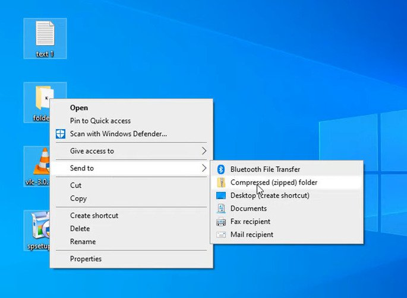
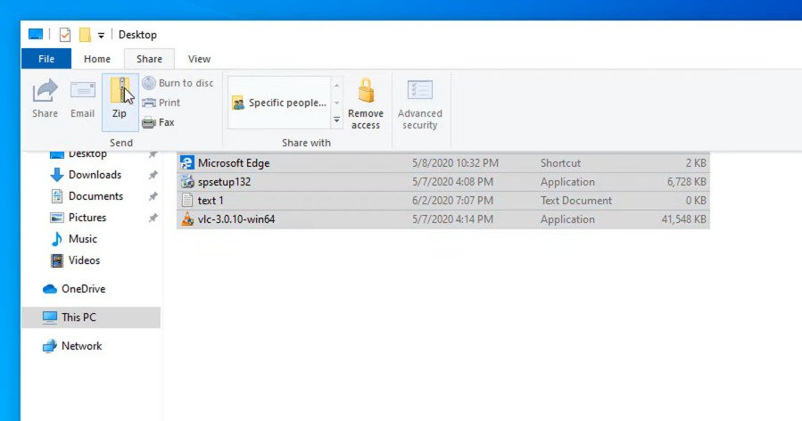

https://youtu.be/78dc2qX7GpQ

A ZIP file is a way to compress files to make them easier to send. Let’s say you have a group of files you want to send to someone or upload to the internet. All you have to do is select the items you want to put in a zip file, than right click them, go to “Send to” and “Compressed (zipped) folder”. This will create a zip file in the same directory as the rest of the files, and you can set the name to whatever you want.

The Zip file will also end up slightly smaller than the original combined files. For example, the 4 files I compressed here in this example were combined 48.5 MB. However, the ZIP file is 48.4 MB. That is a very slight difference, but it makes a huge difference when we are dealing with multi-gigabyte files.

An alternative method to do this is to select files in a folder, go to the “Share” tab, and select “Zip.”

In Windows, you can open a zip file by double-clicking it. However, in this zip folder, you cannot edit or save files without making a copy in another folder. However, you can still add and delete files to a zip file, which is a way to work around the edit limitation.

Another thing we recommend is using 7zip. This gives you more file options, including .rar and .7z file options, and compresses and extracts files a bit faster than Windows Explorer would. It also has higher compression ratios than Windows Explorer, which means your zip files will be even smaller. You can even encrypt and password-protect zip files, so if you haven’t checked out 7zip, we highly recommend it.
