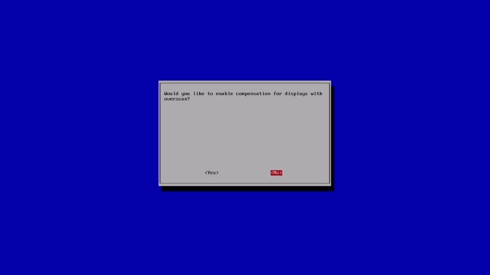
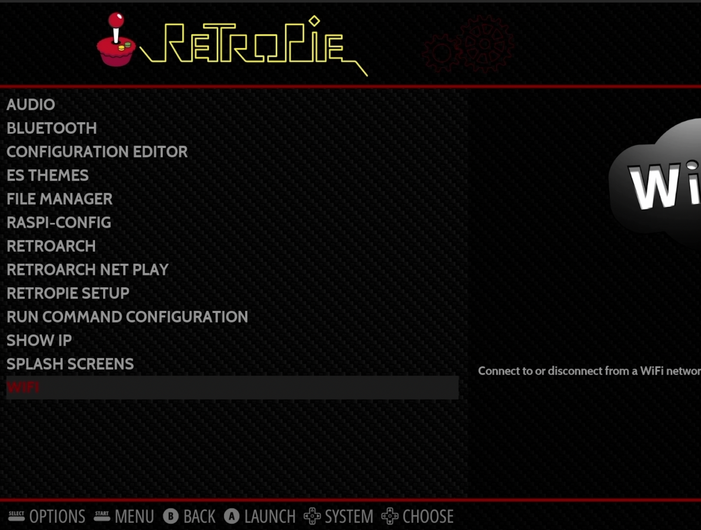

Nothing is better than sitting back and playing some of your favorite games when you were a kid, or even better, showing the next generation some awesome games we grew up with.

In this guide, we will set up our RetroPie console using the Raspberry Pi 4. Depending on the Pi you have, you may be able to emulate old arcade games all the way up to Play Station 1 and N64 games. RetroPie itself allows us to emulate a [good number of older consoles](https://retropie.org.uk/about/systems/?ref=techhut.tv). Before we get into the setup, let's talk about what you'll actually need to accomplish this.

## Gear

### Raspberry Pi

RetroPie works with Raspberry Pi A, A+, B, B+, Zero, 2, 3, and 4. The Raspberry Pi 4 is recommended for PS1 and N64 emulation. Pi 3 can play them, but it may need to be overclocked.

### Power Supply

Make sure this works with your Pi model. If you're unsure, check out this article to ensure your Pi is getting enough power.

### SD Card

RetroPi requires at least an 8 GB SD card. Personally, I know that I will have a huge library of games, so I will be using a 32 GB SD. Generally, ROMS are very small, with many of them being a few megabytes and some PS1 games being around 600mb.

### Controller

You will need this actually to play your games. I use an old wired Xbox 360 controller. You can use almost any USB controller. There are many close-to-original USB controllers on Amazon, such as clones of the [NES](https://amzn.to/3CDAA4L?ref=techhut.tv), [SNES](https://amzn.to/3fPLX0I?ref=techhut.tv), [N64](https://amzn.to/3VjsLJ0?ref=techhut.tv), [PS1](https://amzn.to/3RI0o3S?ref=techhut.tv), [Genesis](https://amzn.to/3EskoVz?ref=techhut.tv), [Atari](https://amzn.to/3CCBLBp?ref=techhut.tv), and more.

### Case and Fan

Now a case and fan isn't really necessary, but its much better using one of these than not. Without a case, your Raspberry Pi will be completely exposed and is more likely to get dusty and/or damaged. Additionally, many cases come with cooling solutions. Using a fan is definitively recommended as you will get better performance overall. I have [a video covering some of the performance differences between not using anything, adding a heatsink, and cooling with a fan](https://www.youtube.com/watch?v=dB9BDq8C3qY&t=225s&ref=techhut.tv).

In the video version of this article, I feature the GeeekPi Raspberry Pi Mini Tower Kit. I like this because it is larger, allowing for the inclusion of a CPU fan, so there is really good airflow, and it just looks awesome overall. Plus, there is a little adapter, so you still have access to the GPIO.

## RetroPie Setup

### Flashing SD

There are two different ways to flash RetroPie on your SD card. You can download and flash manually using a tool like Etcher or Gnome Disks or use the Raspberry Pi Imager. I recommend trying out the Imager, as it will handle the download and flashing for you.

To get the Imager, you go to their website and follow their instructions on downloading and installing, depending on your operating system. When you have the application open you'll want to click 'Choose OS' then select 'Emulation and game OS', pick 'RetroPie' and select the right download for your system. Insert the SD card into your computer, click 'Choose Storage, ' and select the SD card. Ensure there is nothing important here, as it will get erased. Now click 'Write' and wait for the application to finish.

### First Boot

Once the SD card is flashed and you boot into your system, there are some initial steps. One thing to mention is that on first boot, it will resize the file system automatically to ensure you can use all the space on your SD for storing your ROMS. There is also an option to do this later if this doesn't happen for you.

### Configure Gamepad

When it finishes the resizing process, your Raspberry Pi will reboot. Next, you will be greeted with the gamepad configuration process. This is done to map out the buttons on the controller properly to be used by RetroPie. Make sure you pay attention and press the correct buttons, as mic inputs can cause issues in the future, but do note you can reconfigure the gamepad through the settings if needed. Also, RetroPie is fairly smart and can remember mapping for multiple different controllers.

### Select WLAN Country

From there, we can proceed to setting our country so that we can connect to our Wi-Fi network. If you're using the ethernet port, you can skip the Wi-Fi steps.

First, select the large Configuration option from the home screen and then open the Raspi-Config option. This will take you to a terminal user interface with all the possible options within RetroPie. In this menu, select option 5, which is the Localization Options. Please note that selecting these menu options may differ from the standard RetroPie main menu. Ie. A (east) is used to select is the main menu, while B (south) is used to select in the Raspi-Config menus.

In this menu, select L4 WLAN County, and you will get a huge list of possible options. Select your country. Also note that in some of the menus, there will be a Select and Back option. You will use the up and down arrow keys to highlight the option you want, and then press the right arrow key to highlight Select or Back to continue from there.

### Disable Underscan

Underscan adds black bars around the display. This is a great option to keep enabled if you're using an older CRT TV to keep the retro feel. But if you're using a modern flatscreen panel, disabling it is a good option. To do this, go to the first page in the Raspi-Config menu and select option 2, Display Options. From here, select D2 Underscan, and when the Yes/No dialog (displayed below) comes up, select No.

### Reboot RetroPie

To ensure all these settings are in place for our Wifi connection, we will want to reboot our system. We can do this by selecting Finish from the main Raspi-Config menu. This will ask you if you'd like to reboot. Say yes.

## Connecting to WiFi

Once it reboots, you will be taken to RetroPie's main homepage. Once again, jump into the RetroPie configuration. In this menu, there will be an option to connect to Wi-Fi.

In the Wifi selection menu, this will look very similar to the Raspi-Config menus. Select the first option, and it will scan for Wifi networks. Select your and input your password. Once connected, you will be able to see your IP address. Write this down as you will need it to load your ROMS.

### Enable SSH

SSH enables us to connect to our Raspberry Pi via a terminal and other file transfer interfaces. To do this, open Raspi-Config and select option 3 Interface Options. The second option from here is SSH; select it. From there, go ahead and enable. Do note the warning of security risk. It is recommended that you change your password, but we will address this later.

### Adding ROMS

FTP is a way to move files from one computer/server to another. This is what we will use to move ROMS onto our Raspberry Pi. I'm going to be using FileZilla, my favorite FTP application. Open FileZilla; on the top, there will be a place to input your login information. For the host, use 'sftp://yourIP', and the default username and password is 'pi' followed by 'raspberry'. If everything was done correctly, the RaspberryPi filesystem will populate after you click connect.

Under RetroPi/roms, there will be a bunch of folders with the consoles that are supported by default. For example, snes is where you'd place your Super Nintendo ROMS. You can navigate your local system on the left panel, find your ROMs, and drag and drop them into the correct folders. When you reboot your system, the games will display, and you're ready to play!

**NOTE**: This guide is a work in progress. Please refer to the video for more information, such as scraping metadata and some additional tips. Timestamps are included.

https://youtu.be/N3A77Oxbm3g

4k TV config: hdmi\_ignore\_edid=0xa5000080
