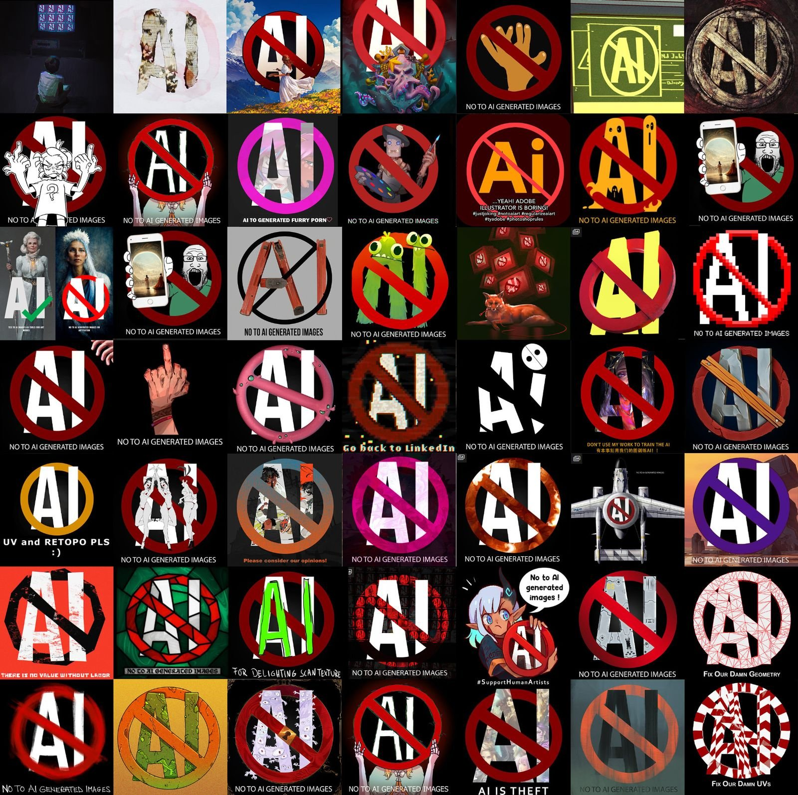

Featured Image by [@TheCrazedEB](https://twitter.com/TheCrazedEB/status/1604275137733353472)

Regardless of how you feel about AI, it’s clear that **something is going wrong**. This is how the ArtStation main page looks at the time of writing:

<figure>

<figcaption>

Image by [@joysilvart](https://twitter.com/joysilvart/status/1603138150028775424?ref=techhut.tv)

</figcaption>

</figure>

The same “No AI” images could be found on DeviantArt and have been tweeted by many artist accounts, even by [KDE’s Krita app](https://twitter.com/Krita_Painting/status/1603287662512820226?ref=techhut.tv). Two lawsuits ([1](https://www.theverge.com/2023/1/16/23557098/generative-ai-art-copyright-legal-lawsuit-stable-diffusion-midjourney-deviantart?ref=techhut.tv), [2](https://www.theverge.com/2023/1/17/23558516/ai-art-copyright-stable-diffusion-getty-images-lawsuit?ref=techhut.tv)) have been filed against AI Art tools. And it’s not just art: ChatGPT has been using AO3 fanfiction as training data, prompting many writers to only make their stories accessible to registered users; and the introduction of Copilot by Github, an AI to suggest code, resulted in [another lawsuit being filed](https://githubcopilotinvestigation.com/?ref=techhut.tv).

Let’s go step by step. To actually generate anything you need to train a model. Taking Stable Diffusion’s art model as a reference, you can see it as a 4Gb file, whereas the training data is 2.3 billion images. Obviously, there’s no way to compress _all_ the training data - we’re talking about hundred of million of images - in such a small size; **in theory, all of the training images are “forgotten” by the model and only the patterns remain**. (In practice? Not quite, but we’ll see that later).

This means outputs from these models _should_ be “original” in the sense that they don’t replicate any of the input training images: they don’t “assemble” an image, nor do they “copy and paste” or "do a collage" - that is, _in theory_ - a common criticism done to AI images, even in the lawsuit explanation website itself:

<figure>

<figcaption>

The lawsuit website goes on to explain a bit of the theory of diffusion and latent spaces.

</figcaption>

</figure>

Also, some models allow users to input an image and a prompt to output that image modified through the prompt. It’s very important to distinguish this from the training part: **the model is not trained on images provided by users**. If you’re using a model, it has already been trained. Uploading an image to Midjourney, as an example, will only have the effect to make it use that image as a "reference", you could say, and not as training material.

Most of the time, we - as users - cannot directly use the model or see what it was trained on, as the companies that authored them prefer not to share them. However, we can make some educated guesses on what the training data included. Sometimes companies do try to be somewhat transparent: as an example, [we do know](https://arxiv.org/abs/2107.03374?ref=techhut.tv) that Copilot is trained on public Github repositories.

Regarding image generation and text instead, we have Common Crawl, a non-profit that scrapes webpages and releases them as datasets:

<figure>

<figcaption>

Screenshot of Common Crawl's website, including a brief explanation of what they do.

</figcaption>

</figure>

This easily includes content coming from stock images or art websites, in the case of images. ChatGPT, as an example, uses Common Crawl for text; the same did Stable Diffusion through another non-profit called LAION that actually groups the images together and filters them:

<figure>

<figcaption>

Screenshot of LAION's website, including an explanation of what they do and their main datasets.

</figcaption>

</figure>

In all of these cases, it’s clear that the data was used for training with no regard for whether it was licensed/copyrighted or not.

**Is any of this legal?** Tough question, actually. (Regarding “ethical”, we’ll also get to that).

The argument - done by companies like Microsoft and AI researchers like the [Fair Learning](https://texaslawreview.org/fair-learning/?ref=techhut.tv) initiative - is that **training is covered by fair use**. To determine whether that’s the case, the two main questions are: “does training change the nature and use cases of the original works, and does it compete directly against the copyright holders?”. [The Verge](https://www.theverge.com/23444685/generative-ai-copyright-infringement-legal-fair-use-training-data?ref=techhut.tv) asked Daniel Gervais (“professor at Vanderbilt Law School who specializes in intellectual property law and has written extensively on how this intersects with AI”); he says that **“it is much more likely than not” that training is indeed covered by fair use**, but it might be necessary to check that for each situation (as we’ll see later). Of course, this doesn’t allow you to generate _any_ kind of image: you can still be held accountable if you specifically ask for some content that might be infringing. “Spiderman flying through buildings” would be a somewhat risky prompt, as an example.

About that, there’s also a quite significant flaw.

In theory, all of the content generated by these AI is completely original; however, **it sometimes happens** - as an unintended behavior - **that some training data is output as is** (or almost). This has happened to Copilot in multiple cases (even prompting Github to add a training data filter). The author of this tweet even managed to make Copilot spit out code he had previously written and published:

<figure>

https://twitter.com/ChrisGr93091552/status/1539734582177562625?ref\_src=twsrc%5Etfw%7Ctwcamp%5Etweetembed%7Ctwterm%5E1539734582177562625%7Ctwgr%5E291207be03447bee5e559e902954df2f07440686%7Ctwcon%5Es1\_c10&ref\_url=https%3A%2F%2Fwww.techhut.tv%2Fai-needs-to-deal-with-copyright-laws%2F

<figcaption>

Here’s another example:

</figcaption>

</figure>

https://twitter.com/StefanKarpinski/status/1410971061181681674?ref\_src=twsrc%5Etfw%7Ctwcamp%5Etweetembed%7Ctwterm%5E1410971061181681674%7Ctwgr%5E291207be03447bee5e559e902954df2f07440686%7Ctwcon%5Es1\_c10&ref\_url=https%3A%2F%2Fwww.techhut.tv%2Fai-needs-to-deal-with-copyright-laws%2F

For images, it’s much harder to spit out a pixel-perfect copy of the training data; however, two studies ([1](https://arxiv.org/pdf/2212.03860.pdf?ref=techhut.tv), [2](https://arxiv.org/pdf/2301.13188.pdf?ref=techhut.tv)) managed to make Stable Diffusion very closely replicate some of the input images, to the point where it would be a clear infringement to use those outputs. Look at these examples:

<figure>

<figcaption>

Comparison between generated images and matches in the LAION database by the second study mentioned.

</figcaption>

</figure>

**This seems to be happening**, both for code and art, **on roughly 1-2% of the outputs**. This poses a significant legal risk to whoever uses AI tools too: if (unluckily!) the generated content is a copy from the training data then you might not notice and still be held legally accountable. In fact, Github explicitly says it’s Copilot users’ responsibility to check for any such copyright infringement.

**There’s more.** As I said, we usually can’t download the AI’s models; but Stable Diffusion is a significant exception, releasing everything to the public (which is why it’s often the most studied and mentioned). Recently, researchers have found (and released) a way to fine-tune an existing model on a small set of images (a couple, or some hundreds). This is some additional training but only on a handful of images and makes the model follow that style much more closely. Normally, it would be impossible to **replicate the style of specific artists** with e.g. Midjourney, unless they’re quite famous. But thanks to Stable Diffusion’s model and this new technique, called “[Dreambooth](https://dreambooth.github.io/?ref=techhut.tv)”, we can do that.

<figure>

<figcaption>

Comparison image from the above-mentioned website. Dreambooth, by taking reference images as inputs, allows replicating with great fidelity those input images in new contexts.

</figcaption>

</figure>

**This might not be legal**, though, if you use it to train a model on a specific artist. Since the result of this extra training is a model that follows very specific styles, it directly threatens the original artists, and might not be covered by fair use. However, the responsibility is not on the companies delivering the general models - like Stable Diffusion - but on those people who Dreambooth-train those models on certain artists. One example is the artist Deb JJ Lee, who discovered a Dreambooth model trained on their specific style (and they were not amused by that, to say the least):

<figure>

https://twitter.com/jdebbiel/status/1601663197031075840?ref\_src=twsrc%5Etfw%7Ctwcamp%5Etweetembed%7Ctwterm%5E1601663197031075840%7Ctwgr%5E291207be03447bee5e559e902954df2f07440686%7Ctwcon%5Es1\_c10&ref\_url=https%3A%2F%2Fwww.techhut.tv%2Fai-needs-to-deal-with-copyright-laws%2F

<figcaption>

**Can you copyright something you created using AI**, by the way?
As always for legal matters, it depends on your country. As an example, the UK does allow that, but it’s not exactly clear how or whether the author would be who used the AI or who created it. As far as the US goes, it’s possible to do that as long as there’s still significant human work behind the piece; as an example, through the curation of images, maybe some post-editing, and through actually putting them together. This is how Kristina Kashtanova - author of the AI-generated comic, _Zarya Of The Dawn_ \- [managed to get US copyright registration](https://arstechnica.com/information-technology/2022/09/artist-receives-first-known-us-copyright-registration-for-generative-ai-art/?ref=techhut.tv), proving that it is indeed possible.

</figcaption>

</figure>

<figure>

<figcaption>

Example taken from _Zarya Of The Dawn_.

</figcaption>

</figure>

It's possible... up to a certain extent. In fact, the copyright has since been partially removed: the US Copyright office has said that Kashtanova “is the author of the Work’s text as well as the selection, coordination, and arrangement of the Work’s written and visual elements” but the images themselves “are not the product of human authorship”.

Now, we could switch to a more “ethical” side of things, rather than “legal”. Are the current training sets “ethical”? Lots of creators that discovered that their art/text had been used for training purposes were upset about the fact, and it’s clear that there’s no consent from them. Sure, the meaning of “ethic” is very subjective (so you might disagree with the ideas here), but it’s easy to see why it would be best to ask. Let’s talk more about this:

Right now, there is a call to action for large art-sharing platforms to stop the scraping of art for training purposes. To address this, **both DeviantArt and ArtStation introduced a metadata tag** that asks AI researchers not to use images for training purposes; of course, this won’t remove existing models already trained on those images, and it’s **not clear whether such a metadata tag has any (binding) effect**. This is especially true for companies, like OpenAI and Midjourney, who do not release their models or training data and thus cannot be held publicly accountable.

There’s another option. Remember LAION, who curates art training data? A group of artists called Spawning created a tool (“Have I Been Trained?”) that searches through its database. They managed to contact Stability AI (who develop Stable Diffusion) and work out a mechanism (whose details are currently unavailable, except for the fact that it works via “LAION tags”) to opt-out images from that training set. Artists can thus make a Spawning account and use their website to ask Stable Diffusion not to be used as training data for the next release, v3.

Of course, artists would prefer not to be trained by default, with the option to opt-in. However, it's not too clear how that could be implemented.

Can you create a training set that’s entirely made of images with copyright non-restrictive enough not to be violating them whilst training, regardless of fair use? Considering that we’re talking about billions of images or code files, that might not be easy. There are projects trying to address that. “The Stack” is a 6.8Tb code dataset in 358 different programming languages that can be used for training without breaking their licenses and with the option to opt out of it. However, in the software world, there’s a strong open-source culture; it might not be easy to replicate this feat for art. Also, the quality of the output somewhat depends on the amount of training data: what if we do get a more fair AI art model, but it’s significantly worse than its competitors?

It’s clear that something will have to change; and - even though there are various obstacles to these more “ethical” ways to create training data - that might be the most promising direction.
