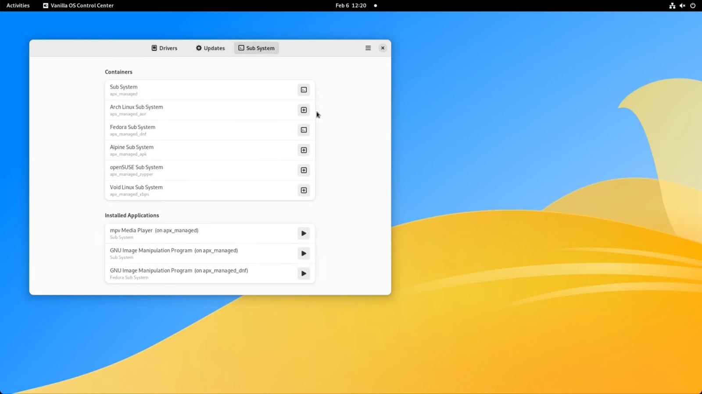
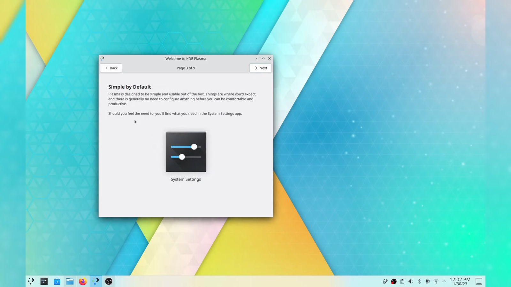

It's been a while since we over-viewed some of my top Linux distributions. Creating top lists for anything is difficult to do, as leaving out bias and opinion is near impossible. An actual top or best Linux distro list would probably have Debian at the top and include OpenSUSE, RHEL, and distributions like that. This list is my favorite Linux distributions I've used on physical hardware in the last year and find myself returning to.

https://youtu.be/fnNmXhUxa30

This will not be ranked necessarily from least to most favorite, but I will rank it from least to most time spent using the distribution. When it comes to ranking, that will be about it.

## 5\. Vanilla OS

Vanilla OS is what I would consider to be a Linux nerds dream. It's based on Ubuntu, but strips out everything I don't like, including snap and any other Canonical trash. Vanilla OS is an immutable operating system, core parts of the system are read only to prevent unwanted changes and corruption from third-party apps or a bad update. Vinialla used ABRoot creating present and feature states for updates. Most packages will be installed as flatpaks, but you have their own package manger allowing you to install Fedora, or Arch Linux packages inside containers. [Learn more...](https://documentation.vanillaos.org/?ref=techhut.tv)

## 4\. KDE Neon

I've been using the GNOME desktop environment for years now as my desktop environment of choice. That is until I installed KDE Neon on a testing drive to check out some updates. The updates were so good that I found myself booting into KDE Neon than the operating system installed on the main partition.

KDE Neon is the Ubuntu LTS based distribution shipped by the KDE team themselves, featuring the latest in what they have to offer. KDE Neon is often the first disto to get KDE Plasma updates and I'm particularly found of their testing image allowing anyone to get a early preview of the work they're doing. I love KDE Neon because there are no customization or modification beyond what the developers of the desktop environment see fit making this distro one of the best ways to experience Plasma. [Learn more...](https://neon.kde.org/faq?ref=techhut.tv)

## 3\. SteamOS/HoloISO

Valve's investment in Linux and the popularity of the Steam Deck have been some of the best things for the entire Linux ecosystem recently. SteamOS for the Steam Deck is an Arch-based Linux distro built around Steam's big picture mode, giving users a console experience while still giving access to a full Linux environment with the KDE Plasma desktop. HoloISO is a rebuilt version of the Steam Deck recovery image, allowing the software to be installed on other systems.

My first experience with this was installing HoloISO on a mini-PC and using it as a living room gaming console, which is still set up and working great. My love for this exploded once I actually got the hardware it was intended for. Valve had a wonderful experience with the menus and the system's fluidity. Even integrations with some Linux tools, such as GOverlay, are built into their Performance Overlay under battery settings. Honestly, this is my favorite implementation of Linux at a normal consumer level. Absolutely amazing. [Learn more...](https://github.com/theVakhovskeIsTaken/holoiso?ref=techhut.tv)

## 2\. Ubuntu Server

Setting away from the consumer level we have probably the most boring item on this list and that is Ubuntu Server. I am no fan of Ubuntu desktop, but their server adition has never done me wrong. Whenever I need to spin up a service in Proxmox I pick Ubuntu Server as goes for needing a server distro on hardware or even spinning up something on Linode. I'm just so use to using it and when it comes to the terminal I am familiar with alot of the packages that Ubuntu server ships and how to use them. Overall, it a mixture of familiarity and efficiency for me as when I use other systems I find myself on forums or guides a lot more when needing to figure something out. Performance is top notch, package availability is there, it's just a great system. Other than the Synology NAS I have it basically powers everything in my homelab. [Learn more...](https://ubuntu.com/download/server?ref=techhut.tv)

## 1\. Nobara Linux

Oh Nobara, I love you so. I started using Nobara full time in the summer of 2022 and it has been my main system ever since. I was using the GNOME version for a while, but in the last few months I switched over to their KDE edition after spending some time checking out KDE Neon. Nobara is basically Fedora (my favorite desktop os) but with a bunch of tweaks and improvements that really do make a difference in what I do. There are a bunch of kernal patches for better hardware support, nvidia optimizations, latest mesa drivers, fractional scaling patches, OBS Studio improvements and a whole lot more. Nobara Linux fixes many of the issues that I've had installing Linux on hardware such as gaming laptops that are often difficult with a stock Fedora installation. Hell, then even have out of the box support for DaVinci Resolve which is often a pain to setup on AMD machines. [Learn more...](https://nobaraproject.org/?ref=techhut.tv)

## Honorable Mentions

### Pop!\_OS

I found it difficult to not include Pop!\_OS in this list as it is a great system, but at the moment most of their resources is going to their new desktop environment written in rust. It should be coming out sometime this year and I'm really looking forward to trying it out. [Learn more...](https://blog.system76.com/post/more-on-cosmic-de-to-kick-off-2023?ref=techhut.tv)

### EndeavourOS

Before Nobara and Fedora I was using EndeavourOS. Nothing caused me to switch away other than to try something new. If you're looking for an Arch distribution that is easy to install and has a wonderful community, I'd recommend this. [Learn more...](https://endeavouros.com/download/?ref=techhut.tv)

## BONUS: Linux on Apple Silicon

https://www.youtube.com/watch?v=Lh1SQFCu61M
