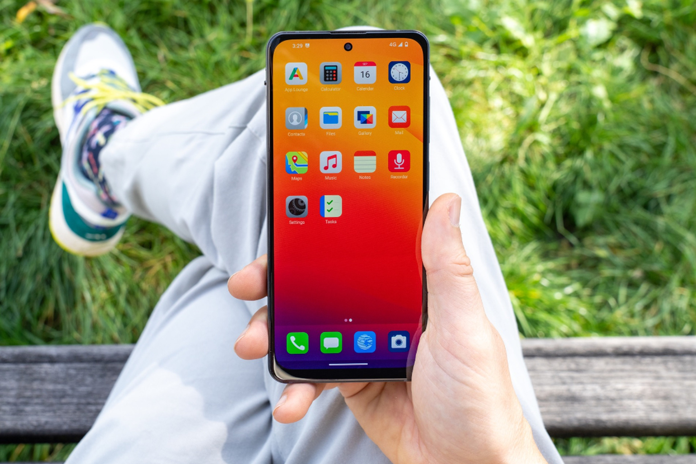
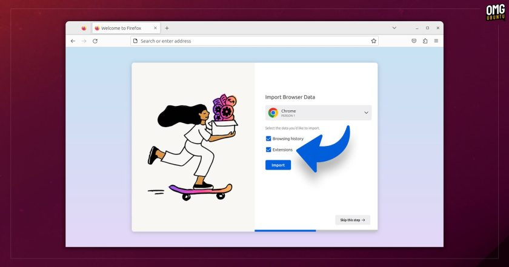

## COSMIC shows off some COOL Login & Lock Screens!

I have to give it to them, the design is somewhat original. Nonetheless, all the basic elements are there: date, time, wifi and battery statuses, keyboard input language, switch user button, and software session selected. You know all of that. However, Jeremy (COSMIC dev) made sure that the floating dialog is customizable in its colors and theme, giving life to some quite cool setups:

Sexy! Login/Lock screens aside, there are lots of smaller progress updates on the project. We have usability testing and adjustments made to "per-workspace tiling", a.k.a. the ability to tile a workspace while still having floating windows on another. There's also an early implementation of the Tiling applet by Eduardo, which contains all the important options about this mode: on/off toggle, important shortcuts, gaps setting, exceptions, and so on.

There's now the ability to assign a modifier key (Ctrl/Shift/Alt) to a shortcut; as an example, the Super/Meta key could bring up the launcher! This was quite recently implemented in KDE Plasma as well, and it's a nice feature to see.

Finally, we have some more technical aspects (which, to be fully honest, I do not understand). One is "support for pointer constraints", then "DMA-BUF screen capture support" (which should improve performances with tools like OBS), and lastly "DRM leasing for VR devices" (apparently, Wayland relies on a subsystem called Direct Rendering Manager to render games on display, but VR headset required some extra support).

If you're interested in the full writeup, you can check it out here:

## Privacy-focused phone Murena Two pulled $156,000 on Kickstarted

As you all know, this newsletter happily covers all kind of hardware that does not run (mainline) Linux out of the box but still offers a higher level of privacy or user respect. Murena is a de-Googled phone that comes with switches for front and back cameras, and a second one for do no disturb & airplane mode. The operating system is called /e/OS (you might have heard about it) and allows for e.g. downloading apps without a Google account.

The goal of the kickstarted for the Murena 2 project was $26,437 (yes, oddly specific). I'm happy to report that the project not only reached the goal, but it received 6 times that, with nine days left on the Kickstarter! If you're interested in the project, you can get one for €399 with an estimated delivery date of December.

## Firefox 119 released with Chrome Extensions Import, Add PDF Image Support

Here's how this works: when you switch from Chrome to Firefox you are given the ability to "import extensions" along with browsing history and such. If you select that, Firefox will automatically install the extensions you had, _assuming they're also available on the Firefox Add-ons site_. If the extension is only available on the Chrome store, then nope, it won't be imported. Still, that sounds like a nice feature that will help users switch to Firefox.

That's not the only feature coming with the latest Firefox release, version 119. We also get the ability to add images to PDFs simply by drag and dropping them in the Firefox window whilst having a PDF open. This is a nice addition, given that the ability to add text and draw was recently added as well.

Finally, Firefox is trying to make their "Firefox View" feature a bit more useful by showing an overview of tabs open in every window, recent browsing history, and all active tabs on devices synced with Firefox Sync. If you're interested in this latest release, you can check out more about it here:

## A Couple of Release Dates: Fedora 39 and Plasma 6

**Fedora 39**: Fedora 39 should've been published on the 24th of October. However, the team discovered some last-minute bugs, featuring - at the time of writing - four hard blockers, which are preventing a release. Because of that, a one-week delay was agreed upon. Futher delays might happen, but currently the goal is to publish on Halloween.

**KDE Plasma**: we now have an official release date for KDE Plasma 6: the 28th of February. Some other key dates are the Alpha (November 8th), the first Beta (29 November), and the first Release Candidate (10th of January). KDE Gear (the suite of KDE applications) and the KDE Frameworks (lots of cool libraries that KDE relies upon) will also follow the same schedule.

****_Notice: This is an older newsletter; many links and images were lost in the migration process. Click [this link](https://archive.techhut.tv/) for an archive of the old newsletter site_**.**
