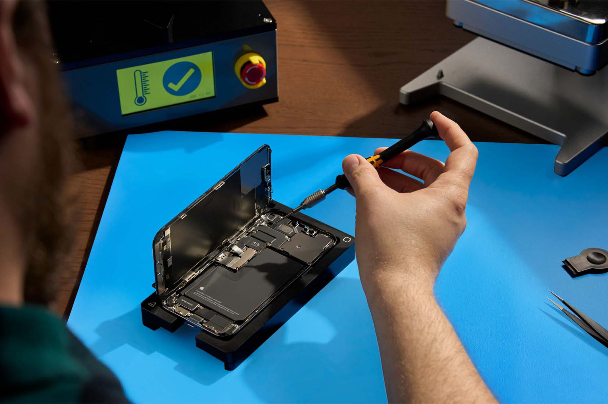
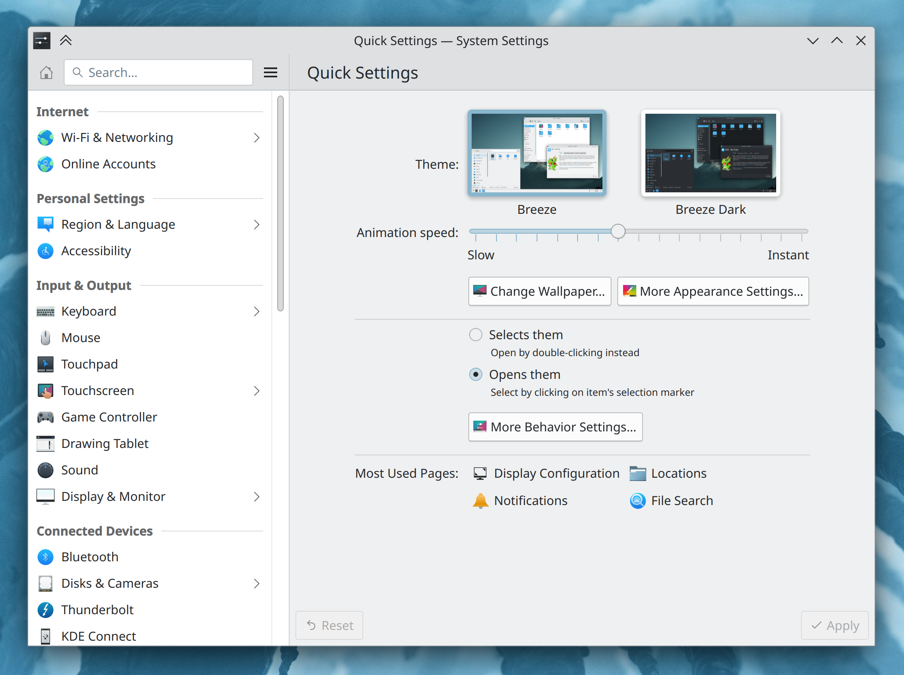

## GNOME wants to drop x11, chaos ensues

I recently covered the proposals by Fedora to stop providing an x11 session, something that generated quite a lot of discussion. Even more controversial, GNOME just proposed to (1) stop providing a x11 session and (2) remove all x11-related code.

Proposal (1) would effectively hide the "x11" button in the log-in screen; you can still get it back by manually adding a desktop file. This is just a first step that tries to be relatively uncontroversial since it's still quite easy to get the session back; nonetheless, users have pointed out some of the missing features of Wayland and asked for more time.

Proposal (2) is much more radical, as it removes x11 support altogether. Not only would this force any GNOME user to Wayland, but it would also force all desktops and distributions relying on `gnome-session` to fork the project until their Wayland transition is ready. Projects like ElementaryOS or Budgie aren't ready for this step yet, and they still rely on GNOME providing x11 support. The discussion between the GNOME developer who created the merge request and a Budgie developer got so heated that the former quite unprofessionally replied with

> Budgie isn't the first project to use a variety of GNOME components, but it does look like it's the only one that even after all these years still behaves like an entitled child the moment anything changes.

What's still unclear is the timeline of this transition. Proposal (1) is supposed to be happening soon, but there are talks about targeting March _2025_ with (2), which is hopefully enough time for a clean transition.

## Latest News in Right to Repair

I've got great news: after covering how a Right to Repair bill was passed in Europe, the Right to Repair Act also was signed by California Governor Gavin Newsom. This means that manufacturers must make replacement parts, software, documentation, and tools available for up to seven years after production for any device above 100$. This is a great step forward, especially since California is the home of various device manufacturers such as Apple (who, interestingly enough, decided to support the bill).

This might somewhat explain why Google has decided to announce seven years of software updates for their latest phone (and seven years of spare parts, too). However, The Verge points out a significant flaw in Google's approach: they are currently limiting which of their devices get which features, even if they're all using the same OS version. As an example, the ability to summarize recordings and advanced editing tools in Google Photo will only be available on the "Pro" version of their device. What will stop them from providing software updates to older phones, but offer them none of these new features?

Finally, there are some device makers who seem to be independently interested in improving the reparability of their products. Take Lenovo: their executive Luca Rossi told the Canalys EMEA Forum that

> More than 80 percent of our devices will be able to be repaired at the customer

This is quite interesting, especially if you consider that Lenovo has sent Frameworks (who actually builds user-reparable devices) a cease-and-desist over the design of a power button, "and then unveiled its own modular concept laptop with no promise to actually build such a thing".

## KDE re-organizes System Settings from scratch

I'm also happy to report that, after years of discussions, the Merge Request to re-organize KDE's System Settings has landed. This is purely about the order of the elements in the left sidebar and their categories, and it's not 100% final; still, everybody pitched in and now every list item should be easier to find.

It's also worth reminding that there's an ongoing effort in re-writing all legacy KCM (System Settings modules) to QML, making sure they're prettier and better organised; many were ported already, so you should notice a significantly better settings application when Plasma 6 is finally released.

Finally, KDE is also currently adding testcases to make sure the system is as stable as possible; this week, GUI tests for Battery&Brightness widget, Clipboard's Widget, and System Settings Users page were introduced.

## OldTechBloke has passed away due to lung cancer

OldTechBloke (Steve Anelay) was a Linux Youtuber active up until 8 months ago; he had decided to take a break due to deteriorating health conditions. We only recently discovered that he died peacefully on Sunday 24th of September. His passion for Linux and his contributions to the community will always be remembered and cherished by his viewers and fellow enthusiasts.

**_Notice: This is an older newsletter; many links and images were lost in the migration process. Click [this link](https://archive.techhut.tv/) for an archive of the old newsletter site_**.
