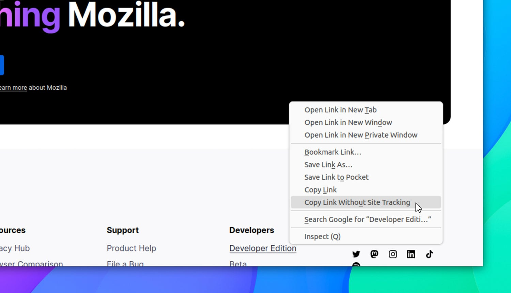
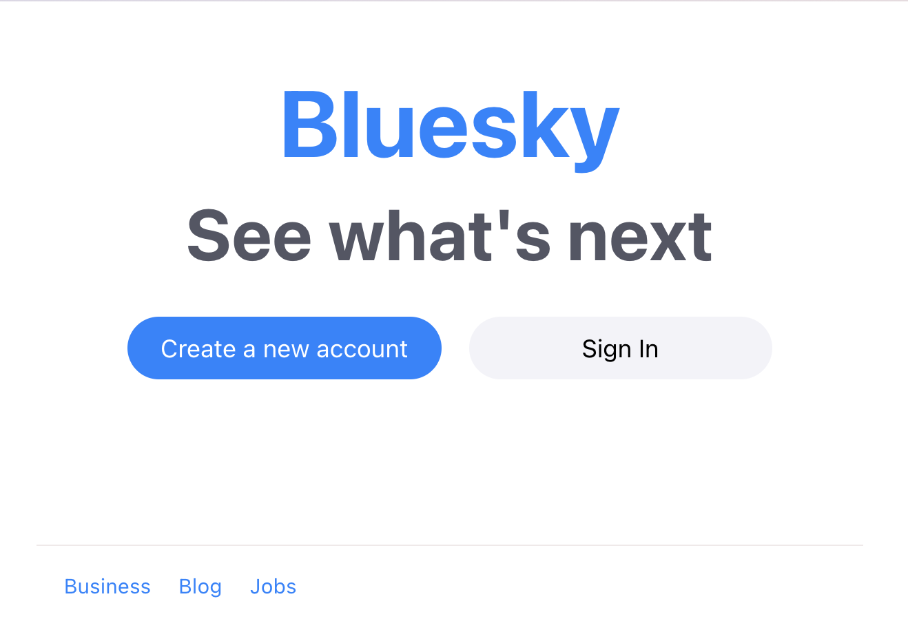

## Earthquake within OpenAI

It's not easy to explain what has happened in OpenAI in the last few days. When the previous newsletter issue was published, Sam Altman was the CEO; now he isn't, but the company just said he'll be right back.

On Friday, Sam Altman was removed from the role of CEO by OpenAI's board. No detailed explanation was given, and the move felt hurried; the CTO, Mira Murati, temporarily took his place. One of the board members, Greg Brockman, resigned in protest. It's important to point out that, since OpenAI was originally non-profit, the board does not have the goal of maximizing revenue - their goal is to guide the company safely toward its AI future.

Negotiations to reinstate Altman began the same day. Many OpenAI employees were immediately on Sam's side, and even Mira Murati switched to his side. However, no agreement was found and the board decided to remove Mira Murati, appointing Emmet Shear (ex-Twitch funder) as a replacement.

As chances of Altman returning to OpenAI seemed to vanish, Microsoft (who did not seem to know this was going to happen and was reportedly furious) decided to hire both Sam Altman and Greg Brockman to start a new AI division. As a result, a letter was written by OpenAI employees threatening to quit and join Microsoft unless the board reinstated Altman. Out of the 770 employees of OpenAI, roughly 700 signed the letter.

Even board member Ilya, who had voted to fire Altman, announced he regretted his actions and signed it. (It seems like he was convinced by Greg Brockman's wife. Sutskever had officiated their wedding at OpenAI headquarters. Yeah). The current CEO, Emmet Shear, reportedly threatened to resign unless the board could provide documentation of Altman's wrongdoing.

Just a few hours ago, the company announced that, yes, Sam Altman will return as CEO of OpenAI. The attempted boardroom coup has failed, though we still don't know what sparked it. A new transitory board will be formed, only keeping one member of the old one. The goal is to eventually expand it to have 9 people (instead of just 6). Microsoft CEO Satya Nadella has said that the company does not want any more "surprises" (understandable, given the million-dollar investment they made towards OpenAI). More updates might come in the following days (or hours), but this is the story so far.

## There's Chaos in Nothing Too

Nothing is a smartphone manufacturing company. It was founded in 2020 by Carl Pei, co-founder of OnePlus. Last week, Nothing announced a new Android application - "Nothing Chats" - featuring iMessage support. User-wise, the application is simple and it allows you to send messages to iPhone users without being recognized as an Android fan. Behind the scenes, this application is "signing in on some Mac Min in a server farm somewhere", according to Marques Brownlee. This backend part is powered by a service called Sunbird, which Nothing claimed was completely private and end-to-end encrypted.

Spoiler alert: **it wasn't**. All messages you send are logged as errors and sent as plaintext to Sunbird, which thus has access to all of them. On top of that, the messages are sent through HTTP (notice the lack of "S") to a Firebase cloud-syncing server which stores them as unencrypted plain text too. Text.com's blog managed to make a successful attack and gain access to some messages and has advised all users who logged to Nothing Chats to consider their messages and password as compromised.

As a direct result, Nothing Chats was pulled from Google Play one day after the release and Sunbird also shut down the services "for now", while it "investigates reports that its messages aren't actually end-to-end encrypted" (quote from TheVerge).

## Firefox 120 Released with PIP Snapping and Privacy Options

We've got a new release of Firefox! Let's talk features. Firstly, you can now do corner snapping for PIP windows. If you hold the `ctrl` key whilst drag-and-dropping them around you'll be able to snap them to the corners of your screen. Secondly, there's a new "Copy Link Without Site Tracking" option in the context menus of links, which automatically removes all useless tracking information, source tags, or other extraneous data.

Then, there's a new "Global Privacy Control" setting in the "Privacy & Security" section of Preferences. When enabled, Firefox will tell websites not to sell or share your data (this is off by default, for some weird reason). Firefox 120 also features the ability to import data from Chromium snaps, the ability to simulate browser tabs being offline in DevTools, better WebRTC audio capture on Linux, and more.

## BlueSky now has 2 million users

BlueSky, the decentralized social network with Jack Dorsey on its board of directors, has just hit 2 million registered users in its first year of life. The platform isn't as decentralized as should be, since the actual federation part is only planned for early next year. However, a public web interface that will allow non-logged-in users to see posts as well will be released towards the end of the month.

This has left me wondering how the numbers compare to Mastodon. I checked, and apparently, the older decentralized social has 8 million users, out of which 1.8 million are active. And there's some good news for them too: Flipboard has decided to stop actively monitoring or posting updates on Twitter (now X); instead, they'll focus on Mastodon and other open social platforms.

Meanwhile, Twitter isn't doing well. They do have 350 million active users; however, the owner of the platform (Elon Musk) is endorsing antisemitic conspiracy theories and posting about supporting white pride. As a direct result, major advertisers (such as Apple, Disney, and IBM) halted their ad spending on the platform. The CEO, Yaccarino, said that this is only temporary and she blamed articles that she believed had been "manipulated" to damage the company.

**_Notice: This is an older newsletter; many links and images were lost in the migration process. Click [this link](https://archive.techhut.tv/) for an archive of the old newsletter site_**.
