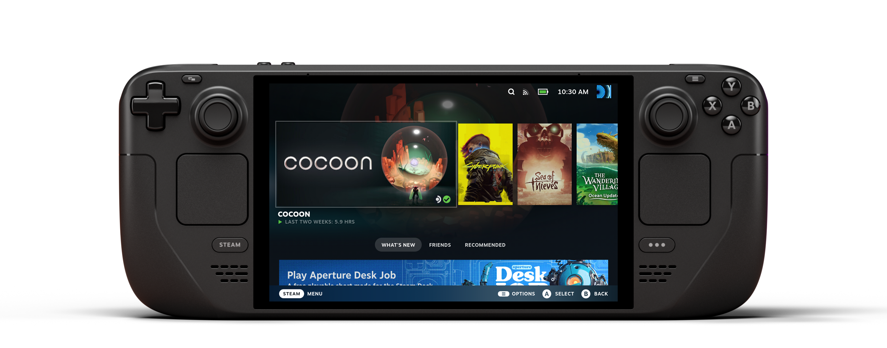

## GNOME gets €1M Funding from the Sovereign Tech Fund

The Sovereign Tech Fund is an organization run by two project managers of open-source projects (Adriana Groh and Fiona Krakenbürger) and is financed by the German Federal Ministry for Economic Affairs and Climate Action. They have a budget of ~€11.5M in 2023 to finance the development, improvement, and maintenance of "critical open digital infrastructure". Selected projects so far include curl, Fortran, OpenSSH, WireGuard, and - now - GNOME.

The GNOME Foundation has presented a clear spending plan, of which we get a peek. The funding will help design, prototype and improve a new accessibility stack, encrypt user home directories individually, modernize secret storage, invest in Quality Assurance and Developer Experience, work to expand freedesktop APIs (which will benefit other projects too), and more. If you are an individual or a non-profit who could help develop one of these goals you can get in touch with GNOME.

This is great news for the GNOME project; other free software organizations, such as KDE, are also working on applying for funding.

## Valve Announces OLED SteamDeck

Nobody was expecting a SteamDeck upgrade, and yet here it is. This new model, which comes without any price increase, has many significant improvements. The first one is the screen: the LCD display has been swapped with a OLED one, providing more brightness and better contrast. The new display is 7.4" (previously 7"), allowing for thinner bezels around it. Oh, and it's a 90Hz display (previously 60Hz). The battery life also received a significant upgrade (30%-50%), both thanks to a bigger battery and the less power-hungry display. We also get WiFi 6E, which offers increased bandwidth (assuming you also own a WiFi 6E modem), and a dedicated Bluetooth antenna (which translates in better connection for multiple controllers).

Other improvements: there's a new 2-pieces carrying case that's a bit more compact, the device is easier to disassembly without damaging it, touchscreen responsiveness and fidelity has been improved, and the same goes for haptics feedback. The charging LED is now RGB, the Deck is ~5% lighter, and so on.

Valve has also decided to launch a "Limited Edition" version of the new Deck which features a sexy see-through shell and various components are colored red. It looks really good, but it is only available in the United States and Canada, in limited quantities.

As mentioned, these new devices have the same prices of the LCD models; if you're on a budget, you can still get a previous generation model at just $399 with 256Gb onboard.

## Blender 4.0 Released

This is a major release of one of the most successful free software projects. This update comes with various significant improvements (sheen and coat layers for principled BSDF, a new view transform that provides better color handling in over-exposed areas compared to Filmic, Light linking, lots of new Nodes and Node Tools, and more). I'm no 3D artist, so - if you're interested in this new update - I would recommend hearing what's new from the Blender announcement or its official video:

https://www.youtube.com/embed/LcQkk7NbOoY?feature=oembed

## KDE Plasma 6 Apps will feature a new look

Even if you are a daily KDE user, you might be looking at the above image wondering what has changed compared to KDE Plasma 5. The change is indeed subtle, but nonetheless, it was an important step of the Breeze redesign that has been in the works for the last few years. Plasma 6 will do away with having a 1px outline around all views and will instead introduce a 1px separator between different views. This was already the case for Kirigami applications (such as Discover or System Settings), but the new look has also been ported to QWidgets (e.g. Dolphin, Gwenview, Okular). Here's a Plasma 5.12 screenshot for comparison:

That's quite a glow-up! The KDE Plasma team is also working on support for HDR games and a new sexier icons theme for Dolphin. Just last week we also got the ability to record part of the screen through Spectacle, a big redesign of the Printer settings page, a complete redesign of panel settings, faster startup times, and more.

## ElementaryOS will go Wayland by default and will use Ubuntu 24.04 LTS

One month after the release of elementaryOS 7.1, Danielle Foré (Founder and CEO of the project) announced the roadmap towards the next major release of the project. We should get elementaryOS 8 in the next six months and it will be based on Ubuntu 24.04, which is a Long Term Support version and releases in April.

One of the most ambitious goals is to use Wayland by default, similar to other desktop environments (GNOME uses Wayland by default already, and KDE Plasma will switch to it on the next release). In order to achieve that Pantheon will need a new Dock; the existing one, Plank, is incompatible with Wayland's security model. Hopefully, elementaryOS 8 will also complete the transition to GTK 4 that started one year ago. The next planned ports are the Captive Network Assistant, Initial Setup, and Video. System Settings is also midway through the transition.

You can read the entire plan for the next release here:

**_Notice: This is an older newsletter; many links and images were lost in the migration process. Click [this link](https://archive.techhut.tv/) for an archive of the old newsletter site_**.
