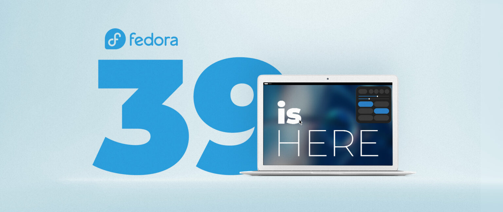
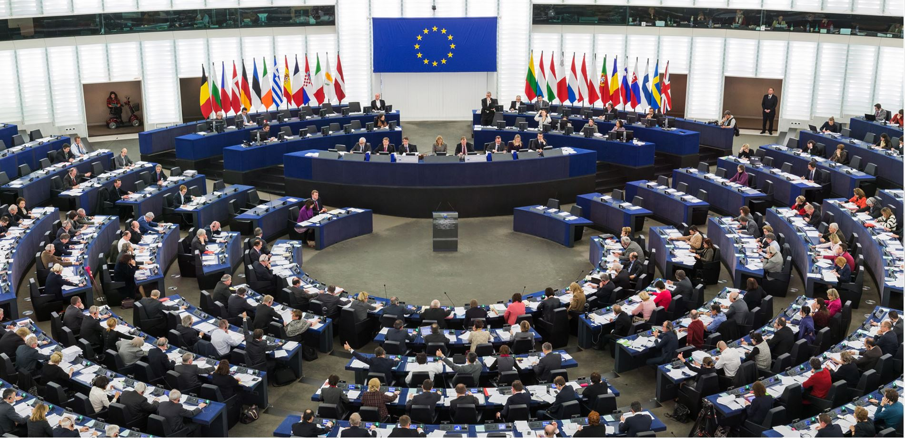

## Today is KDE 6 MegaRelease Day

Plasma 6 artwork.

KDE has decided to release today an alpha of Plasma 6, Frameworks 6, and KDE Gear. Usually, these are different products with different release dates but (given how interdependent KDE 6 development is) the team has decided to release an alpha of everything on the same day (thus the name: MegaRelease).

This release is meant mostly for developers/testers and is expected to be highly unstable. In about a month we will also have a beta release, and we will get the official stable version towards the end of February.

This release is the first one built on the latest version of Qt6, but lacks some of the features in Plasma 6. However, it re-introduces the Desktop Cube effect that was removed a few versions ago and includes initial work for running HDR games. However, we will have to wait for the beta for a definitive feature list.

## Fedora 39 Released with GNOME 45

After multiple delays, Fedora 39 has been released. The Workstation build includes GNOME 45, which features the new dynamic workspace indicator, keyboard backlight toggle in Quick Settings, system info dialog in System Settings, and a new GTK look. Fedora 39 has decided to ship the new GNOME image viewer application as a replacement for _Eye of GNOME_. Fedora 39 brings a colored Bash prompt as well as updates to most system packages (e.g. Python 3.12, Rust 1.73, GCC 13.2, etc). We also have the very latest LibreOffice (7.6) and Firefox (119).

If you're interested in trying out the release, you can find the full announcement here:

It's also worth mentioning that Fedora 40 has officially decided to ship with KDE Plasma 6 and drop X11 entirely, only offering Wayland. The release is expected to be around the end of April 2024.

## OpenAI held KeyNote and Announced GPT-4 Turbo

Artwork by The Verge, see link below.

OpenAI held its first-ever developer conference on Monday. One of the major announcements was "GPT-4 Turbo", which has the benefits of being ⅓ of the price of GPT-4 whilst still accepting image prompts and being able to use browsing/DALLE models to search the web and generate images. Another significant benefit is the much larger context window (a.k.a., how much text the model can "read"), which is now at ~300 pages of text. That's a 4x the previous value.

OpenAI also announced the ability to create custom versions of ChatGPT. This service is called "GPT Builder" and you will be able to add them to a store managed by OpenAI. You will only have to describe how your "GPT" should interact with the user. Of course, all of this will happen by chatting with a "GPT Builder" model.

Another important announcement was about the "Copyright Shield". Apparently, OpenAI is aware that GPT models sometimes output copyrighted text, and they offered to defend their customers and pay the costs incurred if they face legal claims around copyright infringement. This seems to be thought for enterprise users.

## Mozilla warns about "secret" EU law that threatens Internet security

By "secret" law, Mozilla means that certain articles have been reportedly agreed upon during European trialogue negotiations around the eIDAS legislation that happened behind closed-doors, meaning they are not yet publicly available.

To understand the threat behind those articles we require a bit of context. To enable encrypted communication, Browsers rely on Certificate Authorities. They're entities that store, sign, and issue digital certificates. Browsers currently choose which CAs to trust. It's important to note that a malicious CA would be able to intercept all web traffic of browsers that trust them; because of that, browsers are quite careful in trusting them and they have stringent security and safety checks. It has happened in the past that some CAs misbehaved and browsers decided to remove them from the trusted list.

The proposed legislation, according to Mozilla, is rather simple: Article 45 of eIDAS would require browsers to always trust a list of CAs drafted by the European governments. This is particularly risky considering that lots of CAs, including some of those who previously misbehaved, are governmental entities: they'd become simultaneously the suspect, the jury, and the judge in the event of any misbehavior. Obviously, Mozilla would strongly prefer being able to vet those authorities themselves and retain the right to not trust some of them if necessary.

You can read more about it here:

**_Notice: This is an older newsletter; many links and images were lost in the migration process. Click [this link](https://archive.techhut.tv/) for an archive of the old newsletter site_**.
