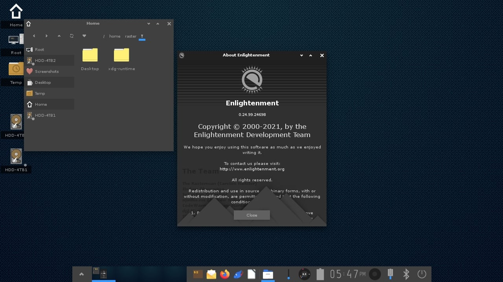

## GNOME development is greatly benefiting from the Sovereign Tech Fund

The amount of work that's currently happening in the GNOME projects thanks to the developers hired using the Sovereign Tech Fund is impressive. Firstly, we have Alice working on adaptive bottom sheet resizing (see above video). This allows bottom sheets to stay centered in bigger applications but to move to the bottom and fill the width on smaller ones (e.g. phone apps). We also have Julian working on making the Quick Setting popup scrollable, since it might not fit in the screen of smaller devices. Georges made sure that applications requesting a screenshot of the screen/of an application will use the UI for GNOME Shell screencasting. And these are just a few UI examples: there are lots of other developers (Adrian, Joanie, Ivan, Philip, Tobias) working on more behind-the-scenes features.

And, of course, there's "normal" development still happening as well. GNOME has just launched a new webpage, [welcome.gnome.org](https://welcome.gnome.org), which explains how the community works and how you can get involved. I strongly recommend going through the full weekly blogpost, as it features all the information that I have condensed here with screenshots and videos, plus all the third-party work that's happening too:

## KDE KWin will have Dynamic Triple Buffering

Both the GNOME and KDE projects now have implementations of Dynamic Triple Buffering, though neither has landed yet. Though I will defer the technical explaination to a window manager expert of your choice, Dynamic Triple Buffering can "ramp up the GPU clocks to deliver better performance", managing to double the fps in some scenarios. The patch on the KWin side was done by developer Xaver Hugl, who also has been working on the implementation of HDR in KDE Plasma.

## Nobara 39 Released, featuring KDE Plasma

Nobara is a Fedora Linux downstream meant for more gamer-focused tasks, and it comes with some extra drivers and gaming consoles patches out of the box. The Nobara team has decided to change the desktop of Fedora Workstation with KDE Plasma, though vanilla GNOME builds are also available. The release updates various of the projects it ships with (OBS Studio, NVIDIA graphic drivers, ...) and adds some SteamDeck OLED patches, CoreCtrl support, patched GLFW for native Wayland support, and more. You can check out the full changelog here:

## Enlightenment releases a new Stable version

It has been two years since the last stable version of the Enlightenment desktop; version 0.26 was released on the 23rd mostly focusing on bug fixing. However, it does contain some new features too: task previews have been made larger, there's support for freedesktop ScreenSaver inhibit API, there's an API to spawn test notifications, and more. You can read the full announcement here:

## Zorin OS 17 Officially Released

I'm happy to report that Zorin OS 17 has officially been released. I had reported on this a few newsletters ago, but I had failed to mention that only the beta had been released, whereas now we do have the stable release.

As a quick summary, most new changes come from new features of projects that Zorin OS relies on: we have the new GNOME Quick settings menu and Overview, better search in the Zorin Menu, the latest GNOME Software application, "advanced" window tiling, the desktop cube plug-in, and more.

A remarkable choice by Zorin was to provide an advanced version of their operating system, Zorin OS Pro, available for a one-time purchase of 48€. This comes with some extra themes and layouts and more pre-installed applications; it's particularly relevant now since all of those who bought Zorin OS 16 Pro will now have to pay for the new version as well, since the one-time purchase does not give you right to claim the successive Pro versions of the OS.

## Firefox to experiment with "MemoryCache" Local AI

"MemoryCache" is a Mozilla Innovation Project to automate the creation of a context-aware AI application based on your browser activity. It would be presented as a Firefox extension allowing for features such as conversations about the visited webpages, the ability to save webpages locally to analyze them offline, and so on.

Currently, the project is a set of tools to "augment" a local copy of privateGTP; developers are still working on adding an UI and additional features around it.

**_Notice: This is an older newsletter; many links and images were lost in the migration process. Click [this link](https://archive.techhut.tv/) for an archive of the old newsletter site_**.
