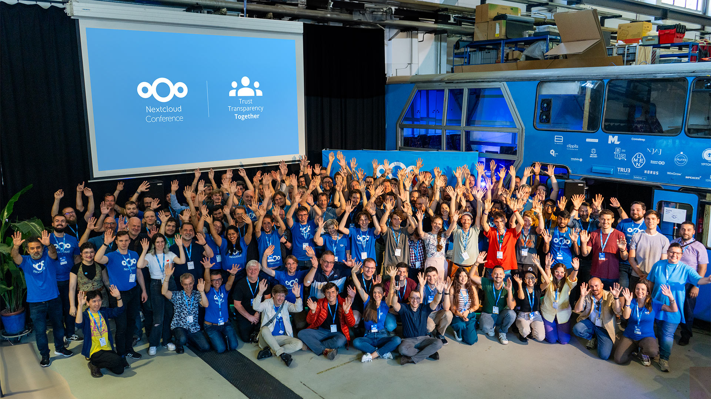

## Nextcloud announces Hub 7

Just a couple of days ago, the Nextcloud project announced a new major version of the project; amongst the new features, we see global search, new AI models to choose from, and more.

I have to say: this "global search" seems to be very well implemented. It performs, you guessed it, a global search throughout all Nextcloud (supported) apps, and you can filter by date and people. Even cooler, though, is the fact that you can select which application to search in, and these include integrations such as GitLab, GitHub, OpenStreetMap, PeerTube, Reddit, and so on; this means you can search through all of those projects as well, all in a single search bar.

There are various improvements on the AI side of things. Firstly, there's a new UI for the Assistant, which has its button in the top bar and allows you to craft your prompt. Nextcloud allows you to switch between different models depending on whether you want an open-source one or not, running locally or not, and so on. Hub 7 brings a couple of new cool integrations: Aleph Alpha, a text-based model that processes your data in Germany, and Stable Diffusion to generate images running locally. You can also make sure the costs of these features are under control by setting the maximum amount of tokens/images each user can generate.

There's a bit of a teaser for the future too: Nextcloud collaborated with the German state of Schleswig-Holstein to bring "Context Chat", which will allow most text-based models (including those running locally) to search through your data and files to provide answers that are tailored for you.

However, there's so much more to it. Nextcloud is a massive project, and I would recommend you to go through the entire official announcement if you use it:

## Framasoft announces Mobilizon v4

What's "Mobilizon", you might ask?

In the previous newsletter, I covered the latest update in the decentralized video system "PeerTube" by Framasoft, and their ongoing fundraiser. This update is similar: the organization is announcing the first "mature" version of the decentralized alternative to Facebook groups and events. Development started in December 2018 thanks to 1,000 donors and v4 now offers private announcements and conversations, the ability to import information from other platforms (such as Facebook and Meetup), and so on.

I quite like this approach to offering multiple services, all part of the Fediverse, that each implements one core functionality of proprietary alternatives instead of creating one big project that's tasked to deal with all of them simultaneously. Thus, you're more than welcome to help Framasoft develop these alternative platforms!

## Austrian Game Studio now supports Krita

You might've heard (even in this newsletter) about large donations and generous support from big game studios towards Godot and Blender, as replacements for Unity. However, this week it is Krita - an open-source graphics editor by KDE - who managed to get a stable supporter. I'm talking about "Broken Rules", a Vienna-based game development studio that has produced games such as Old Man's Journey and Gibbon: Beyond the Trees. This is great news for the project, and it always makes me happy to know that there are for-profit companies out there actively supporting the free and open-source projects they rely on.

## News in AI: Google flops Gemini, EU agrees on AI Act

https://www.youtube.com/embed/UIZAiXYceBI?feature=oembed

Google has recently announced a new AI product, called "Gemini", whose goal is to finally rival - and maybe beat - GTP4. They did this in great fashion: they published a video showing Gemini interacting in real-time with a user based on their voice and a constant camera feed. You can see it above: it's pretty cool.

It's also fake. The model was given much more precise prompts, which were cut out, and Gemini output was also "shortened". Also, the "video feed" part of it was a lie: Gemini was fed screenshots and text prompts, which were then edited together to look like the video you see above. Overall, the news that Google pushed out such a misleading promotional video managed to outnoise the original announcement itself; it does not help that Gemini is not yet publicly available.

And now, for something completely different: EU has reached a provisional agreement on the "AI Act", which would be the first comprehensive set of rules to govern AI. We don't have the final text that was agreed upon - it will be available in the upcoming weeks - but we have a rough idea of what it should feature. (As a bit of a fun fact, I met today MEP Brando Benifei, who negotiated the text on the Parliament side; I briefly asked about the act's final text, but without snagging any private information ;-).

Some uses of AI will be prohibited: social credit scoring systems, emotion recognition at work and education, scraping of facial images, predictive policing, and so on. Other AI uses will be marked as "High-risk" (medical devices, vehicles, recruitment, ...) and will have to abide by a special set of requirements (impact assessments, conformity assessments, ...). All of this is taken from Oliver Patel's cheat sheet.

**_Notice: This is an older newsletter; many links and images were lost in the migration process. Click [this link](https://archive.techhut.tv/) for an archive of the old newsletter site_**.
