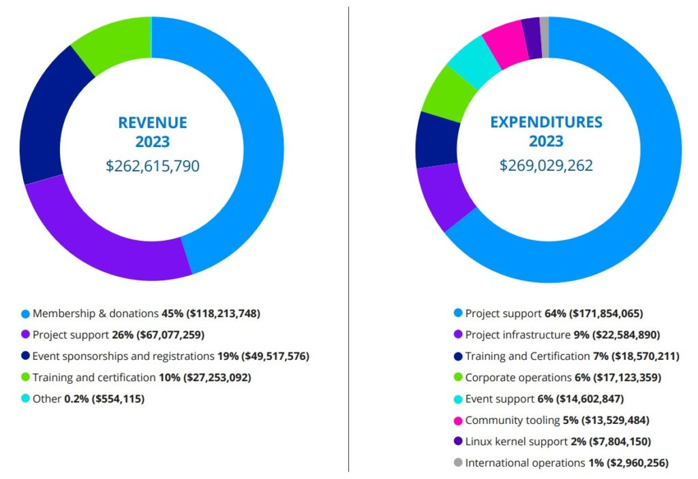

## The Linux Foundation makes $262 Million

The Linux Foundation has published its yearly activity report: let's see if there are interesting insights! From a financial point of view, you might be surprised to see how the LF is not just about Linux, which only directly accounts for 2% budget. Instead, most of the expenditures are all about supporting a wide variety of projects in Cloud, Containers & Virtualization, Networking & Edge, AI, ML, Analytics, Web & Application development, …

Some of these projects are RISC-V Software Ecosystem, Servo (the ex-Mozilla experimental web engine), the Green Software Foundation to promote sustainable software development, OpenSSF, the Open Voice Network (working on conversational AI technologies), Yocto, the Academy Software Foundation, PyTorch, and so many more! The report contains one or two pages on each project so that you can get a more precise idea.

If you're interested in the inner workings of such a big organization, with members such as Microsoft, Oracle, Intel, Huawei, Meta, and more, I'd suggest skimming through the entire report [here](https://www.linuxfoundation.org/hubfs/Reports/2023_lf_annual_report_122123a.pdf?hsLang=en).

## Intel released AI Voice effects for Audacity

Audacity is the most used Open-Source audio editing application. It is thus quite noteworthy that Intel decided to publicly release a set of plug-ins to implement various AI features in it! These are a Noise Suppression tool, a Transcription tool powered by OpenAI's Whisper.cpp, Music Generation, and Music Style Remix based on Stable Diffusion to generate music based on prompts, and Music Separation to split a song into its vocal and instrumental parts. All of these run locally on your PC, even if you're offline.

The project even includes build/install instructions specifically thought for Linux! More specifically, Ubuntu 22.04 LTS. You can check out the announcement from Audacity here:

[https://www.audacityteam.org/blog/openvino-ai-effects/?ref=techhut.tv](https://www.audacityteam.org/blog/openvino-ai-effects/?ref=techhut.tv)

## The Final Text of the Cyber Resilience Act is Not That Bad

This is a photo of inside the European Parliament structure - took by me!

I have covered the Cyber Resilience Act in multiple past newsletters; we now have the final compromise text. The good news is that various of the problems that were in the previous versions seem to have been addressed. Firstly, the CRA now only applies to commercial activity, which is great news for Open Source organizations: sure, you can write Free Software and still have a commercial activity, but many of them don't. Even better: receiving financial support or accepting donations without the intention of making a profit won't be considered commercial activity. Even if you do receive money for development, you shall not be considered a commercial activity if the organization is set up in a way that ensures that all earnings after cost are used to achieve not-for-profit objectives. Finally, if someone is using your project and making money out of it but not you, it's still not a commercial activity on your side of things. These new definitions are much wider compared to the previous versions and much more reasonable; most Open-Source organizations should be safe from them. I would say this is a great win for the FOSS world!

If you're interested in a much deeper analysis of the latest version of the CRA, you will find it here:

[https://berthub.eu/articles/posts/eu-cra-what-does-it-mean-for-open-source/?ref=techhut.tv](https://berthub.eu/articles/posts/eu-cra-what-does-it-mean-for-open-source/?ref=techhut.tv)

## ElementaryOS 7 updates, getting ready for v. 8

Danielle Foré, CEO of Elementary, has published a blogpost illustrating the new changes in the latest version of ElementaryOS 7. Firstly, you can see above the new look for the Tab Overview in the GNOME Web. This overview is a new libadwaita component that will be used consistently throughout different applications. The update also contains various fixes for the Window Manager, and a new version of Network Settings which support Wireguard VPNs.

The full blogpost also contains some insight into what ElementaryOS 8 will bring: there's GTK4 porting work going on, an entire new Dock that has just gotten improved Drag and Drop (plus badges and progressbars), and more.

[https://blog.elementary.io/updates-for-january-2024/?ref=techhut.tv](https://blog.elementary.io/updates-for-january-2024/?ref=techhut.tv)

## The Ideal Monitor Rotation

The above picture is taken by a blogpost published on the 2nd of December by user "sprocketfox". I had initially thought that this was meant to showcase weird Linux functionalities and not much more, but since then the story has been picked up by The Verge and I discovered that there's more thought about it. Though Windows and macOS only allow for 90° and 180° rotation, you can use `xrandr` on Linux to achieve pretty much any transformation.

This means you're effectively free to rotate the monitor however you prefer. Sprocketfox has found that a typical horizontal monitor setup does not work well when reading websites and documents, whereas a 90° rotated setup will have issues displaying videos and movies. After multiple tests with different angles, he has found 22° to be his ideal rotation (pictured above). This is because it provides, on a 21:9 screen ratio, the longest possible line length. The number might be different depending on your screen ratio, but he provides a nice little tool to generate a `xrandr` command given the desired angle and X,Y shifts:

[https://sprocketfox.io/xssfox/2021/12/02/xrandr/?ref=techhut.tv](https://sprocketfox.io/xssfox/2021/12/02/xrandr/?ref=techhut.tv)
