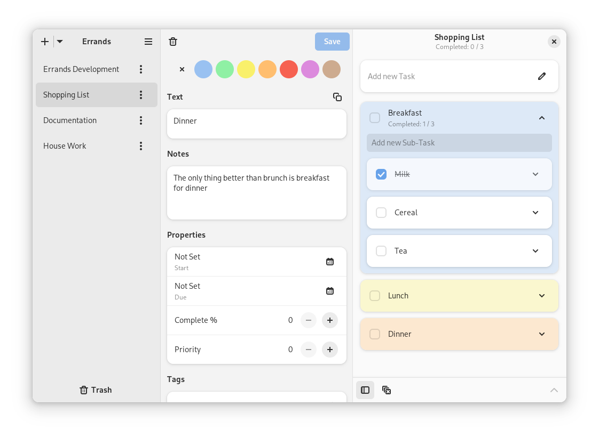

## Linux Marketshare at an all-time high!

Graph by GamingOnLinux (see link below)

I'm happy to report that the Linux market share is at an all-time high according to two reports. Firstly, we have "Statcounter", whose results over time you can see above. The spike in December 2023 is easy to see, but - even better! - it's part of a clear positive trend overall.

We also have the monthly Steam report, which only measures Steam users rather than attempting to extrapolate data for the general population. Because of that, the number is lower (1.97%); nonetheless, it's the highest value it has ever been in years. Again, we can easily see a positive trend most likely driven by SteamDeck sales.

Though it's hard to measure Linux market share correctly, it is certainly a good sign that multiple trackers tell us that more and more people are using our favorite kernel.

[https://www.gamingonlinux.com/2024/01/linux-use-on-steam-ends-2023-with-a-multi-year-high-thanks-steam-deck/?ref=techhut.tv](https://www.gamingonlinux.com/2024/01/linux-use-on-steam-ends-2023-with-a-multi-year-high-thanks-steam-deck/?ref=techhut.tv)

## Scribus publishes a new major version

For those out of the loop, Scribus is the largest open-source desktop publishing app; you can use it for books, newspapers, brochures, posters, and so on. The latest version is 1.6 and brings an official dark mode, new icons, HiDPI-aware canvas rendering, and a new PDF-based output preview. We also get the ability to search throughout all the actions available to the application, a feature that's slowly starting to appear in many Linux applications (as an example, it's Ctrl+Alt+I in KDE apps). We also get two new actions: "Weld" - to combine objects - and "Symbol".

You can check out the full changelog here: [https://9to5linux.com/scribus-1-6-open-source-desktop-publishing-app-released-as-a-major-update?ref=techhut.tv](https://9to5linux.com/scribus-1-6-open-source-desktop-publishing-app-released-as-a-major-update?ref=techhut.tv)

## Does Wayland really break everything?

I would like to tell you above a very nice article written by KDE developer Nate Graham; it's called "Does Wayland really break everything?", and it's a direct reply to the document "Wayland breaks everything!" by one of the core AppImage developers. It explains that Wayland is not meant to be a drop-in replacement for X11; it does not have _more_ issues compared to the status quo, it just has a _different_ set of problems. X11 is a bad platform: it tries to do too much, and it ended being quite buggy, with applications having to fight against it. You can read it here:

https://pointieststick.com/2023/12/26/does-wayland-really-break-everything/?ref=techhut.tv

## VanillaOS 2 Orchid will be released on January 3rd

https://www.youtube.com/embed/pQ_A5lcLIdI?feature=oembed

I have mentioned the in-progress work for VanillaOS 2 multiple times here, and I thought it would be good to cover how the project has finally announced a release date. The new version, codenamed Orchid, was introduced as a concept roughly eight months ago and has been actively developed ever since. However, it required some significant structural changes: even the base, which used to be Ubuntu, was swapped out in favor of Debian. This was done in an extremely modular way, so that you can change entire set of applications and built-in software to make your custom install. It's a very nice concept that's throughoutly illustrated in the original blogpost:

[https://vanillaos.org/blog/article/2023-03-07/vanilla-os-20-orchid---initial-work?ref=techhut.tv](https://vanillaos.org/blog/article/2023-03-07/vanilla-os-20-orchid---initial-work?ref=techhut.tv)

## GNOME To-Do application looks _awesome_, and more!

The latest issue of "This Week in GNOME" contains some very nice now features and releases. The first one, which you can see above, is "Errands", a GNOME Circle to-do application. The latest version comes with multiple task lists - which you can see on the left sidebar - but also: notes, start and due date, priority, tag and percentage of completion for each task. You can also see the existing feature for task colors as well. The new multiple task lists can support the multiple calendar feature for CalDAV and Nextcloud Tasks, and all the above properties will be synced as well. Finally, you can export and import in the standard ".ics" format. All of these features now make Errands a viable option for a main task manager tool!

You can find the above, and many more changes, in the full blogpost here:

[https://thisweek.gnome.org/posts/2023/12/twig-128/?ref=techhut.tv](https://thisweek.gnome.org/posts/2023/12/twig-128/?ref=techhut.tv)
