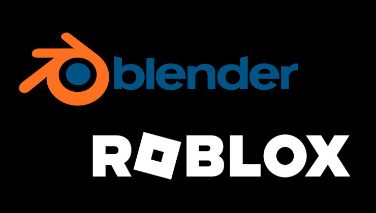

## Roblox now funds Blender development too

It's always nice to see big companies use part of their profits to donate to the open-source projects they rely on. The latest example is Roblox, who decided to become a Corporate Silver Member of the Blender Community, meaning they will be paying at least €12K/year to the project. Other Silver Corporate members are Activision and Steam; whereas Gold and Patrons include Meta, Google, AMD, AWS, Epic, Volkswagen, and Adobe.

The donation is somewhat limited: keep in mind that Blender currently makes €1920K/year through individual and corporate contributions. You can hear more about it in this GamingOnLinux article:

[https://www.gamingonlinux.com/2024/01/roblox-now-helping-fund-blender-development/?ref=techhut.tv](https://www.gamingonlinux.com/2024/01/roblox-now-helping-fund-blender-development/?ref=techhut.tv)

## Two Months of Servo Development

Servo is currently the only project that tries to be an "independent, modular, embeddable web rendering engine"; its development is currently sponsored by the Linux Foundation, and it is slowly resuming after some difficult times.

The team has just published a blogpost covering the improvements achieved in the last two months. It's quite technical, but they seem to be working on CSS sticky positioning and tables support; pass rates for tests are improving significantly, and the example browser now also has "back" and "forward" buttons. You can see all the changes here:

[https://servo.org/blog/2024/01/26/two-months-in-servo/?ref=techhut.tv](https://servo.org/blog/2024/01/26/two-months-in-servo/?ref=techhut.tv)

## Purism Announces First Public Offering

You can now invest in Purism! With as little as $500.00 you can "become an owner in Purism \[...\] to bring our vision to life: a world where technology serves humanity, not the other way around". They have managed to raise $120K so far, and some articles have appeared analyzing the documentation provided by the company. Some things are quite interesting; for example, they've managed to sell $2.4M worth of Librem phones in 2022, and they value themselves at $75M. Their 2022 net income was -$478K, compared to -$2.7M for 2021 (notice the minus signs!). They currently have a total of $21.8M in debt. To be honest, I have no clue whether this is good or bad news for a company like Purism; still, those are interesting figures to read!

[https://puri.sm/posts/purism-announces-first-public-offering-on-startengine/?ref=techhut.tv](https://puri.sm/posts/purism-announces-first-public-offering-on-startengine/?ref=techhut.tv)

Please note that Purism has had noticeable difficulties in delivering its products and has been criticized for "refund scam & delay tactics"; as an example, here's one such video by none other than Louis Rossman:

https://www.youtube.com/embed/-IjUryQOlgk?feature=oembed

## Ubuntu Touch teams released OTA-4

The team behind Ubuntu Touch has released the OTA-4 Focal release today. This includes some very nice new features; as an example, you can now hide the content of notifications when the screen is locked (this is customizable in Security & Privacy settings). You can also disable the "quick settings" button that will still show the notification content.

The lock screen now shows the estimated time to charge the phone (such as: "_4 hours, 25 minutes until full_"). This is also customizable in the Battery settings, as you can see above. In the "Background & Appearance" section you now have a slider to enable/disable dark mode, which previously required a third-party app to change. You can create a customized ringtone for each contact and there's now a pop-up that asks for permission to turn on USB debugging for certain devices. You can read about all of the changes here:

[https://ubports.com/en/blog/ubports-news-1/post/ubuntu-touch-ota-4-focal-release-3916?ref=techhut.tv](https://ubports.com/en/blog/ubports-news-1/post/ubuntu-touch-ota-4-focal-release-3916?ref=techhut.tv)

## EndeavourOS released Galileo Neo

EndeavourOS has recently announced a new version of its "Galileo" release, called "Galileo Neo". This updates various components (the Linux Kernel, the Calamer installer, Firefox, Mesa and Xorg-server, and Nvidia-dkms). There's also "a series of bash script fixes" to "ensure smoother running of Wayland sessions", less composition issues in Plasm Live environments, some fixes related to the installer fetching outdated packages, and better Calamares error handling. You can read more about it here:

[https://linuxiac.com/endeavouros-galileo-neo/?ref=techhut.tv](https://linuxiac.com/endeavouros-galileo-neo/?ref=techhut.tv)

## Flathub Reaches One Million Active Users

Flathub reached one million active users! The value is estimated by looking at the number of downloads of updates to recent version of a certain runtime (the FreeDesktop SDK one, which is quite necessary regardless of the desktop/OS you're using). This is great news for the project, and the developers speculate that the growth comes from the availability of some very popular apps and the inclusion of Flathub as the default store for the SteamDeck. You can read more about this here:

https://9to5linux.com/flathub-now-has-over-one-million-active-flatpak-app-users?ref=techhut.tv#google\_vignette
