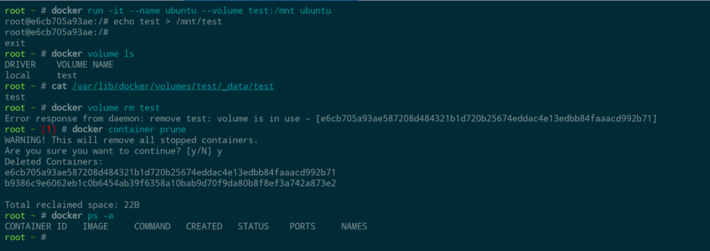

If you've been following recent videos on TechHut, you probably know we're big Docker fans. Whether it's media servers, analytic tools, web services, or download clients, most applications demoed on the channel are running in Docker containers. In this post, we'll go over the why, the how, and some of the basics you need to know to start using Docker and implementing it in your network.

## **What is Docker?**

But first, what is it? Docker is a platform that allows you to work with containers and containerized applications. In the world of software and servers, a container is an isolated environment that generally has a single primary application running inside. Containers allow developers and system administrators to create and deploy reproducible images that are similar to packages from a distro's package manager. However, containers don't rely at all on libraries or dependencies from the host system–they come with everything required to run a given application in a known working configuration.

https://youtu.be/q8MRqdqeh8U

In addition to the dependency benefit, using Docker and containers makes it really simple to deploy and manage services. Since they are isolated from the host system, whether that's bare metal or a VM, containers also make tearing down and cleaning up easy, so they're a great way to experiment and play with various software and services.

## **1\. How to install Docker**

So, how do you get started using Docker? In general, when I use Docker, it's usually integrated into whatever operating system I tend to be using. Currently, in my UNRAID instance, Docker containers are installed through its applications page. When you install it here, you see a lot of variables that we're going to touch on later. Once something is deployed, the applications are managed through the Docker page going forward.

I also have a bare metal Ubuntu server with Docker installed. Installing Docker on an Ubuntu server is pretty easy; you can install it with `apt` using the following commands:

```
sudo apt update
sudo apt install docker.io
```

If you want the most up-to-date version directly from Docker, you can install it from Docker's official repositories for most major distros, including Ubuntu. The instructions are in Docker's documentation, which can be found at [this link](https://docs.docker.com/engine/install/ubuntu/?ref=techhut.tv).

Also, you can check out the "convenience script" for one of the easiest ways to install it on your system. Once that's done, any future updates will also be available through `apt`. Here are the commands to install using the script:

```
curl -fsSL https://get.docker.com -o get-docker.sh
sudo sh get-docker.sh
```

Regardless of how you install Docker on Ubuntu, the Docker systemd service will automatically start and enable. So, Docker will start automatically if the system is ever rebooted. You can check to see if it is running with the following command:

`sudo systemctl status docker`

## **2\. Manage Docker as a non-root user**

One step in the Linux post-installation steps is to manage Docker as a non-root user. To do this, you can add your user account to the `docker` group. This allows you to run Docker commands without using `sudo` them every time. However, it is important to note that adding a user to the `docker` group grants them significant privileges, as Docker allows direct access to the host system. Therefore, exercise caution when granting Docker access to non-root users, as it can potentially lead to security vulnerabilities if not properly managed and monitored.

If you want to do this, run the following commands:

```
sudo groupadd docker
sudo usermod -aG docker $USER
newgrp docker
```

## **3\. Docker basics usage**

After that, a way to test that everything is working properly is to run the "hello world" container like this:


Docker's `run` command takes the name of a Docker image as its argument; in this case `hello-world`. It downloads the image if needed and then creates and runs a container based on that image.

Downloading images is known as "pulling", and you can also pull an image manually using the "pull" command. This can be useful for getting a newer version of an image or initiating the download of a large image for later use.

For example, this command pulls the latest Ubuntu container image:

`docker pull ubuntu`

Then, we can run an Ubuntu container with an interactive session using the `-it` argument. Since the image is already pulled, this container will start automatically.

`docker run -it ubuntu`

This drops into a bash shell running in a fresh Ubuntu container. There's a full Linux file system and basic commands `apt` are available. To exit the container, hit ctrl-d.


The command `docker ps` gives a view of the containers that Docker is currently managing. By default, it only shows running containers, so the Ubuntu container won't show up since it's now stopped. By adding the `-a` flag, all containers will be shown:

`docker ps -a`

One thing to know about containers is that just creating a container doesn't take up any extra space. Docker works by creating layers on top of the image as files are added or modified. Removing old containers is still a nice way to keep things tidy, and that can be done by running `docker rm` with the container ID or the name of the container shown by `docker ps` earlier:

`docker rm <container name>`

When you don’t add a name variable to running a container it will randomly generate one. So, next time I run this Ubuntu container, I’ll be sure to give it a creative name.

Containers can only be removed when they are stopped, so it's sometimes necessary to stop a running container before removing it, using docker stop:

`docker stop <container name>`

If stopping doesn't work, killing the container may also sometimes be necessary:

`docker kill <container name>`

This can be compared to closing out an application versus ending the task in Task Manager.


When we remove the Ubuntu container, the hello-world container remains. We'll cover how to clean up old containers more efficiently later.


## **4\. Volumes and Bind Mounts**

When containers are removed, any changes to them, including stored data, will be lost. In general, containers are considered disposable, and they are expected to be periodically replaced, such as during updates. So, any important data that the container uses or generates should be stored separately.

Docker provides two main mechanisms for storing data persistently on the host system: volumes and bind mounts. Volumes provide a dedicated storage space that can be referenced by name for later use. Bind mounts, on the other hand, are a way of giving a container access to a limited scope of a file system on the host. Bind mounts are what I end up using more than anything, as my main use case is sharing media that I have on the network shares with various docker containers. For example, many of my Arr applications have identical binds to work better together.

First, let us touch on volumes. These can be added to a container by adding the `--volume` flag (or `-v` for short) to a docker run command. Here's an example:

`docker run -it --name ubuntu --volume test:/mnt ubuntu`

This adds a volume named "test" to a new Ubuntu container and mounts it at `/mnt`. Now that we are in the container shell, we can create a file inside the volume:

`echo test > /mnt/test`

After exiting the container shell with ctrl-d, we can see the created volume by listing Docker's volumes with:

`docker volume ls`

By default, Docker stores volumes on your host system in the subdirectories of `/var/lib/docker/volumes`, and we can access the contents like any other file. We'd need `sudo` in this case, if we're not already root:

`sudo cat /var/lib/docker/volumes/test/_data/test`

Anytime we give the same volume name to a future Docker command, it will use the same volume and the same data will be available. The volume can also be removed like this:

`docker volume rm test`

In this case, you can see my volume is in use. You can see the last couple we created if I list all stopped containers. The volume is associated with the Ubuntu container, so I must remove it. I could do a `docker container rm` command but want to remove all my stopped containers. To do this, I can use a prune command.

`docker container prune`

It will ask me if I want to remove them all, so I will say yes. This is a command you want to be careful with, so do keep note of that. The prune command also works with images, volumes, networks, and everything else.



Here's another example of how bind mounts work. In this case, we'll mount the root user's home directory. The invocation is very similar; we just substitute the host path in place of a volume name:

`docker run -it --name ubuntu --volume /root:/mnt ubuntu`

Now, inside the home folder, it will be available under `/mnt` inside the container:

`ls /mnt`

In this case, there's just a copy of the Docker install script I used to install Docker into this instance:


Be careful with bind mounts since any changes the container makes will also be permanently made on the host system. Generally, giving containers access to the minimum necessary set of files and folders from the host is a good idea.

## **5\. Docker Networking**

So now, moving on to the network side. Docker provides a networking stack that can isolate containers from each other and the host system on the network level. By default, containers are added to a default "bridge" network where they can communicate with each other but can't reach the host system or any other devices in the host network.

Ports from specific containers can also be exposed to the outside world. If that port is also open in the host system's firewall, it becomes a service available on the host's network. When using "docker run", a port can be exposed using the -p option like this:

`docker run -p 8080:80 nginx`

The two numbers separated by the colon are port numbers. In this case, port 8080 on the host is mapped to port 80 inside the container. To check that it's working, open a web browser and enter `localhost:8080` in the address bar (or for a remote server, after opening the firewall for Nginx, replace localhost with the server's IP address or domain). If everything is working right, the welcome page from Nginx should load.


Docker's other primary network driver is called "host" networking, which gives containers direct access to the host's network stack. This mode provides some benefits that are especially helpful when high-performance or low-level networking operations are required. It's also conceptually simpler but less flexible and potentially less secure since the containers aren't isolated.

Here's the previous example again with host networking:

`docker run --net=host nginx`

In this case, nginx will bind directly to port 80 on the host, so it should be reachable from a web browser just by typing "localhost" or the host machine's IP address.


## **6\. Docker Compose**

Now, when you go to spin up a container, you may see normal Docker commands like this in their documentation, but you may see instructions for Docker Compose instead. Compose is primarily a system for orchestrating groups of containers that work together, but it can also be used with single containers.

For example, a web application might include a database and a web server. Each can run in separate containers as part of a single Docker Compose deployment managed as a single unit.

When using Compose, containers in the same deployment by default share a single Docker bridge mode network that's separate from the usual default network. Each container gets an IP address in a subnet unique to that network. Docker also provides a DNS system so containers can resolve the IP address of other containers using their container name.

Each group of containers managed by compose is defined in a `docker-compose.yaml` file. In the simplest form, this file specifies names for each container and which image they use. Networking, volumes, and many other options can also be specified to control the containers' behavior and how they work together.

Many Docker Compose files are available online, and they are easy to get started with. Just download the `docker-compose.yaml` file, navigate to the folder where you saved the yaml file, and after any necessary edits, run:

`docker compose up -d`

This single command will set up everything defined in the yaml file. The `-d` flag tells Docker to run the deployment in the background and return control of the shell. Logs for the containers won't be printed to the console in this case, but they can be accessed with:

`docker compose logs`

To stop a Compose deployment later, just run:

`docker compose down`

This will stop and remove all of the containers. By default, the data stored in volumes is retained. You can also remove the volume data by adding the `-v` flag:

`docker compose down -v`

## **7\. Updating Containers**

The basic method for updating a container is to pull a newer version of the container image, remove the container, and then start a new container using the new image version. This is one reason storing data inside volumes is important—it's the only way data can survive this process.

Watchtower is a service for keeping containers up to date, which runs inside a container. It detects whenever a new version is available and automatically replaces containers with the new version using the same settings they were created with. It's very simple to set up and works great in our experience. See the [Watchtower site](https://containrrr.dev/watchtower/?ref=techhut.tv) for more details.

## **Conclusion**

Now you should have a good base-level knowledge of Docker, which is necessary to start managing applications and services. If you want to dive deeper, there are many great videos and articles out there with great information. The official Docker documentation is also an excellent resource if you want to learn more.

Learn more about Docker Scout: [https://dockr.ly/4ceMO2I](https://dockr.ly/4ceMO2I)

Download Docker Desktop: [https://dockr.ly/4efYxjh](https://dockr.ly/4efYxjh)
