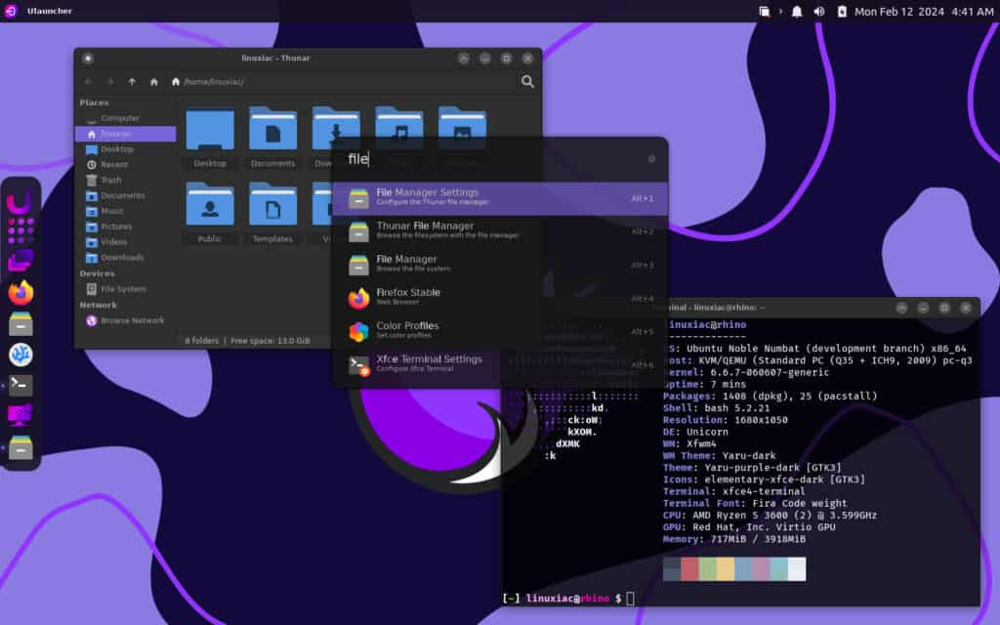

## Mozilla Corporation CEO, Mitchell Baker, steps down

**Mitchell Baker**, ex-Mozilla Corporation CEO, was one of the first employees of the Netscape legal department in 1994. She worked on both the Netscape Public License and the Mozilla Public License and became the general manager of `mozilla.org`. She was later fired, in 2001, but kept her manager role as a volunteer.

In 2003, America Online shut down the Netscape browser division and scaled back its involvement in Mozilla. As a direct result, the **Mozilla Foundation** - a non-profit legally representing the community - was founded. Baker was essential to the process and she became the President of the newly-formed organization. She was also appointed to the five-person **Board of Directors**.

Two years later, the Mozilla community also decided to found the **Mozilla Corporation**, a for-profit subsidiary of the Foundation. Baker was named CEO of this new entity and was also awarded a seat in the Board of Directors of this entity too, leading her to have core roles in both organizations. In 2008 she stepped down as CEO but was reinstated in 2020. She's now stepping down again. She retains all her other current roles.

Her leadership has been criticized mostly for her quickly increasing salary while Firefox's market share was dropping quickly. Her pay received a 400% increase in 2018, it reached $3 million in 2020 and $7 million in 2022. In 2020 the Mozilla Corporation laid off roughly 250 employees, leading to the end of projects such as Servo (which is now part of the Linux Foundation instead). Baker blamed this on the COVID-19 crisis, though revenue had risen to record highs in 2019.

In 2021, **Laura Chambers** joined the Board of Directors of the Mozilla Corporation. She had just became the CEO of Willow Innovations, a company producing wearable breast pumps in Mountain View. She is stepping in as the new Mozilla Corporation CEO, though she said she does not seek a permanent role as she'd like to move back to Australia later this year for family reasons.

The change in leadership comes with a change in vision. Chambers has been tasked with "refining" the company strategy and strengthening their core product, Firefox. The company has already laid off 60 employees, mostly from the development team. Affected products seem to be VPN, Relay, and the Online Footprint Scrubber (whose Plus version was announced just last week). The new goal is to bring trustworthy AI into Firefox through the Pockets, Content, and AI teams.

You can read the official announcement here: [https://blog.mozilla.org/en/mozilla/a-new-chapter-for-mozilla-laura-chambers-expanded-role/?ref=techhut.tv](https://blog.mozilla.org/en/mozilla/a-new-chapter-for-mozilla-laura-chambers-expanded-role/?ref=techhut.tv)

## Taliban shut down queer Mastodon instance

Did you know there was a queer Mastodon instance at the `queer.af` address? I'm actually a big fan of creatively using addresses meant for countries to express a different meaning; as an example, I tried - for a long time - to get my hands on the Venezuelan `niccolo.ve`, before settling on the even weirder `nicco.love`. As a fun fact, `.tv` was originally meant for the small nation `Tuvalu`, which made enough money out of it to fund its entry in the United Nations in 2020.

However, `.af` is handled by Afghanistan, currently governed by the not-very-LGBT-friendly Taliban. Erin Shepherd, administrator of the instance and key ActivityPub developer, already wanted to shut down the site in April; he certainly did not expect to receive an email from the Afghanistan Ministry of Communications and IT shutting down the domain.

[https://www.theverge.com/2024/2/12/24071036/queer-af-mastodon-taliban-shut-down-afghanistan?ref=techhut.tv](https://www.theverge.com/2024/2/12/24071036/queer-af-mastodon-taliban-shut-down-afghanistan?ref=techhut.tv)

## A rather exciting Open Public Transport Routing story

Fun fact: to write this newsletter, I skim-read through quite a lot blogposts! There are a few that I mostly follow "just in case", as they usually provide developer-oriented content that's too technical or niche for a wider audience. I expected Volker Krause's (KDE developer) blogpost titled "FOSDEM 2024 and Open Public Transport Routing" to be in that category.

I was wrong!

The issue is: currently, there's no Open-Source solution to check for public transport routes. That service is usually offered by transport operators themselves or companies like Google. We need freely available schedule data, a FOSS routing engine, and someone to run all of that.

We already have standards to exchange schedules and, in the EU, there's even regulation making it mandatory. We also have three FOSS routing engines: OTP, Navitia, and MOTIS. OTP is used nationwide in Finland and Norway, and Navitia also covers many areas around the world. In 2023, however, Navitian dropped much of its coverage from their free services and there were many discussion at 37C3 "showing a growing demand for a proper alternative".

This was the somewhat-boring part! From now on, the blogpost becomes a day-to-day chronicle about different people coming together and finding volunteers and hardware to start this alternative project. It's quite exciting to read, in my humble opinion, and you can do so here:

[https://www.volkerkrause.eu/2024/02/10/fosdem-2024-open-public-transport-routing.html?ref=techhut.tv](https://www.volkerkrause.eu/2024/02/10/fosdem-2024-open-public-transport-routing.html?ref=techhut.tv)

## Bazzite Linux adds support for Lenovo Legion Go

Bazzite Linux is a "custom image built on Fedora Atomic technology that brings the best of Linux gaming to all of your devices (yep, even your favorite handheld)". They managed to achieve full feature completion for the Lenovo Legion Go device, pictured above, so that you can now run Linux on it! Though my hearth is with the SteamDeck, it's awesome to see the list of handheld supported devices grow.

[https://www.gamingonlinux.com/2024/02/bazzite-linux-adds-support-for-the-lenovo-legion-go-handheld/?ref=techhut.tv](https://www.gamingonlinux.com/2024/02/bazzite-linux-adds-support-for-the-lenovo-legion-go-handheld/?ref=techhut.tv)

## Rhino Linux developers take a break

I just wanted to quickly praise the Rhino linux project for openly discuss about import issues such as developer burnout, mental health and its effect on the project. They have thus decided to temporarily pause the development to "ensure the sustainability of the Rhino Linux project". I would recommend giving a read to their announcement:

[https://rhinolinux.org/news-11.html?ref=techhut.tv](https://rhinolinux.org/news-11.html?ref=techhut.tv)
