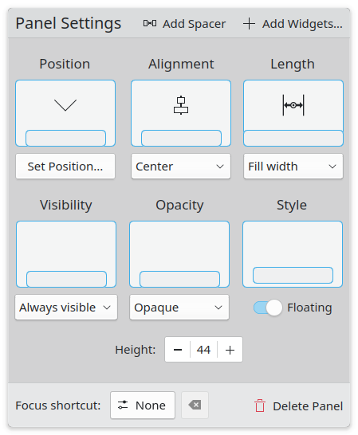
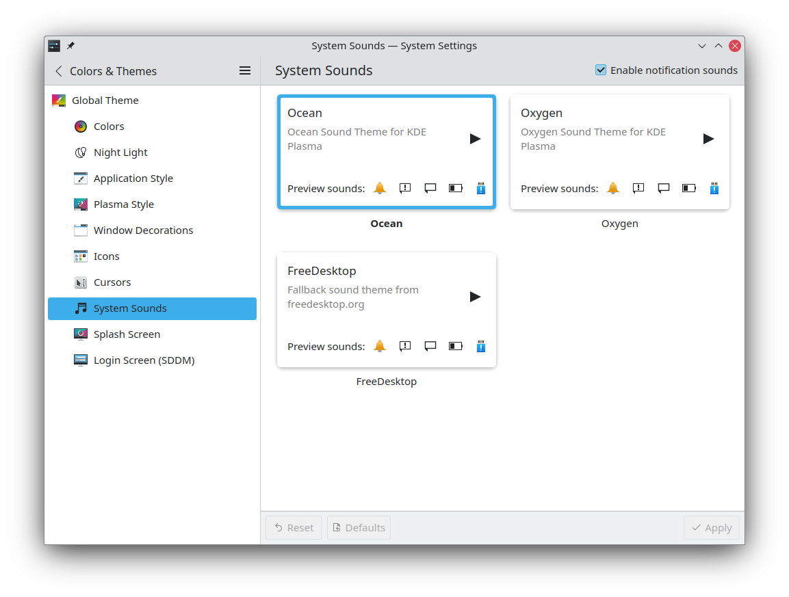

## KDE MegaRelease 6 Is Out!

The KDE MegaRelease 6 includes releases of Plasma 6, KDE Frameworks 6, and multiple KDE applications ported to Qt6. It's the biggest release of KDE software we've seen in multiple years, and it has been ongoing work since 2019. On a personal note, I've been working on this for years too, and I'm extremely excited to share the new features with you.

### Qt6 and Wayland by default

KDE Plasma 6 now uses Wayland by default, thanks to the work of the Wayland team who managed to fix all blockers and many of the existing issues with that session. Of course, KDE 6 software is also based on Qt6, which brings performance improvements, extra stability, and bugfixes.

### A New Fancy-Looking Overview

This feature was initially developed by me around March, and GNOME's Overview directly inspires it. It merges the overview of a single desktop and of all desktops together in the same effect, it moves around the desktop with 1:1 animations, it allows to switch between desktops through gestures whilst in the Overview, it has a nice blurred-out backdrop and more.

### Initial HDR support

Thanks to the work of KDE Developer Xaver, KDE Plasma now has an option to toggle HDR in external monitors that support it, and it can play HDR games. Other use cases are also supported, such as playing HDR videos, but they still require some command-line hacking.

### Plasma Panels: Now Floating, New Settings, Dodge Windows

All panels are now floating by default. If you dislike that, you can still turn it off in their settings! And, if you do, you'll notice they have been completely redesigned. Instead of being a thin horizontal bar full of buttons, we now have a dialog with clearly labeled options, each of which has its own graphical representation. There's a new feature too; it's called "Dodge Windows" and it allows the panel to only auto-hide when it's directly above a window.

### A Breeze Redesign

All Breeze applications received a significant visual redesign in their frames; we no longer have _all_ views contained in a blue frame, but rather they will always extend to the window borders or be separated with other elements by a single-pixel line. This builds on top of hundred of Breeze style improvements that have been implemented in the latest versions of Plasma 5.

### The Cube Is Back

The beloved "Cube" effect is back in Plasma 6. Rejoice!

### Complete System Settings Re-Organization

The "System Settings" application has received a complete re-organization; we've been discussing how to improve it since years ago and I'm particularly happy to see this work included in Plasma 6. There are some graphical improvements too, with some options being moved from the footer to the header area, allowing for a nicer window.

There's also a completely new Setting page (after all, we're KDE, we can't release a major version without a new setting page). It's called "System Sounds" and it allows you to switch between the included sound themes; we've even designed a new one from scratch, called "Ocean", to replace Oxygen.

There's also a new setting page that allows you to change the wallpaper; you could previously do that only by right-clicking the desktop, now you can find that in Settings too.

### A New Plasma Mobile Homescreen

Plasma Mobile 6 comes with a completely rewritten homescreen where you can drag and drop application icons around, create folders, and even add widgets in an Android-like fashion. It's completely customizable and should be much more stable compared to the previous homescreen. There's also a welcome screen on first launch that guides you through the setup of the system.

### Kdenlive: External Editing of Clips

On the applications side of things, the Kdenlive release includes quite some features; you can now export the video or audio of a certain clip and then edit it externally (e.g. using Audacity for audio); all changes will automatically be reflected in the timeline of your project. You can now create multiple tracks of subtitles (e.g. for different languages), import and export subtitles, and more. Finally, you can now use various interpolations between keyframes, such as bounce and exponential.

### KDE Slimbook V

This is not directly related to the KDE MegaRelease 6, but let's keep everything KDE-related in the same segment! Slimbook and KDE jointly announced a collaboration for a newer model of the KDE Slimbook, which will feature Plasma 6 out of the box. Here are the specs:

> AMD Ryzen 7 7840HS
> Radeon 780M integrated graphics
> 16-inch IPS LED display with 2560 by 1600 resolution at 165 Hz and sRGB 100%
> Up to 8 TB storage NVME PCIE 4.0
> Up to 64GB 5600 MHz non-soldered memory
> 720p webcam with physical switch
> 68‑watt‑hour battery

### ... and more!

These were just a few of the new features in the MegaRelease, but there's so much more. If you're interested you can find a much more extensive list at the following links:

[https://kde.org/announcements/megarelease/6/?ref=techhut.tv](https://kde.org/announcements/megarelease/6/?ref=techhut.tv)

## Tails 6.0 Out

In a very lucky coincidence, the Tails project has also just announced its 6.0 major version! Tails is a "portable" distribution, meaning it's meant to be run live from a USB stick, leaving no trace of itself on the computer it's run on. The goal is to avoid any kind of surveillance, censorship, targeted advertising, or viruses.

Tails 6.0 was rebased on the latest Debian, codenamed Bookworm, and it ships with GNOME 43 out of the box. It comes with extra functionalities to check for possible data loss, it automatically mounts external devices (such as other USB sticks) and updates the built-in software it ships (such as Tor Browser, Electrum, and KeePassXC).

[https://linuxiac.com/tails-6-0-is-out-with-a-host-of-improvements/?ref=techhut.tv](https://linuxiac.com/tails-6-0-is-out-with-a-host-of-improvements/?ref=techhut.tv)

## LXQt 2.0 will come with Qt6 and Wayland

The team behind LXQt has published an update on the development of the next major version of the project. The two main goals are to port as many components as possible to Qt6 and implement Wayland support. LxQt 2.0.0 is expected to be released in April, and it will also bring some nice UI changes, such as the new application menu that you can see in the screenshot above. If you're interested in reading some more technical details, you can find them here:

[https://lxqt-project.org/blog/2024/02/15/qt-6-and-wayland/?ref=techhut.tv](https://lxqt-project.org/blog/2024/02/15/qt-6-and-wayland/?ref=techhut.tv)
