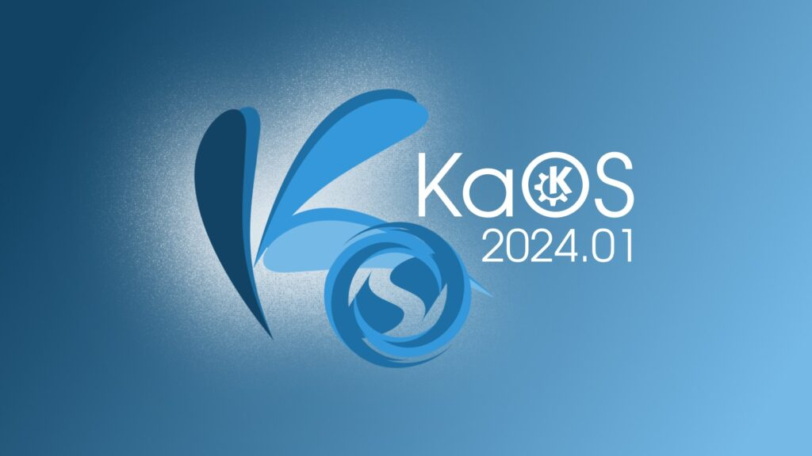
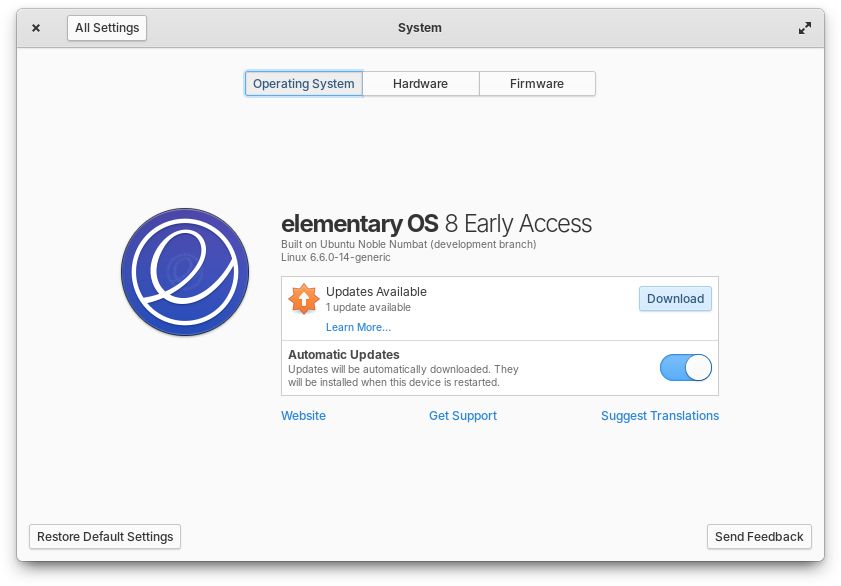

## You can try out Plasma 6 with KaOS!

KaOS is a rolling distribution that focuses on providing a great KDE Plasma experience. The team has just released a new release that replaced the good old Plasma 5 with the 6 version. If you're a bit confused (Plasma 6 has already been published and I didn't tell you about it?), remember that this is based on "RC2", the second beta of the KDE MegaRelease. The stable version is still planned at the end of February. We can also look at the rest of the components in KaOS 2024.01:

> Under the hood, KaOS 2024.01 is powered by Linux kernel 6.6.14. The distro introduces significant system base enhancements, including FFmpeg 6, a fully updated Boost and ICU stack, LLVM/Clang 17.0.6, Systemd 254.9, Python 3.10.13, Util-Linux 2.39.3, IWD 2.13, MariaDB 11, and PostgreSQL 16.

You can read more about this release here:

[https://linuxiac.com/kaos-2024-delivers-a-pure-plasma-6-experience/?ref=techhut.tv](https://linuxiac.com/kaos-2024-delivers-a-pure-plasma-6-experience/?ref=techhut.tv)

## Also, you can try out ElementaryOS 8!

Great news: _also_ in Early Access is the new major release of elementaryOS. Interestingly enough, to try it out you are required to become a supporting member of the project, which is quite affordable (starting at $1/mo). Anyway: what's new?

There's a new mechanism for system updates in System Settings, which you can see in the above screenshots; it should be "super fast" and include an option to download new updates automatically. The search function in Settings has also been improved, now providing more relevant results _and_ the title of the section they are matched in. The Shortcut Settings page now has a new "Keyboard Layout" section to change the layout upon pressing a certain shortcut, plus the ability to change between emoji and Unicode typing modes.

The Multitasking View has received some design updates (fun fact: the same applies with Plasma 6 above!). As an example, your wallpaper will also be used as a background, and it's going to be _blurred._ It simply looks awesome:

If you like what you see, you can check out more here:

[https://blog.elementary.io/updates-for-february-2024/?ref=techhut.tv](https://blog.elementary.io/updates-for-february-2024/?ref=techhut.tv)

## Mozilla introduces privacy-oriented paid subscription service

A GIF!

Mozilla has been providing a service, called Mozilla Monitor (previously Firefox Monitor), that notifies you when your email has been part of a breach. This is completely free, and quite useful as well!

Today, Mozilla has announced a "Plus" version of this service that also offers automatic data removal and continuous monitoring of (any) of your exposed personal information. This subscription is somewhat expensive, starting at $8.99/month (between this and elementaryOS, I already sold you $10/month worth of subscriptions!).

Mozilla Monitor will send data removal requests on your behalf and check every month to make sure the data stays off the data broker sites. As you can see above, there's a nice graph explaining the steps they are taking and reminding you that they are worth your money.

You can read more about it here: [https://blog.mozilla.org/en/mozilla/introducing-mozilla-monitor-plus-a-new-tool-to-automatically-remove-your-personal-information-from-data-broker-sites/?ref=techhut.tv](https://blog.mozilla.org/en/mozilla/introducing-mozilla-monitor-plus-a-new-tool-to-automatically-remove-your-personal-information-from-data-broker-sites/?ref=techhut.tv)

## Bluesky is now Open to Everyone!

You can now sign up to Bluesky! The Twitter (/Mastodon) alternative had always been invite-only, managing to reach three million accounts in the first year-and-something. Now, you can just go to bsky.social and sign up.

Though I have criticized Bluesky in the past (even in this very newsletter), I have to admit I particularly admire how they decided to announce this change. They teamed up with Davis Bickford ("an artist on the \[Bluesky\] network"), who drew a short comic explaining why this social network is cool and why you should join it. You can see one panel above, but I'd suggest giving a brief look to the entire thing here:

[https://bsky.social/about/blog/02-06-2024-join-bluesky?ref=techhut.tv](https://bsky.social/about/blog/02-06-2024-join-bluesky?ref=techhut.tv)

## Lots of Kubuntu 24.04 LTS News!

Firstly: Scarlett Gately Moore has been hired to work part-time on Kubuntu! This name might not say anything to you, but Scarlett has been contributing to the KDE world and it's very nice to see people remunerated for their work. I'll immediately plug the blogpost announcing this:

https://www.scarlettgatelymoore.dev/some-exciting-news-kubuntu-im-back/?ref=techhut.tv

As a result, we have some extra news on this release. Firstly, it won't feature Plasma 6: even though it will go out a couple of months after the MegaRelease, there was a unanimous agreement in the Kubuntu Council to stay on Plasma 5 for the time being:

> _“I’m the leader of Ubuntu Studio, which also uses Plasma, and would’ve had something to say about any last-minute (at this point) transitions with a lot of panic in my voice”_, Eickmeyer adds.

https://www.omgubuntu.co.uk/2024/02/kubuntu-24-04-wont-use-kde-plasma-6?ref=techhut.tv

Finally, the 24.04 LTS release will switch to the Calamares universal graphical installer. Previously, Lubuntu was the only Ubuntu derivative using it. However, this means that the Ubuntu Desktop Installer will be ditched! The two applications provide fairly different experiences, with some bugs on both sides, so this does have an impact on the first setup experience.

https://9to5linux.com/kubuntu-24-04-lts-is-switching-to-the-calamares-installer-by-default?ref=techhut.tv
