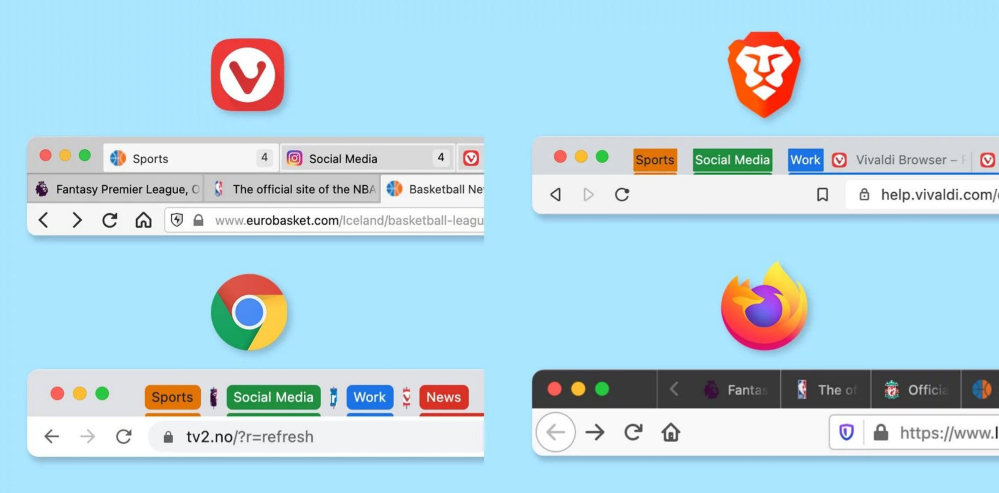

## COSMIC's getting close to Alpha!

Yes, I said that last month too, but it's gradual work that will take some time! The release is currently planned around late May, following a delay due to the decision to include some core applications in the alpha too.

Meanwhile, we have some new goodies to talk about! First of all, the team has finished hybrid graphics support. The Battery applet will tell you when the GPU is being used, and which applications are using it so that you can close them to save battery life. You can also now minimize and restore windows (take than, GNOME!).

The team has finished work on the tiling applet. This includes buttons to quickly toggle tiling on/off, select affected workspaces, and select the behavior of new workspaces. There's a list of the shortcuts you need to know, and a switch to toggle the active hint.

You can read more about this here:

[https://blog.system76.com/post/cosmic-more-alpha-more-fun](https://blog.system76.com/post/cosmic-more-alpha-more-fun)

## Yes, Linux did hit 4% on StatCounter

…but does it matter? I've seen many articles talking about a 25% increase in market share compared to just ~3 months ago, which is correct, assuming that StatCounter is representative of real-world usage. And, yes, this is the first time Linux has exceeded the 4% mark. It is my duty to remind you, though, that Linux marketshare has always been fluctuating around 3%; it has risen to ~3.8% since a few months ago and is overall quite stable. Other OSs have very volatile shares: macOS dropped 5% in December and ChromeOS fell from 4% to 2% in a few months. Thus, always take these statistics with a grain of salt! It's a bit soon to start talking about the Year of Linux on the desktop…

[https://linux.slashdot.org/story/24/03/04/2159239/linux-passes-4-desktop-market-share?utm\_source=rss1.0mainlinkanon&utm\_medium=feed](https://linux.slashdot.org/story/24/03/04/2159239/linux-passes-4-desktop-market-share?utm_source=rss1.0mainlinkanon&utm_medium=feed)

## VLC has been downloaded more than 5000000000 times

That's 5 Billion, if you were wondering. Quite a milestone!

So, what's next for the project? Well, firstly, the team is working on bringing VLC to the Apple Vision Pro. According to Kempf, Videolan president, there's a not-published-yet version of the application already running on that environment. Another new area of work is WebAssembly, which allows to run bytecode-compiled applications directly within a web browser. I'm not sure what this would mean for the project: maybe you'd be able to embed VLC within a webpage to play a video? Or maybe you will be able to play local videos through a remote build of VLC?

The team is also working on a big rewrite happening behind the scenes, called Version 4.0. The exact quote as reported by Lowpass (see below) is: "We've been rewriting the whole core of VLC". Sounds exciting!

[https://www.lowpass.cc/p/vlc-five-billion-downloads-vision-pro-app](https://www.lowpass.cc/p/vlc-five-billion-downloads-vision-pro-app)

## Yuzu (Open-Source emulator of the Nintendo Switch) to pay $2.4 million to Nintendo

_Ouch_!

Nintendo had filed a lawsuit against the Yuzu team on the 26th of February, and it sounds like the project decided to settle the dispute by paying a $2.4 million fee to Nintendo and shutting down its operations. Even worse, Citra, an Open-Source Nintendo 3DS emulator, has also been discontinued as a result of these events.

A joint statement has been shared by both teams, and it sounds rather unbelievable (as in, it's probably written by Nintendo lawyers); it contains sentences such as "yuzu and its team have always been against piracy", "we have been deeply disappointed when users have used our software to leak game content", "we believe that piracy of video games and on video game consoles should end", and even "We hope our actions will be a small step toward ending piracy of all creators’ works", where "our actions" refer to shutting down operations (with, ehm, a $2.4M fine to pay too).

[https://www.gamingonlinux.com/2024/03/yuzu-agrees-to-pay-nintendo-2-4-million-and-will-entirely-shut-down/?ref=techhut.tv](https://www.gamingonlinux.com/2024/03/yuzu-agrees-to-pay-nintendo-2-4-million-and-will-entirely-shut-down/?ref=techhut.tv)

# Mozilla’s New CEO Prioritizes Tab Grouping Feature in Firefox

In the picture above, you can see how tab grouping works in other browsers. The idea is fairly simple: you should be able to create "groups" to organize tabs into. There used to be a similar feature, called "Panorama", but it was eventually discontinued; later on, third-party add-ons were created to handle the groups. It seems like 3000 users voted to bring the feature back, and the new Mozilla CEO has appointed a dedicated team working on this. You can read more about this in the article below, though there's quite a lot of clearly ChatGPT-generated text in it too:

https://debugpointnews.com/firefox-tab-grouping/?ref=techhut.tv
