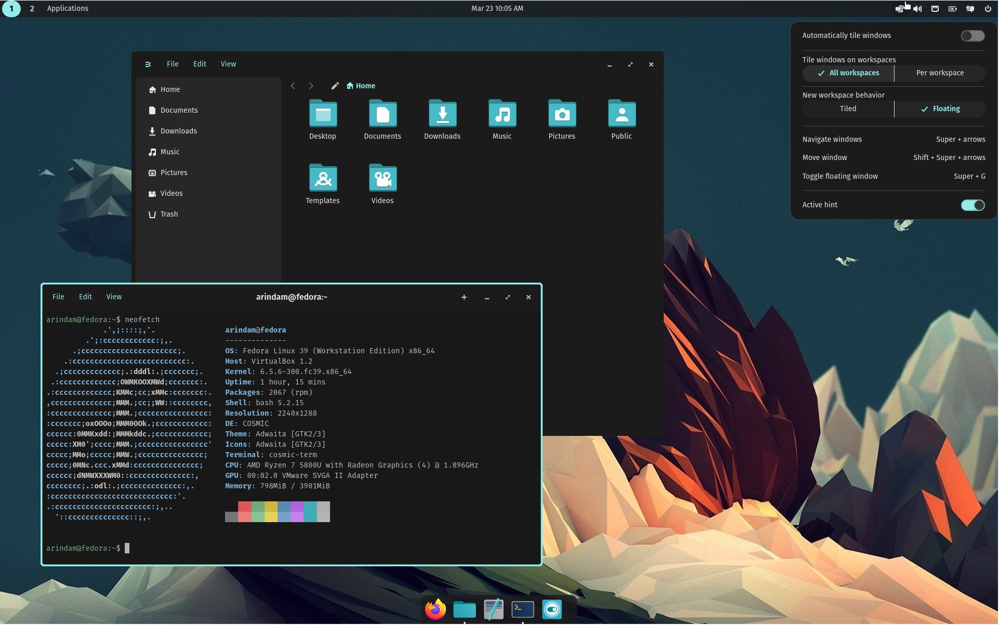
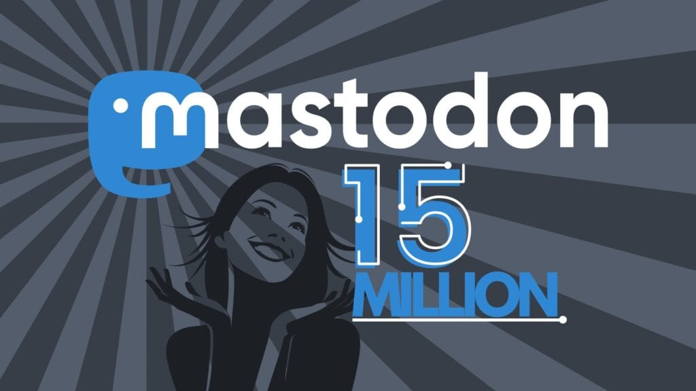

## GNOME 46 Released!

This version is codenamed "Kathmandu", the Capital city of Nepal. What's new?

Firstly, there's a new global search function within the Files applications. You enter a query and see all matches from the "configured search locations", meaning that the exact folders to search in will be customizable. This will also search within the file contents and allow filtering based on file type and modification date. Even better, you will be able to search within the Files preferences to find specific settings.

Whenever you copy or move many files in the Files app, a progress bar will appear at the bottom left of the application; clicking on it will reveal a dialog with full information about the running operation. Files should also be much faster when switching between list and grid modes, or when displaying a lot of files.

GNOME Online Accounts also improved (which is impressive, considering that other desktops - such as KDE Plasma - still mostly lack that feature entirely). There's now support for Microsoft OneDrive, which will let you browse your OneDrive remote files directly from the Files sidebar. The settings page was completely redesigned, there's a new WebDAV account type for integrating online contacts, calendars, and files, and the default web browser will now be used to sign into those accounts (allowing for a wider range of authentication methods).

Lots of the above was implemented thanks to the Sovereign Tech Fund, which awarded the GNOME project with $1M to spend on features such as Online Accounts.

There's a new Settings page that exposes Touchpad settings (such as: configuring how right clicks are performed with a touchpad, and whether the touchpad should be disabled while typing). Generally speaking, multiple settings pages have been redesigned and their order and navigation have been tweaked to make them more intuitive.

Also sponsored by the STF, and Igalia, we have significant Accessibility improvements; there's a new sleep mode to temporarily disable the screen reader Orca, new commands to make Orca report on the system status (battery, CPU, memory usage, …), much better table navigation through keyboard navigation, and even experimental support for Spiel, an "exciting next generation speech synthesis API" according to the GNOME release.

The look and layout of notifications in the clock applet have been improved (see the above screenshot) and it's now possible to expand notifications in the list to use their actions. The on-screen keyboard gained automatic capitalization and new keyboard layouts when entering phone numbers, email addresses, and URLs; also, tap-to-click has been enabled for a "more intuitive" touch experience.

GNOME 46 also comes with a variety of small improvements to the built-in application suite, and new applications joining the Circle initiative (called Errands, Letterpress, Switcheroo, Decibels, Fretboard, Graphs, and Railway). You can read the entire announcement in the link below; I particularly like the wording of the very last sentence:

> GNOME is a free and open project: if you want to join us, [you can](https://welcome.gnome.org/).

[https://release.gnome.org/46/?ref=techhut.tv](https://release.gnome.org/46/?ref=techhut.tv)

## KDE Plasma Global Themes can wipe your data (and worse)

8 days ago, a user called JeansenVaars installed a Global Theme called "Grey Layout" from the KDE Store. This, as (almost) all of the content on that store, was a mostly-unreviewed and user-submitted theme. Global Themes are incredibly powerful, being able to change not only the look but the behavior of your system too; to do that, they are able to run arbitrary code on your system.

This particular theme, Grey Layout, re-used chunks of code of another theme (that's fine!) which, amongst other things, created and deleted a configuration directory. Due to what we can safely assume is a mistake by its creator, this config directory was not set in Grey Layout; as a result, installing the theme would wipe out the config directory, which the theme thought to be "~". Yes, it deleted all user data.

The theme was immediately pulled off the store. As this is the first time something like this has happened, a conversation started among KDE developers on what can be done to prevent further issues like this. In the short term, we would like to reduce the capabilities of Global Themes to make sure they don't run any arbitrary code but only change the look of the elements. We'd also like to improve the warning message in the KDE store to more clearly communicate which KDE addons can be safely installed, and which ones you should be careful with since they could run arbitrary code. Long term, there are conversations around manual moderation of all submitter addons and whether that's feasible, maybe moving the KDE store away from the KDE domain, and more.

You can read more about this here:

[http://blog.davidedmundson.co.uk/blog/kde-store-content/?ref=techhut.tv](http://blog.davidedmundson.co.uk/blog/kde-store-content/?ref=techhut.tv)

## First looks at COSMIC development version!

Over the last couple of weeks, I've started to see the first articles on how to manually install/build the new COSMIC desktop environment on Fedora. This is extremely exciting: we've been covering COSMIC for almost a year without ever being able to try it!

This review, from DebugPoint, highlights the most important components. There's also a list of settings, from the super key action to auto-hide in panels (and much, much, much more). I'd strongly suggest you check it out, even if to check the (many) pretty screenshots:

https://www.debugpoint.com/cosmic-desktop-first-look/?ref=techhut.tv

## Mastodon userbase reaches 15 Million users!

Last week, Erik Uden (admin of mastodon.de) posted a message clearly stating that Mastodon has 15M users. He mentioned that this number is probably inaccurate, given Mastodon's decentralized nature, but "this is still something to celebrate" (I agree!). The Mastodon Users bot reflects that, showing a total of 15,022,014 users at the time of writing.

[https://linuxiac.com/mastodons-user-base-skyrockets-to-15-million/?ref=techhut.tv](https://linuxiac.com/mastodons-user-base-skyrockets-to-15-million/?ref=techhut.tv)

## Inkscape development switches to GTK4

The Inkscape project has announced (on Mastodon!) that development has now switched to the latest version of the GTK toolkit. As they mention, this is a significant architectural change that will probably take some time to fully process, but it should also bring improvements to the application, such as proper graphics acceleration. This transition was made thanks to the donations to the project, as they invested roughly $80,000 towards it. And, of course, you can check out how to donate here: [https://mastodon.art/@inkscape/112151266538190571?ref=techhut.tv](https://mastodon.art/@inkscape/112151266538190571?ref=techhut.tv)
