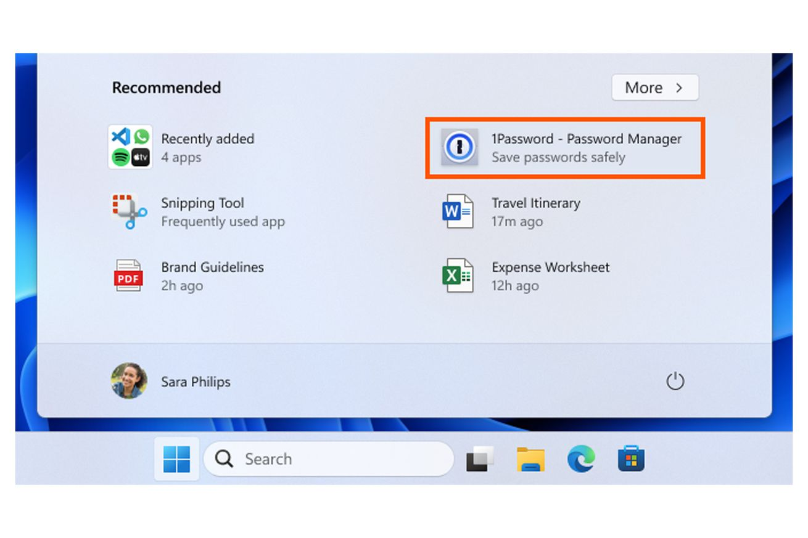

## Fedora Workstation 40 has been released

I'm always in an awkward spot when talking about new versions of distributions; usually, the user-exciting part is done in the desktop environment, and as a result, the changelog looks like a "let's remind everyone what the new GNOME version includes".

Fedora 40 does have GNOME 46 out of the box, which brought: notification grouping by application, shortcuts for opening new app instances from the dashboard, Tap to Click enabled out of the box, and Remote Login options. All the core applications have also been upgraded to the latest version.

And then, finally, there are the "under-the-hood" changes. Interestingly enough, Fedora decided to drop the term "immutable" to refer to those distributions using rpm-ostree, instead preferring "Atomic". PyTorch is also now directly in its software repositories, which should make it easier for users to access the framework, and IPV4 Address Conflict Detection is enabled by default. You can find all the detailed information here:

https://fedoramagazine.org/whats-new-fedora-workstation-40/?ref=techhut.tv

## New improvements to COSMIC Pre-Alpha

COSMIC is closer and closer! Here's another round of improvements to the current pre-alpha.

Firstly, theming support has been added to GTK applications _and_ apps packaged through flatpaks (which are within a container and thus need extra support to follow the system theme). You can also choose _not_ to apply a global theme and let the apps style themselves. You can also switch between dark and light mode depending on the time of day, which is a feature that comes out-of-the-box almost nowhere else.

COSMIC is also building its own App Store. So far it's fairly simple (in fact, I would even say it's similar to Discover, KDE's app store). You can see it here:

You can also now move windows around by holding the Super/Meta key and dragging them around (this works on KDE too!), and there's a whole new Keyboard settings page. Again, all of this is playing catch up, but it means we're getting ready to have a full and stable release of the desktop environment. Another example is: we now have dialogs when you change the brightness and volume, and there are warning sounds for low battery and plugging/unplugging the charger.

You can check out the full changelog since last month here:

[https://blog.system76.com/post/hammering-out-cosmic-features](https://blog.system76.com/post/hammering-out-cosmic-features)

## Windows 11 is rolling out advertisements in the Start menu

If you need one more reason _not_ to use Windows, here's a great one: Microsoft has decided to add featured applications in the Start menu that you don't actually have installed. Even within the interface, these are called "app promotions" and - thankfully - they can be turned off. This is nothing new, though: Windows 10 already had advertisements on its lock screen, the File Explorer application had them too "as an experiment", and who knows what they'll come up with next. On top of all of that, there are popups everywhere reminding you to use Microsoft's own products, such as Edge and OneDrive; even worse, they injected custom content in the Chrome download page to convince you to keep the default browser!

[https://www.theverge.com/2024/4/21/24063379/windows-11-ads-bing-edge-cruft?ref=techhut.tv](https://www.theverge.com/2024/4/21/24063379/windows-11-ads-bing-edge-cruft?ref=techhut.tv)

## Framework raises $18M in new funding

The Linux-friendly modular laptop manufacturer Framework would like to build new types of products; to do so, they've just raised another $18 million in funding. The community will be part of this: 100 accredited investors will be able to invest $10,000 each too.

Of course, the big question is: what _kind_ of products? Desktop computers? Headphones, like Fairphone is doing? Printers? I would love a modular, open-source printer. Framework has carefully avoided the question though, so we have no information on that.

They will still work on their laptop line and make sure to offer plenty of support over time, but the laptops hardware design is locked in and won't change from now on (which is great for us customers), and e.g. industrial designers can move on to a different project.

I hope it's a printer, though.

[https://www.theverge.com/2024/4/23/24138475/framework-laptop-product-categories-new?ref=techhut.tv](https://www.theverge.com/2024/4/23/24138475/framework-laptop-product-categories-new?ref=techhut.tv)

## New Linux tablet fundraiser launched by Volla

Sadly, we rarely see Linux-first tablets. There are some attempts, the most interesting one being the JingPad, which shortly went out of business after production. We should soon see a new player, though, as Volla - previously a Linux phones manufacturer - launched a fundraising for the Volla Tablet.

The device is fully founded already, raising €77k out of the €50k goal. This is the fourth Kickstarter attempt of Volla, and three out of four of them quickly succeded. In fact, the Volla Phone 22 managed to raise €100k out of the €10k goal, and the device can now be ordered at the price of €452 each.

Let's talk about the tablet, then! It should have a 12", Quad HD display, have Ubuntu Touch as an option, a customized Android as another, a metallic body with a slim design, 4 speakers, an attachable keyboard (no pictures of it are provided), a MediaTek Gaming G99 processor with 12GB of RAM, a 10,000 mAh battery, and cellular network support. You can try to get one by pledging €528 and the estimated delivery date is October 2024.

https://9to5linux.com/volla-tablet-launches-on-kickstarter-with-support-for-ubuntu-touch?ref=techhut.tv#google\_vignette

## Ghost adopts ActivityPub

The platform that we're using to publish these newsletters is called "Ghost". It's open-source, it's really cool, and I love using it. I thus particularly appreciate the latest manifesto published by the organization, claiming that they will now federate with ActivityPub "to bring back the open web".

They say that, even though the closed networks are competing with each other for users, the biggest networks will necessarily end up being the federated ones. Users within those are able to talk to each other and interact with different platform and services, a bit like emails is still the biggest platform out there.

This will create a social network-like structure where "publishers will be able to follow, like and interact with one another \[...\] The difference, of course, is that you'll also be able to follow, like, and interact with users on Mastodon, Threads, Flipboard, Buttondown, WriteFreely, Tumbrl, WordPress, PeerTube, Pixelfed…". Even better, all of the users in those services will be able to follow your blog (including this one!). I'm looking forward to it!
