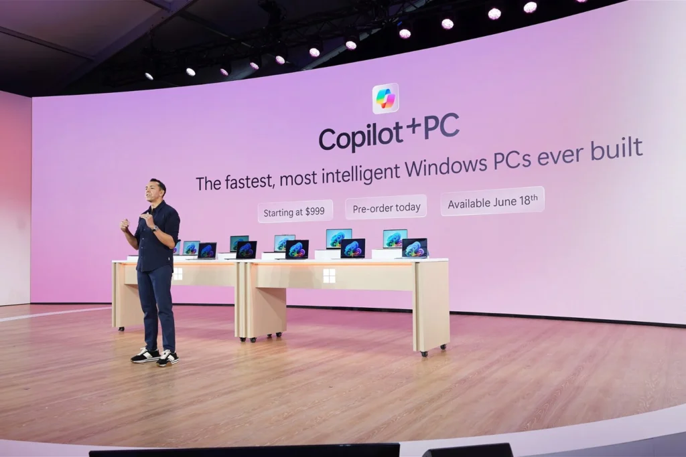

## OpenAI released GPT-4o: it's like GPT-4, but so much better

The "o" stands for "omni", by the way.

One of the biggest deals around this new model is that it takes a significant step towards "more natural human-computer interaction". As in, you can both talk to your phone and have your video feed on - as if you were in a video call - and the model will talk back to you with minimal latency using the video as additional information. Words don't do this justice, so I would recommend watching the videos on the below-linked webpage.

It's also incredibly fast, and 50% cheaper in the API compared to GPT-4 Turbo. The audio delay is 320 milliseconds on average, which is close to human speed. Previously, voice interaction was just the standard text-based GPT but with transcribe + voice synthesizer models. This meant a complete lack of the ability to gather tone, handle multiple speakers, or express emotions. GPT-4o instead uses a single end-to-end model across text, vision, and audio. It's seriously impressive.

Everyone can try out ChatGPT-4o right away, it's free (but up to a limited amount of messages). Image generation requires payment, and the vision model requires to be a developer. The new audio and video capabilities will be soon available to "a small group of trusted partners".

[https://openai.com/index/hello-gpt-4o](https://openai.com/index/hello-gpt-4o)

## The Open Source Initiative tries to define Open Source AI

The Open Source Initiative is the non-profit organization that oversees the Open Source Definition, which states the requirements for licenses to be considered Open Source. Even though many organizations have defined themselves to be working on "Open Source AI", there's actually no agreed-upon definition for that term. And, maybe, we need one?

The latest draft, from the 24th of April, requires the following. We need detailed information about the data used to train the system, how it was obtained and selected, and all about the labeling procedures. The source code used to train and run the system has to be fully open source, including tokenizers, inference, and the model architecture. Finally, the model parameters have to be available too.

It's important to notice that OpenAI's work is extremely opaque and it would not even get close to being classified as "Open Source", under _any_ definition.

[https://www.theregister.com/2024/05/16/open\_source\_initiative\_ai/?ref=techhut.tv](https://www.theregister.com/2024/05/16/open_source_initiative_ai/?ref=techhut.tv)

## Microsoft announces ARM laptops from six different manufacturers

And they've chosen the worst possible branding for it!

Microsoft is now trying to compete with Apple's (great) M-chips by using custom Qualcomm Snapdragon X ARM chips. Even though they've tried this road in the past with little luck, they now claim that they have improvements to the hardware and software that will make these devices competitive with Apple's line on both performance and battery life. They managed to get six different hardware manufacturers - Acer, Asus, Dell, HP, Lenovo, and Samsung - to release their own Snapdragon X laptops, collectively called "Copilot + PC".

Yes. Copilot + PC.

Anyway. As mentioned, the hardware improvements are mostly about this new Snapdragon X Elite chip, whereas on the software side, there's an improved emulator called Prism. According to Microsoft, Prism is as efficient as Apple Rosetta 2. Also, most applications - Photoshop, Dropbox, Zoom, Spotify … - have been ported to ARM already, another improvement since the first Microsoft ARM laptop introduction.

[https://www.theverge.com/2024/5/20/24160463/microsoft-windows-laptops-copilot-arm-chips-m1?ref=techhut.tv](https://www.theverge.com/2024/5/20/24160463/microsoft-windows-laptops-copilot-arm-chips-m1?ref=techhut.tv)

## Open Source is neither a community nor a democracy

This is an article by David Heinemeier Hansson. It raises some important point about how those who take decisions within Open Source are those who contribute to it, and that the wider community of users shouldn't feel entitled to say how a certain project should be developed. It argues that elitism is good when it comes to Open Source. Though I definitively disagree on many definitions and wordings by Hansson, I would recommend you go through the article!

[https://world.hey.com/dhh/open-source-is-neither-a-community-nor-a-democracy-606abdab?ref=techhut.tv](https://world.hey.com/dhh/open-source-is-neither-a-community-nor-a-democracy-606abdab?ref=techhut.tv)

## Microsoft announces a tool that keeps track of everything you do

I'm giving this its own section, though it comes from the same announcement as the previous segment. This feature is called "Recall" and it's been widely criticized: when turned on, it will log everything you do (applications, meetings, websites you've visited, everything). You can then search through all of those logs using an AI language model. According to Microsoft, this all happens locally on your device, and no data is sent to their servers.

Here's a tweet from Eric Steven Raymond, a very popular software developer and open-source advocate:

> Whoever came up with Microsoft's proposed new "Recall" feature really, really wants users to bail out to Linux.— Eric S. Raymond (@esrtweet) [May 21, 2024](https://twitter.com/esrtweet/status/1793026364934611357?ref_src=twsrc%5Etfw&ref=techhut.tv)

And here's some more:

> I’m so glad Microsoft is out here helping me recall why I don’t use Windows if I can help it, and when I do, I disable every “smart” feature they add [https://t.co/ZhxizdXwst](https://t.co/ZhxizdXwst?ref=techhut.tv)— Emily Young (@EmilyAYoung1) [May 21, 2024](https://twitter.com/EmilyAYoung1/status/1792945640487759955?ref_src=twsrc%5Etfw&ref=techhut.tv)

> They are literally telling us that they will put spyware on us and expect us to take it as "innovation."
>
> It's good that no one in the world wants to use Windows 11 [https://t.co/o07hHK50ng](https://t.co/o07hHK50ng?ref=techhut.tv)— NecroKuma (@NecroKuma3) [May 20, 2024](https://twitter.com/NecroKuma3/status/1792622450405933296?ref_src=twsrc%5Etfw&ref=techhut.tv)

Note that this feature requires the above-mentioned Snapdragon X Elite or X Plus, 40 TOPs, 225GB of storage (why?), and 16GB of RAM.

[https://www.theverge.com/2024/5/20/24159258/microsoft-recall-ai-explorer-windows-11-surface-event?ref=techhut.tv](https://www.theverge.com/2024/5/20/24159258/microsoft-recall-ai-explorer-windows-11-surface-event?ref=techhut.tv)

## Thunderbird has a new beautiful website

There's not much to say about it: it's just beautiful! I wanted to give a very brief shoutout to the designers and developers behind the project, which is undergoing a massive redesign in its desktop application too and is even working on an official mobile app. Great job! [Check out the blog post!](https://blog.thunderbird.net/2024/05/the-new-thunderbird-website-has-hatched/)
