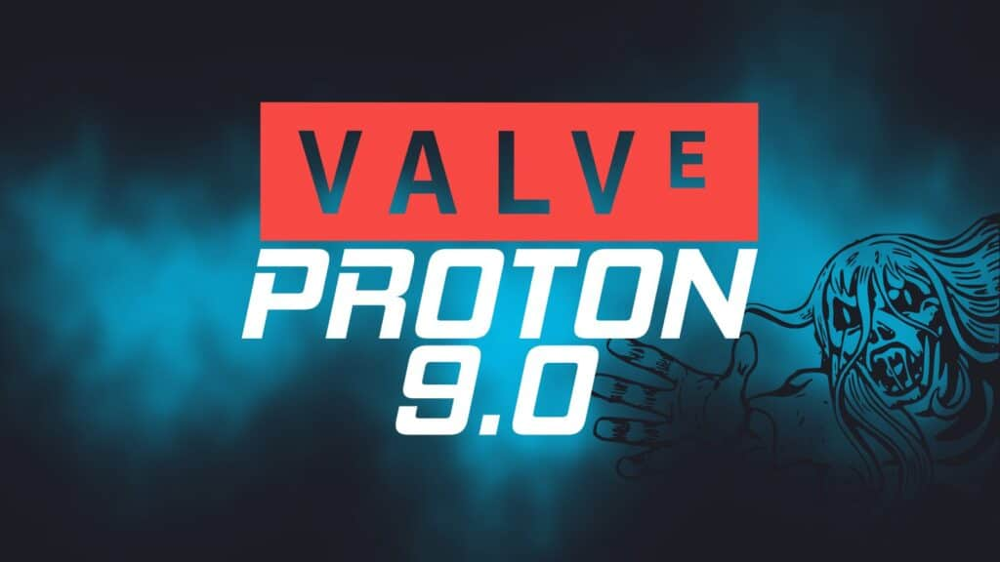

## The Nix Governance Crisis

Nix is a declarative package manager, builds packages in isolation from each other, and strongly focuses on reliability (as in, "one package cannot break other packages"). The project is currently undergoing a governance crisis that resulted in the resignation of the head of the NixOS Foundation (Eelco Dolstra) and even a fork supported by some of the biggest Nix contributors.

Let's quickly introduce the actors involved in the crisis. We have the NixOS Foundation, representing the Nix community on legal matters, led (until recently) by Eelco Dolstra – the main author of Nix. Dolstra also leads a for-profit company called Determinate Systems, offering paid support on Nix-related matters to private companies.

A Moderation Team has also been instituted within the Nix project, though it is quite limited in scope compared to its initial introduction proposal: it can merely monitor official spaces and ban people obviously acting out of ill intent and has no authority over community teams and developers.

Even though Dolstra does not officially have a privileged role within the Nix developers community, many members have accused him of implicit authority and soft power, abusing his role to push his decisions and block others'. He has also reportedly acted dismissive towards any criticism towards him or the Foundation, which has led many to burn out.

One of the main examples of this behavior is the Anduril incident. Anduril is a military tech company, a US defense sector contractor that produces war drones and cameras for the US-Mexico border. They seem to use Nix internally and have contributed to the project throughout the years. They wanted to sponsor the 2023 Nix Conference, but the community did not want Nix to be associated with Anduril, the video operation centre threatened to pull off at the last minute (effectively preventing the event from happening), and the sponsorship was dropped. However, Anduril was yet again selected as a sponsor for the 2024 NixCon; an open letter was published asking for the sponsorship to be retracted, but Dolstra quickly brushed off the criticism without acting on it. Anduril is likely a paying customer of Dolstra's company, Determinate Systems, which would result in a significant conflict of interest.

Another open letter ("Eelco Dolstra's leadership is corrosive to the Nix project") was crafted and driven forward by many Moderation team members. Much controversy ensued, and third open letter appeared ("Memorandum on Equitable Moderation") effectively accusing the Moderation team of attempting a hostile takeover of the project. Here the whole crisis got quite political since the Moderation team was accused of using the "myth of marginalization" to censor Nix developers – though, the evidence of this is quite unconvincing. The authors of this Memorandum, and other Nix developers who aggressively attacked the Moderation team and its policies, were eventually banned from the community.

On the 30th of April, Dolstra announced he would be stepping down from the board of the NixOS Foundation; a "constitutional assembly" was announced to institute a community-based governance of the project. This Assembly would also be tasked with defining sponsorship policies (e.g. whether to accept Anduril sponsorship) and policies against discrimination towards minorities.

Just a couple of days a fork of Nix was announced. It's called Lix and it's been in the works since early February; it's handled by "a team of 10+ people" and represents "an independent organization that takes its responsibility to its community seriously". Its main points include being "built for a community, not for a corporation", "a safe community for developers of all backgrounds" and more. There's no explicit reference to Nix, but the subtext is quite clear.

This story is still developing and I'll be following it in the coming weeks too.

[https://github.com/KFearsoff/nix-drama-explained?tab=readme-ov-file&ref=techhut.tv](https://github.com/KFearsoff/nix-drama-explained?tab=readme-ov-file&ref=techhut.tv)

## Valve publishes Proton 9.0

Valve has just published another major update to Proton, the compatibility layer that allows to run Windows-based games on Linux. It's a lovely tool that allowed the SteamDeck to be Linux-based and helped out significantly to run any type of game on our favorite operating system. I'll quote the Linuxiac regarding the now-playable games:

> Titles that were previously only playable using the experimental version of Proton, such as Sonic Colors: Ultimate, The Finals, and Lord of the Rings: Gollum, are now fully supported.

You can find more information here:

[https://linuxiac.com/proton-9-0-rolls-out-with-improvements-for-gaming-on-linux/?ref=techhut.tv](https://linuxiac.com/proton-9-0-rolls-out-with-improvements-for-gaming-on-linux/?ref=techhut.tv)

## LXQt publishes version 2.0.0

This week we also got a new major release of the LXQt project; the main new feature is the support for Qt6, as the desktop now relies on version 6.6 of the graphical toolkit. Other changes include much better Wayland support (for compositors such as LabWC, Wayfire, kwin\_wayland, Hyprland, and Sway); layer-shell-qt6 compatibility (a new spec that allows defining some shell components such as panels); a new default application menu called Fancy Menu (which includes "Favorites", "All Applications", and better search). You can read more here:

https://www.debugpoint.com/lxqt-2-0-0-features/?ref=techhut.tv

## Jack Dorsey is no longer on Bluesky's board

Bluesky is a platform that was commonly referred to as "that platform that the ex-CEO of Twitter made after leaving Twitter" – which is almost true, though he only joined the board of directors in February 2022. Bluesky is quite similar to Mastodon, and its main advantage over it is that it makes switching between servers much easier (though, there aren't nearly as many to switch between).

Well, Dorsey has just announced he's no longer on Bluesky's Board of Directors and he endorsed Twitter instead, calling it "freedom technology". Though it is debatable whether Bluesky or Mastodon "is better", we can certainly say that either platform is miles ahead of Twitter in terms of transparency and decentralizing. It will be interesting to see how Bluesky will evolve from now on.

[https://www.theverge.com/2024/5/5/24149543/jack-dorsey-gone-bluesky-board?ref=techhut.tv](https://www.theverge.com/2024/5/5/24149543/jack-dorsey-gone-bluesky-board?ref=techhut.tv)
