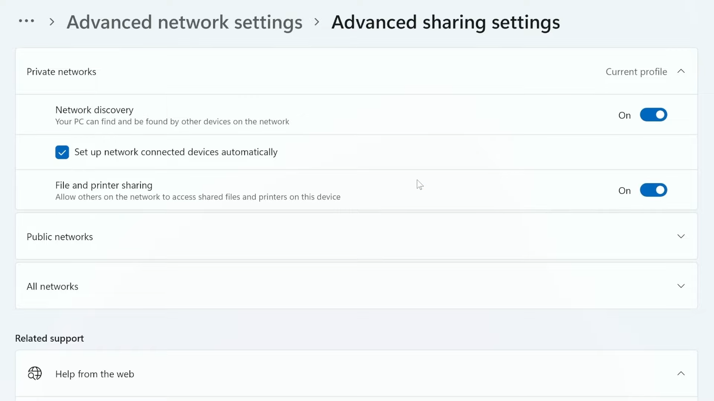
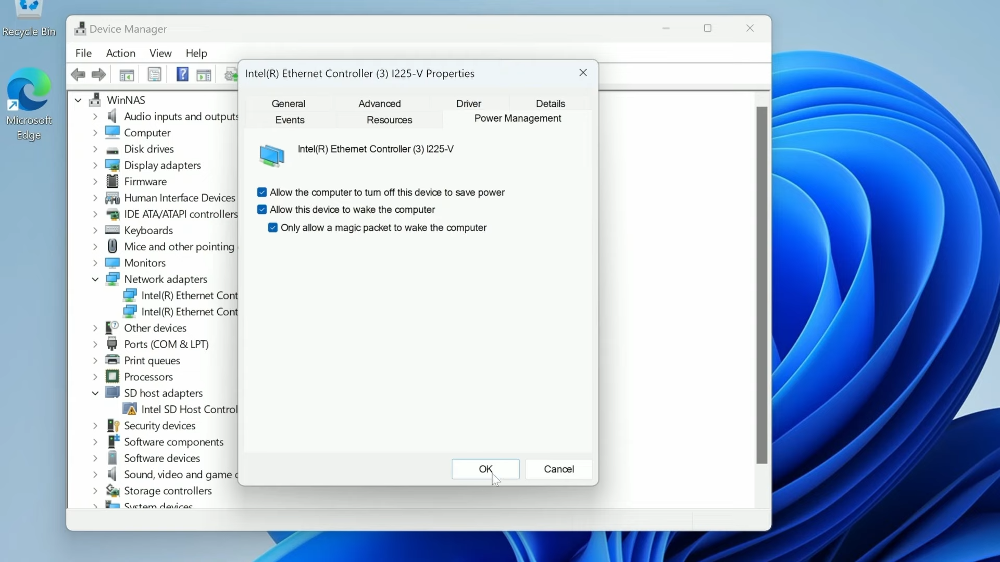
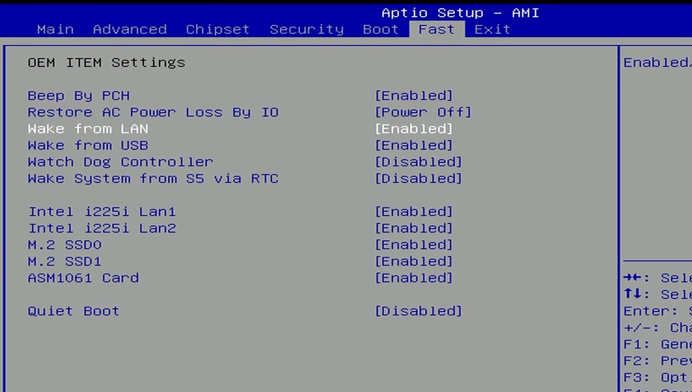
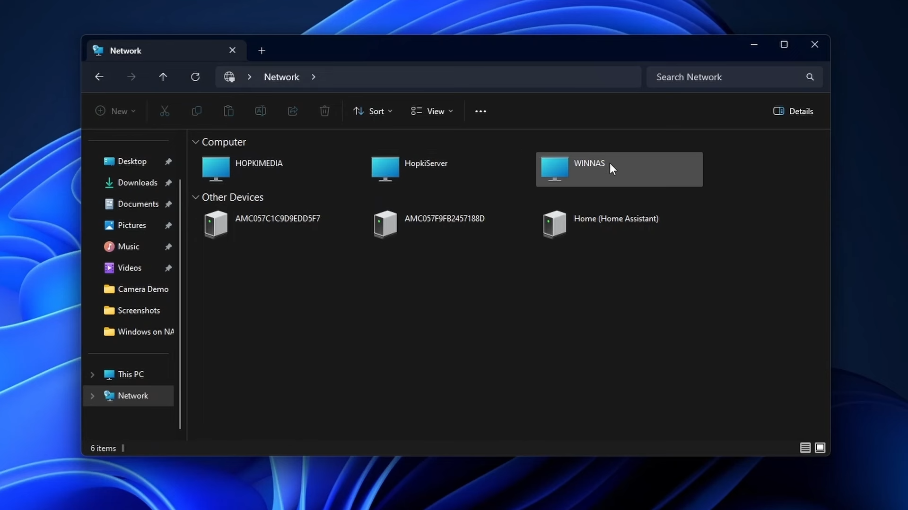
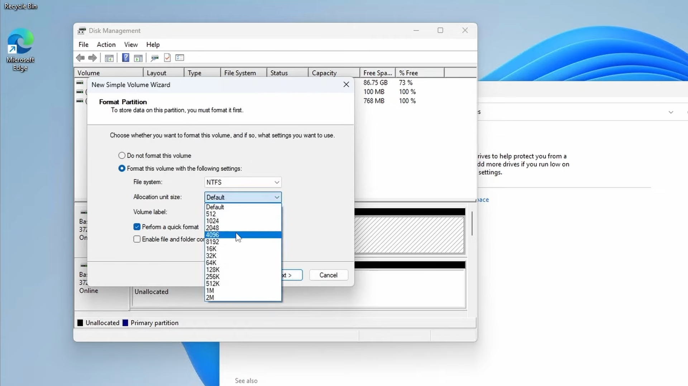
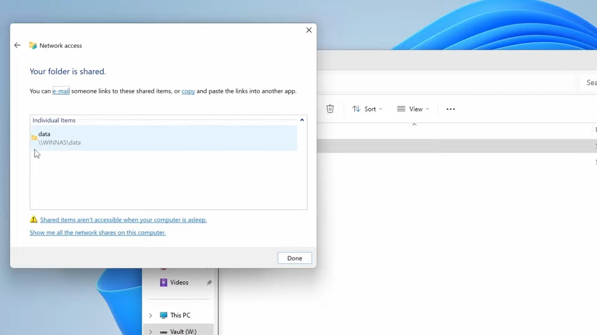

---

Recently, I was asked a surprising question: Can you use Windows as a NAS (Network-Attached Storage) operating system? Initially, I reacted with shock and horror, but upon further thought, I realized it’s a valid query worth exploring. Yes, you can use Windows for this purpose, and I'll guide you through the process.

https://youtu.be/5pZu35hTipo

## Introduction

While there are superior NAS-specific operating systems like UNRAID, TrueNAS, and Open Media Vault, Windows can still provide NAS functionality for those who prefer it or are simply working with an existing Windows installation. This guide will show you how to transform a Windows desktop into a NAS.

### Prerequisites

1. **A PC or NAS Unit**: If using a NAS make sure it is compatible with 3rd party operating systems.

3. **A USB Drive (at least 8GB)**: You'll need this to install Windows.

5. **Ethernet Connection**: For downloading necessary tools and updates. Ethernet is highly recommended, but Wifi will work.

## Steps to Set Up Windows as a NAS

### 1\. Preparing the Installation Media

1. **Download Windows 11**:
    - Visit the [Windows 11 download page](https://www.microsoft.com/software-download/windows11).

    - Scroll down and click "Download Now" for the Windows 11 installation media.

    - Select your language and click "Confirm" to start the download.

3. **Download and Install Rufus**:
    - Go to the [Rufus website](https://rufus.ie/) and download the latest version.

    - Rufus helps create bootable USB drives with additional customization options.

        

5. **Create a Bootable USB Drive**:
    - Open Rufus and plug in your USB drive.

    - Select the downloaded Windows 11 ISO file.

    - Choose the default settings or customize as needed. For simplicity, name the drive (e.g., "WinUSB").

    - Below is a screenshot with the recommended option. The main option that makes the process easier is to create a simple username with no spaces.

    - Click "Start" and wait for the process to complete.

### 2\. Installing Windows on a Home Server

https://youtu.be/lTlGJC6irNQ

1. **Boot from USB**:
    - Plug the USB into your NAS device and boot into the BIOS (usually by pressing Delete, F1, F12, or Esc during startup).

    - Set the USB drive as the primary boot device and save changes.

3. **Windows Installation**:
    - Follow the on-screen instructions to install Windows.

    - When prompted to select an installation location, choose the NVME or SSD boot drive. Do note that this will delete any data on the drive.

    - Select "Custom: Install Windows only (advanced)" to manually configure partitions.

    - If necessary, delete existing partitions on the NVME drive to start with a clean slate. Select each partition of the proper drive and click "Delete".

        

    - After deleting partitions, select the unallocated space and click "Next" to allow Windows to create the necessary partitions automatically.

    - Proceed with the installation.

5. **Initial Setup**:
    - After installation, if you didn't step the user in Rufus, go through the basic setup, creating a local account (preferably without spaces, e.g., "admin").

    - Update display drivers and other essential drivers through Windows Update.

### 3\. Configuring Your Windows NAS

1. **Rename the Device**:
    - Open Settings > System > About > Rename this PC.

    - Choose a recognizable name (e.g., "WinNAS").

        

3. **Enable Network Discovery and File Sharing**:
    - Go to Settings > Network & Internet > Ethernet (or Wi-Fi only if necessary).

    - Set the network profile to "Private".

    - Go to Advanced Network Settings > Advanced Sharing Settings.

    - Turn on network discovery and file and printer sharing.

        

5. **Disable Sleep Settings**: **(if not using Wake-on-LAN)**
    - This is only necessary if you're not going to use Wake-On-Lan below,

    - Go to Settings > System > Power & Sleep.

    - Set sleep settings to "Never".

7. **Enable Wake-on-LAN**:
    - Open Device Manager > Network Adapters.

    - Right-click your network adapter > Properties.

    - Under the Advanced tab, enable "Wake on Magic Packet".

        

    - Under the Power Management tab, check "Allow this device to wake the computer" and "Only allow a magic packet to wake the computer".

9. **Configure Local Group Policy**
    - Press `Windows + R` to open the Run dialog.

    - Type `gpedit.msc` and press Enter to open the Local Group Policy Editor.

    - In the left pane, navigate to `Computer Configuration -> Administrative Templates -> System -> Power Management -> Sleep Settings`.

    - Double-click on the policy named `Allow network connectivity during connected-standby (plugged in)`.

    - Select the "Enabled" option to enable network connectivity during connected standby.

        

    - Click on "Apply" and then "OK" to save the changes.

    - Close the Local Group Policy Editor.

11. **Restart Windows to Apply Changes**

### 4\. BIOS Configuration

During the reboot process, now is a good time to make sure our BIOS setting won't interfere with anything we're trying to do.

- **Enabling Wake on LAN:**
    - Locate the Wake on LAN setting in the BIOS menu.

    - Enable Wake on LAN for network cards to allow the system to wake up remotely.

        

- **Optional Settings:**
    - Optionally, enable S5 via RTC if you want the NAS to start up automatically at a specific time.

    - Disable Fast Boot if using Wake on LAN, as Fast Boot may interfere with Wake on LAN functionality.

### 5\. Accessing Your NAS

- **Checking Wake-up Status:**
    - Connect to the network tab on another machine to check if the NAS responds and wakes up as expected.

        

    - Verify that the NAS wakes up and is accessible on the network.

### **6\. Create a Storage Pool**

https://youtu.be/Ipnnt6f7d4I

1. **Working with Windows Storage Spaces**
    - Press `Windows + S` to open the search bar, then type "Manage Storage Spaces" and select "Manage Storage Spaces" from the results.

    - Click on "Yes" if prompted by User Account Control (UAC).

    - In the Storage Spaces window, click on "Create a new pool and storage space."

    - Select the drives you want to include in the storage pool by checking the boxes next to them.

    - Click on "Create pool."

    - Enter a name for your storage pool in the provided field.

    - Choose a drive letter or mount point for the pool.

        

    - Select a resiliency type for your storage space:
        - **Simple**: Provides no data redundancy. Data is stored across the selected drives without duplication. This offers the highest storage capacity but offers no protection against drive failure.

        - **Mirror**: Stores two copies of your data across the drives. This provides better protection against drive failure, as your data remains accessible even if one drive fails. However, it requires at least two drives.

        - **Parity**: Similar to RAID 5, Parity stores data along with parity information across the drives. This allows for data recovery in case of a single drive failure. However, it requires at least three drives and can have a performance impact during write operations.

    - Click on "Create storage space" to create the storage pool.

3. **Fixing Common Errors: Physical Disk Sector Size**
    - Open the Disk Management tool by pressing `Windows + X` and selecting "Disk Management" from the menu.

    - Locate the disk(s) you intend to include in the storage pool. Right-click on each disk and select "Properties."

    - Go to the "Volumes" tab and click on "Format." Follow the on-screen instructions to format the disk with a sector size of 4096 bytes.

        

    - Repeat this process for all disks that will be part of the storage pool.

    - After formatting the disks with the correct sector size, attempt to create the storage pool again following the previous instructions.

### 7\. Setting Up Network Shares

https://youtu.be/1yrChg7XW-A

1. **Create Shared Folders**:
    - Create your shared folders in the new storage pool that we created. If you're doing this on a system without a storage pool any folder that you create on your system can be shared.

    - Right-click the desired folder > Properties > Sharing tab.

        

    - Click "Share" and select users or groups to share with.

    - Set permissions as needed.

        

3. **Access Shares from Other Devices**:
    - Use the network path (e.g., `\\WinNAS\sharedfolder`) to access the shared folders from other computers on the network.

5. **Layout is Important**
    - Generally, I create a data folder that stores most everything (e.g., movies, books, downloads) so that future application have easy access to move data within a single share.

    - If you plan on using docker, creating a share for the configurations is a good practice.

### 8\. Remote Desktop Configuration

- **Enabling Remote Desktop:**
    - Navigate to the system settings to enable Remote Desktop access on the NAS.

        

    - Configure Remote Desktop settings, including user permissions and connection preferences.

- **Connecting via Remote Desktop Connection:**
    - Use Remote Desktop Connection to connect to the NAS from a remote device or computer.

    - Enter the NAS's IP address or hostname along with the appropriate credentials to establish a remote desktop session.

### 9\. Enable OpenSSH Server for SSH/SFTP

https://youtu.be/9kQ75FxxkUw

1. **Enable OpenSSH Server and** **Authenticat****ion**
    - Open the "Settings" app by pressing `Windows key + I`.

    - Go to "Apps" -> "Optional Features".

    - Click on "Add a feature".

    - Scroll down or search for "OpenSSH Client" and "OpenSSH Server"

    - Click on the feature and select "Install".

3. **Enable the Services**:
    - Press `Windows + S` to open the search bar, then type "Services" then click on the first result.

    - In the Services window, scroll down or use the search bar to locate the service you want to enable. These will be "OpenSSH SSH Server (sshd)" and "OpenSSH Authentication Agent (ssh-agent)".

    - Right-click on the service and select "Properties".

    - In the Properties window, under the "General" tab, find the "Startup type" dropdown menu.

    - Select "Automatic" from the dropdown menu to ensure that the service starts automatically when you boot your computer.

    - From this same panel you can click "Start" to start the service then click "Apply" and then "OK" to save the changes.

### 10\. Installing Docker Desktop

Docker Desktop for Windows is a powerful tool that simplifies the process of containerization on Windows operating systems. It provides a user-friendly interface and seamless integration with Windows applications, making it an excellent choice for developers and IT professionals looking to leverage container technology. With Docker Desktop, users can easily create, deploy, and manage containers directly from their Windows environment, streamlining development workflows and enhancing productivity.

\[video\]

**Installing Docker Desktop on Windows:**

1. **Download Docker Desktop:** Visit the Docker website and download the Docker Desktop installer for Windows.

3. **Run the Installer:** Once the download is complete, run the Docker Desktop installer executable (.exe) file.

5. **Follow Installation Wizard:** Follow the on-screen instructions provided by the installation wizard to install Docker Desktop on your Windows system.

7. **Enable Hyper-V (if required):** If Docker Desktop prompts you to enable Hyper-V, follow the instructions to enable it. Hyper-V is a virtualization feature required for running Docker containers on Windows.

9. **Complete Installation:** After the installation is complete, Docker Desktop will launch automatically. You may need to sign in with your Docker Hub credentials or create a Docker ID if you don't have one already.

Once installed, Docker Desktop will be ready to use, allowing you to start containerizing your Windows applications effortlessly. With its intuitive interface and robust features, Docker Desktop empowers Windows users to leverage the benefits of containerization in their development and deployment processes.

### 11\. Accessing Services Remotely (Twingate)

Several methods exist for remote connectivity, including setting up a reverse proxy, using a virtual private network (VPN), or employing zero-trust services. Reverse proxies like Nginx or Apache allow users to securely access web applications by routing traffic through a single entry point. VPNs create encrypted connections between remote devices and the home network, ensuring data privacy and security. Zero-trust services, such as Twingate, provide secure access to resources without exposing the network to external threats.

Twingate is a channel sponsor and I've been using them for a long time. Checkout the video below to get started using them. Additionally, in the Windows on a NAS video. I do a quick setup demonstration.

https://www.youtube.com/watch?v=yaw2A3DG664
