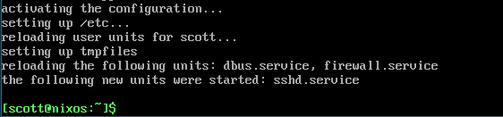
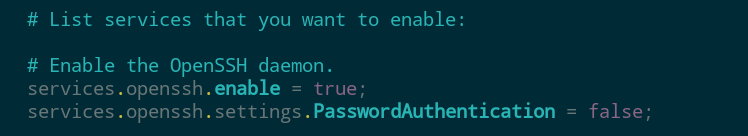
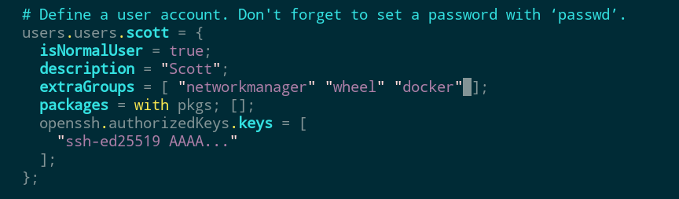
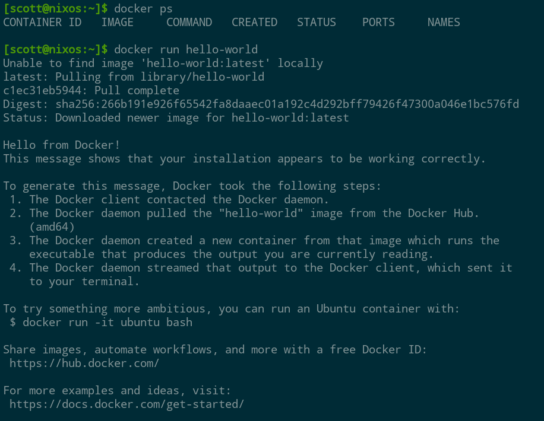

NixOS is a Linux distribution based on the Nix package manager. Nix has been trending lately so there's a good chance you've heard of it. But if you went to do some research about Nix you might have gotten a bit lost in concepts like dependency trees and the Nix programming language.

The good news is that you don't need to understand how Nix works in depth or know any programming to enjoy the benefits that it brings. Nix has a repo of about 80,000 packages, which puts it up there with the Arch Linux AUR as a contender for the largest in the Linux ecosystem. You can actually use Nix on top of any distro and even MacOS, but today we'll be focusing on NixOS specifically. First, I'll tell you a bit about what makes Nix special, and then I'll demonstrate a basic server installation to show how it works in practice.

https://youtu.be/GymWdyizBRA

## What's Great About NixOS?

Aside from a large amount of available software, NixOS provides a unique approach to system administration that comes with some solid advantages. Every NixOS installation is built from a configuration.nix file in such a way that the same configuration always results in the same system. Said differently, NixOS is an immutable operating system. It's not the only one though, there's also Fedora Silverblue and GNU's Guix which includes a package manager similar to Nix.

So in practice, updating a NixOS system or installing packages is done by editing configuration.nix and rebuilding the system. If something goes wrong, it's easy to roll back to a previous working configuration. That's similar in a way to snapshot systems like Timeshift, with the difference that Nix stores the recipe needed to build the system as it was at that point in time rather than just a copy of a given filesystem state.

The configuration based approach to system administration also means that it's easy to replicate a given system. All that's needed is to copy and apply the configuration into the new environment. This is rather different than the traditional approach where systems are set up using a combination of shell commands and editing config files. If you ever tried to duplicate a Linux environment from one server or VM to another, you might understand part of the problem that NixOS solves.

Unless you have a photographic memory for every shell command and configuration edit, probably you've ended up in the situation where a fresh install didn't quite work because of some forgotten `apt install` command or config file edit. With NixOS all you have to do is keep a copy of your `configuration.nix` safe, and all the package installs and config edits are handled automatically when building the system.

Let's jump in and see how that works in practice when setting up a fresh NixOS system.

## Installing NixOS

If you want to try NixOS, you'll need to first download one of the ISO images. Just head over to the download page at [nixos.org](https://nixos.org/download/), scroll down to _NixOS : the Linux distribution_, and grab either the graphical or minimal ISO image.

You can use the graphical ISO and graphical installer to do a minimal server style install too. If you prefer to install from the CLI, grab the minimal image. The NixOS documentation includes complete instructions for how to do a CLI install, and to be honest it isn't bad. If you ever tried installing Arch manually, you'll find Nix to be quite a bit simpler.

Here I'll show the process of using the graphical installer to do a minimal install into a VM that would be suitable as a server. If you are interested in testing NixOS on a single board computer like a Raspberry Pi, the support for ARM is apparently pretty good, according to the [folks on Reddit](https://www.reddit.com/r/NixOS/comments/18qzhv7/nixos_on_arm_easy_peasy_or_a_time_sink/), but I didn't test that yet. In any case, for installing to a physical machine, go ahead and burn the ISO to a USB stick and boot from it.

### Install Steps

When you boot up the NixOS graphical ISO it will launch the installer automatically. The first steps are pretty standard stuff. It will ask you about your language, timezone, keyboard layout, and preferred user name. The installer is a bit strict about requiring strong passwords for your user account and the root password, which is kind of annoying if you only plan to connect to the machine using SSH keys or via secure tunnels.


Next is the choice of desktop environment. There are about ten to choose from which is a nice range of options, but in this case I'm choosing "no desktop" as this will only be for server use.


After that there's a choice about whether or not to include unfree software. Just to be clear, that's "free" as in "free speech", so this is just asking if you want to allow any non open source software to be installed on your system. That can include hardware drivers where no open source option exists, so there can be issues with hardware support if these packages aren't allowed.

Finally there are a couple of options for partitioning disks as setting up the bootloader. If you have a full disk to dedicate to the install, just select it and use the erase option to start fresh. Otherwise you can partition the disk manually. Of course if you want more control, installing manually in a terminal is the way to go.

You can double check the summary to make sure everything looks alright, then start the install and kick back. Once it's completed, you can now reboot into your fresh NixOS environment.


### After boot setup

On the first login, we're in a shell with some nice green and black hacker vibes. Let's first get our system set up with SSH.


To activate services or install packages, we'll edit our `configuration.nix` file. This requires root, so using nano that would be:

```
sudo nano /etc/nixos/configuration.nix
```

Inside we find the configuration file that the installer has created for us. Basically, all the info we provided to the installer is here, and we can see that it's also referencing the results of a hardware scan that are stored in a separate file.


Scrolling down the file a bit, we'll also see some suggestions that are commented out, including for activating SSH.

```
  # List services that you want to enable:

  # Enable the OpenSSH daemon.
  # CUSTOMIZED
  services.openssh.enable = true;

  # Open ports in the firewall.
  # networking.firewall.allowedTCPPorts = [ ... ];
  # networking.firewall.allowedUDPPorts = [ ... ];
```

I've just deleted the # symbol at the beginning of the line to indicate that SSH should be active. Above there's also a list of installed packages. I've also uncommented vim here so that I can use it rather than nano to edit this file in the future. One important note here is that we don't need to include SSH in the list of packages. Nix will automatically make sure that the package is present when we enable the service.

Now I'll save and close the file with `ctrl-o`, enter to write the file and `ctrl-x` to exit. So far nothing has actually changed on the system though. To do that, we need to rebuild. The standard command looks like this:

```
sudo nixos-rebuild switch
```

This builds everything we need for our new system, including downloading any new software packages, and switches us immediately into the new environment. It will also set the new configuration as the default when we boot the system up again. Let's try that now.



It looks like everything went well and the sshd service has been started. And indeed, I can connect over SSH and enjoy managing my new server OS with all the amenities of my daily driver terminal.

### Key Based SSH Auth

Personally, I like to use key based authentication for SSH exclusively and not allow any password based remote logins. To add an authorized public SSH key to a user in NixOS, edit the configuration.nix file again. This time look for the user account section and insert a block like shown here:


To also disable password based logins, add a line like this one:



One unavoidable quirk of working with NixOS is that all of this configuration is done in the Nix programming language. Even if you have background in programming, it can still take some getting used to. The good news is that in the end most things that you will want to do are basically the same story as in other config file formats: copy and paste and fill in your own values as needed.

### Resources for NixOS Config

There are various resources for finding configuration.nix snippets to add whatever you might need to your system.

- [nixos.org/manual/nixos](http://nixos.org/manual/nixos)

- [nixos.wiki](http://nixos.wiki)

- search the web (look for Reddit and NixOS forum posts)

If all else fails and you aren't faint of heart, there is essentially an exhaustive list of options available at [mynixos.com](http://mynixos.com). These are derived from the source code that defines the options, and they typically come with a default or example to reference.

### Set Up Docker

So far we didn't rebuild our system yet to add the SSH key to my user account and disable password based SSH logins. Before doing that, let's also add Docker.

As an example of what I was just saying, searching for Docker on nixos.wiki leads to this rather helpful [page](https://nixos.wiki/wiki/Docker), and we can basically just copy and paste what we need from there.

Here's the one line to enable Docker:

```
virtualisation.docker.enable = true;
```

This can go anywhere in the `configuration.nix` file. Also, I recommend checking out the [Docker page on the Wiki](https://nixos.wiki/wiki/Docker), this goes into detail on adding your user to the docker group and enabling rootless commands. Placing it together with the lines I added earlier for SSH feels good for now:


Per the wiki page, I'll also add myself to the \`docker\` user group by adding an entry to my groups list:



With that, let's do a nixos-rebuild switch and see what happens:

```
sudo nixos-rebuild switch
```

Nix will install all the necessary packages and start up the Docker daemon. After that, I'll also need to log in again so that the fact that my user is in the \`docker\` group takes effect. To do that I just disconnected and reconnected by SSH, and now I can use Docker:



### Firewall

Depending on the type of container you're running in Docker you may need to open some ports in the firewall. Below is an example from the Wiki on enabling standard web ports and opening ranges of ports.

```
networking.firewall = {
  enable = true;
  allowedTCPPorts = [ 80 443 ];
  allowedUDPPortRanges = [
    { from = 4000; to = 4007; }
    { from = 8000; to = 8010; }
  ];
};
```

For the example in the video above I only needed to open the 9443 port for Portainer and the 9090 port for Cockpit. Like everything else checkout the [Firewall Wiki page](https://nixos.wiki/wiki/Firewall) for everything you need to know.

## Conclusion

NixOS is a rather interesting development in the world of Linux distributions. While immutable operating systems are not exactly a new thing--mobile devices and gaming consoles have worked this way for a quite a while--they are by far not the norm either in home labs or commercial deployments.

Getting started with NixOS turns out to be rather simple, and it provides a really nice experience for setting up server and VM instances like I showed here. With just a few lines of config, we got a core system running with SSH, Docker, and remote access via Twingate. And by keeping a copy of that configuration.nix file, we can spin up an identical machine with just a couple commands in a fresh NixOS install.

There are some caveats though to working with NixOS, and they may or may not bother you depending on your use case. For our Docker host example, everything will work more or less identically to a more mainstream distro. However the way that Nix handles packages can come with some surprises for certain use cases. For example, installing Python packages that don't already exist as a Nix package can be notoriously [difficult](https://discourse.nixos.org/t/why-is-it-so-hard-to-use-a-python-package/19200). That's never going to be an issue when running deployments in Docker though.

Certainly Ubuntu isn't going anywhere anytime soon as the server OS of choice across the planet, but with next generation immutable options like NixOS gaining popularity, we may be in the midst of a shift toward a new and better style of operating system for servers.
