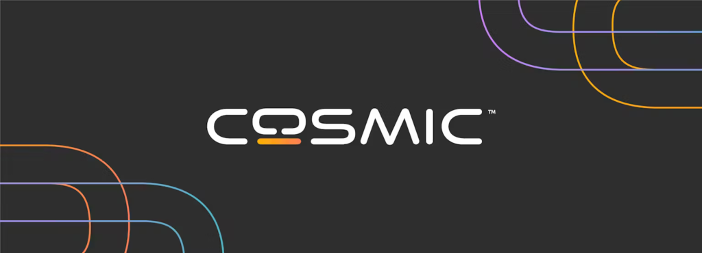

Looks cool, doesn't it?

The Alpha release is approaching. We don't have an exact release date yet, we only know it will be in **late July**. Still, a completely new desktop environment requires a new brand, and we now have it! The "O" represents Open Source and should resemble a display. The orange-red blip underneath instead represents a keyboard.

The fact that the keyboard is orange-red should communicate a keyboard with customized LEDs, "representing what's possible with COSMIC".

https://youtu.be/aorVb1SNR7Y
Video covering an early development build the of the new COSMIC desktop.

System76 decided to use this occasion to spin up a sale too: from June 26th to July 9th you'll be able to have up to $200 off on selected devices, such as the Pangolin, Oryx Pro, Thelio Spark, and Thelio laptops and desktops. There are also discounts on keyboards and t-shirts -- including those with the new COSMIC logo!

You can find more information here:

