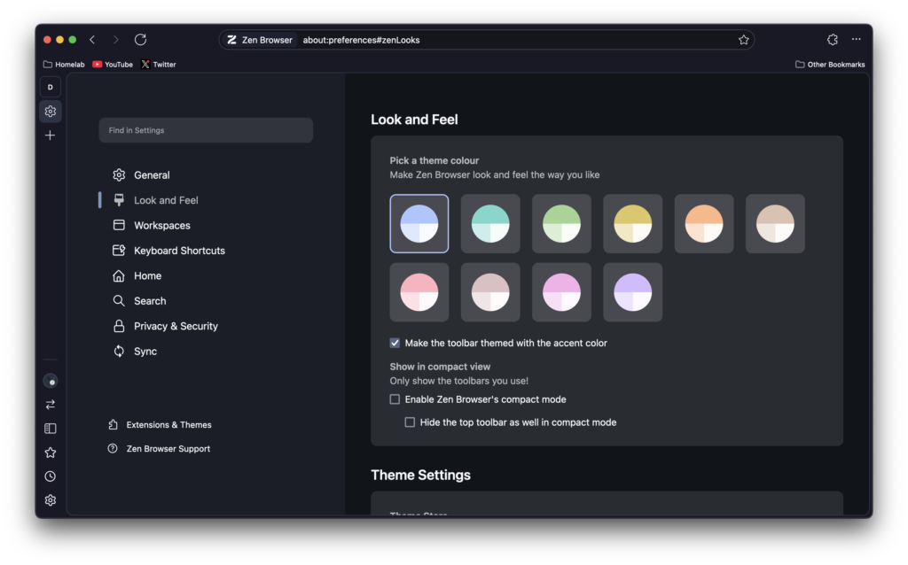

For over a year I have been using Microsoft Edge. In [my testing](https://techhut.tv/microsoft-edge-might-win-on-linux/) it is the most performant browser ranked against many others and with the integration of ChatGPT and many other helpful features I just stuck with the Windows default. A few weeks ago, I started using Firefox off and on, but it just doesn't feel like the best workspace to be in. I love the Firefox engine, but the user interface just isn't it for me. Then I stumbled on [this video by Theo](https://www.youtube.com/watch?v=tKM2N4TQHQY) that introduced me to Zen.

### What is Zen

You can think of Zen as what Edge is to Chrome or even what Ubuntu is to Debian. It's new browser that uses the engine of Firefox to give us a new browsing experience. Their homepage states: "Beautifully designed, privacy-focused, and packed with features. We care about your experience, not your data."


The browser has a host of UI changes and under the hood tweaks to give users a better browsing experience. We will dive more into some of the features in the moment, But, first lets test some claim that it will preform better than other browsers. They do have some [benchmark results posted](https://github.com/zen-browser/desktop/blob/main/docs/performance.md), but I want to compare with other browsers.

With my testing I can see why they didn't have comparison scores on their webpage. It's still behind Chromium based powers in most testing. However, it is nice to see the browser taking the lead over Firefox in Basemark Web. Meaning that there have been improvements made compared to the browser running the same engine. Zen is still behind on the more specific tests. With this as an alpha release I'm not going to stress this too hard as the differences are marginal and some are within the margin of error.

### Features

Many of these feature can be found in many other browsers, but most of all of those that I know of are chromium based browsers. This is the first time I'd seems some of these implemented as a Firefox front end with such a modern feeling UI

#### Customization

The way theming is done is the first I've seen. When you apply a theme from their store it immediately makes changes as if all the customization and themes are preinstalled. You can checkout their [theme store](https://www.zen-browser.app/themes) to see all the different themes and tweaks. Some of these include modifying the bookmark toolbar, and a floating URL bar, private mode theming, and removing browser padding. This is in addition to the custom color schemes available and the built in theming options you get.



This seems to be done with simple CSS files that modify the appearance and UI. For example, an option within the theme store is to disable rounded corners. If we browse their theme store [Github page](https://github.com/zen-browser/theme-store/tree/main) we can see how this is being done.

```
:root .browserSidebarContainer {
    margin: unset!important;
    box-shadow: unset!important;
    clip-path: unset!important;
    border-radius: unset!important;
    overflow: unset!important;
}
```

Being that this is so new and quickly gaining popularity, I look forward to seeing what the community comes up with to improve and add to what Zen offers.

#### Split View

I love split view, this is probably mt favorite feature of any browser. As I'm on macOS more than I'd prefer it's nice not to replay on Apples crappy window management. Zen has a nice split view mode that offers side-by-side, tiling, and horizontal layout options. To enable split view you need to select multiple tabs by hold shift, right click, and split them. You can see the default key bindings below to actually switch between these modes.


Unfortunately, that seems to it be it. I cant figure out how to move them, resize the spaces and take one tab out of the view without closing it. More options, presets, and key binding added to these split view options would make this great.

#### Side Bar

This is a neat little panel that can be shown at any time. It has it's own bookmarks and tab system. Basically feels like a small independent mobile browser within your desktop browsers. Making browsing sites like Twitter, YouTube, and even your email provider nice and handy.


You can pin it or have it floating about the desktop content, close it and quickly re-open to where you last were, and when you add a new website to the sidebar there is an option to force it to be in mobile view.

### Try it

https://youtu.be/ppdzVvzOMrc?si=ZAZlztFmj1Ot8koG

Now we didn't go over all the features here. For example, Workspaces, compact mode, and all the various improvements. I highly recommend checking out their Github, going through their documentation, and viewing the release notes. Zen is available on Windows, macOS, and Linux as a flatpak.


### Zen Browser

Download now and experience the Zen Browser
