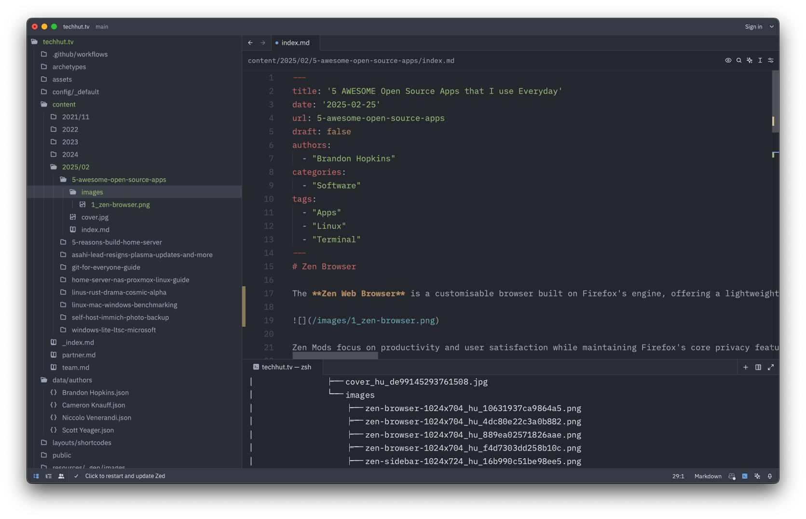

With most of my daily tasks handled through web browsers, there are still a few exceptional desktop applications I cannot function without. Below, you'll find the five open-source tools I rely on every day.



## [Zen Browser](https://zen-browser.app/)

The Zen Web Browser is a customisable browser built on Firefox's engine, offering a lightweight and fast experience without compromising privacy or security. It’s designed to be more intuitive than other browsers like Chrome or Firefox by providing Zen Mods, which are highly customisable addons tailored to individual needs—often surpassing the functionality of generic browser extensions.

Zen Mods focus on productivity and user satisfaction while maintaining Firefox's core privacy features, such as built-in trackers removal and advanced ad-blocker capabilities. For more information, you can visit the [main website](https://www.zenwebbrowser.com) or explore the [documentation page](https://docs.zenwebbrowser.com) to learn about the various Zen Mods available.

## [Zed Code Editor](https://zed.dev/)

 The ZedCode Editor is an efficient and minimalist integrated development environment (IDE). Its sleek interface offers a distraction-free experience, making it ideal for developers prioritizing simplicity.

 **Pros:**
 - Minimalist Design: Reduces cognitive load, allowing focus on coding.
 - Robust Syntax Highlighting: Enhances code readability and understanding with many addon options.
 - Performance Efficiency: Known for speed and lightweight operations.
 - Cross-Language Support: Compatible with multiple languages beyond Rust.
 - Extensibility: Facilitates customization via plugins, offering tailored environments.
 - Transparency: Being open-source ensures trustworthiness and adaptability.

 **Cons:**
 - Minimalist Aesthetic: Might be overwhelming for those seeking a richer interface.
 - Customization Limitations: While plugins exist, flexibility might not match established IDEs like VS Code.
 - Potential Bottlenecks in Complexity: Users with larger projects or complex codebases may find it less powerful than other editors.

## [Tabby Terminal Emulator](https://tabby.sh/)

Tabby is an open-source terminal emulator built with Electron. It excels in supporting multiple terminal sessions and connects to remote servers via SSH with profiles and an ecrypted vault. Runs on Windows, Mac and Linux

**Key Features:**
- Integrated SSH client with a connection manager.
- PowerShell, PS Core, WSL, Git-Bash, Cygwin, Cmder and CMD support.
- Full Unicode support including double-width characters.
- File transfer from/to SSH sessions via SFTP and Zmodem.
- Theming and color schemes.
- Fully configurable shortcuts and multi-chord shortcuts.
- Remembers your tabs and split panes.
- Integrated encrypted container for SSH secrets and configuration.

## [Cider for Apple Music](https://cider.sh/)

Cider is a high-performance cross-platform music player built on Vue.js for Apple Music, designed with modern aesthetics and functionality in mind. It seamlessly integrates with services like Discord, Last.fm, Spotify, and more, offering features such as spatialization, an advanced audio processor, and customizable controls. Cider boasts native backends for Windows, macOS, and Linux, ensuring smooth performance across platforms. Its intuitive interface and robust plugin system allow users to tailor their experience, while its remote control is anticipated for convenience. Reviews highlight Cider's superior performance compared to traditional apps like iTunes and its sleek design, making it a standout choice for music enthusiasts seeking efficiency and style.

**Key Features:**
- Modern slick UI similar to the native Mac OS application.
- Customizable controls.
- Remote control capabilities.
- Review highlights its superior performance compared to traditional apps like iTunes.

### Self-Hosted Alternatives

Now, I generally prefer self-hosting or non-streaming depenant applications. Here are some I would recommened if Apple Music isn't your thing.

- [Navidrome](https://www.navidrome.org/): A high-quality, self-hosted music streaming service. Highly recommened.
- [PlexAMP](https://www.plex.tv/plexamp/): Ideal for Plex Pass users seeking a dedicated music client.
- [Strawberry](https://www.strawberrymusicplayer.org): Open source desktop client with a classic feel.
- [Tauon](https://tauonmusicbox.rocks/): This is a modern feature rich music client.

## [Betterbird Email Client](https://www.betterbird.eu/)

Betterbird is a refined version of Mozilla Thunderbird, offering improvements and exclusive features over traditional email clients. It boasts a multi-line view akin to Outlook or Lotus Notes, vertical tabs for better organization, customizable header pane options, and enhanced attachment management compared to standard Thunderbird versions.

While Thunderbird faced critical issues like data loss in certain POP setups and IMAP failures, Betterbird addresses these with fixes that restore functionality post-folder repairs. The 128.x series has seen several updates, each improving specific areas without introducing regressions, ensuring a stable user experience.

Easily integrable with existing Thunderbird profiles, Betterbird allows seamless coexistence, enabling users to switch effortlessly based on their needs.
