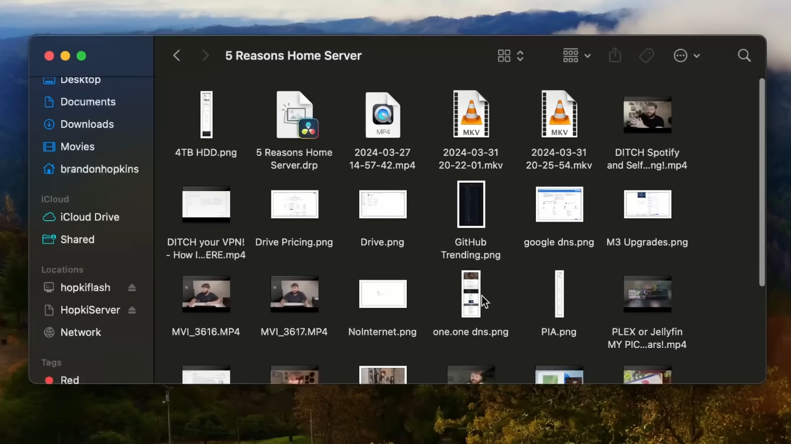
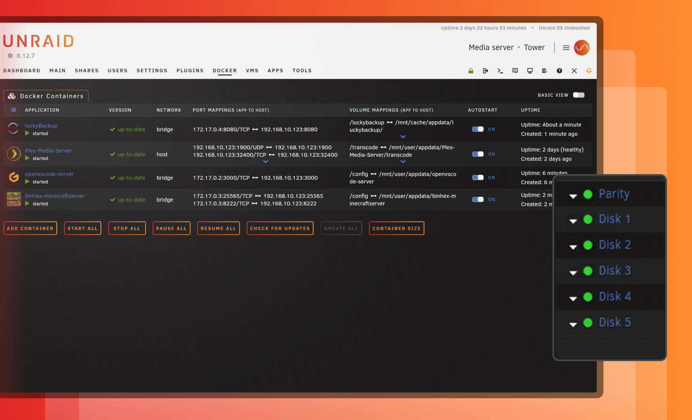

# Why on Earth Would You Need a Home Server?

Whether you're just dipping your toes into the world of home servers or you're an IT professional, there are plenty of reasons to consider setting one up. Whether it's for fun, to break free from the grip of big tech, or simply to explore new possibilities, here are five compelling reasons to get started. And no, you don’t need a massive rack-mounted server—your setup could be as simple as a NAS, a Raspberry Pi, a budget mini PC, or even an old computer lying around.



## Local File Backups and Sharing

You don’t have to ditch cloud storage entirely. I still keep backups of important files on Google Drive, for example. But relying solely on the cloud comes with risks. Companies can change their policies, or worse, flag your files as copyrighted without justification. That’s why I keep everything on a NAS (Network Attached Storage) and use the cloud as a secondary backup for critical data. This dual approach gives me peace of mind—if one fails, I still have the other.

There’s also a cost-saving angle. Instead of paying $10 a month for 4TB of cloud storage, you could spend $80 on a 4TB hard drive and run it on an old computer. Plus, local storage means your files are always accessible, even if your internet goes down.

Another perk? Network shares. For instance, my MacBook Air has only 256GB of storage, and Apple charges a fortune for upgrades. With a NAS, I don’t need to store large files locally. Instead, I can set my project or download directories to point directly to the network share. With a solid Ethernet connection, the speed difference is negligible—even when using demanding software like DaVinci Resolve.

## Media Streaming

A home server lets you self-host your movies, TV shows, music, eBooks, and more. If you're Chromecasting everything to your TV, this might not seem essential. But if you want to create your own personal Netflix—accessible to friends and family—or simply have a native app that instantly streams your media to multiple devices, this is a game-changer.

There are several excellent tools for self-hosted media streaming, including [Plex](https://www.plex.tv/), [Emby](https://emby.media/), and [Jellyfin](https://jellyfin.org/). All three are fantastic for media organization and device syncing. If you’re curious about getting started, check out our [video comparing Plex and Jellyfin](https://www.youtube.com/watch?v=MUhpu42sWWM) or our [guide on turning an old PC into a media server with Plex](https://techhut.tv/old-pc-laptop-media-server/).

Beyond video streaming, there are specialized tools for other types of media. For example, [Navidrome](https://www.navidrome.org/) lets you host your own music with a Spotify-like interface ([video guide here](https://www.youtube.com/watch?v=RSIvuyLDuvk)), and Podgrab automatically downloads new podcast episodes for streaming ([video guide here](https://youtu.be/tQgGTI8wfqw?si=xOnX5xXuLQavfUak)). I also recommend Overseerr, which helps you discover new content to add to your media library.

## DNS and VPN Services

Next up: hosting your own DNS and VPN services. DNS servers translate domain names like "techhut.tv" into IP addresses. While you can use public DNS services like Google’s (8.8.8.8) or Cloudflare’s (1.1.1.1), running your own DNS server with tools like PiHole has unique advantages.

PiHole is a DNS service that blocks ad-serving domains across your entire network, effectively giving you network-wide ad blocking. It’s also customizable for web filtering and monitoring, making it great for blocking distracting sites, tracking network activity, or setting up parental controls.

*Image sourced from [Wikimedia](https://commons.wikimedia.org/wiki/File:Pi-hole_Screenshot_2.png)*

You can also use your home server to run a VPN. This isn’t the same as paid VPN services like Private Internet Access or NordVPN, and it won’t help much with privacy or torrenting. However, it’s perfect for securely accessing your local network services without exposing them to the open internet. It’s also handy for creating an encrypted tunnel on public Wi-Fi or accessing your home country’s internet while abroad—especially useful for streaming services that block VPNs.

## Learning and Homelab

A home server is an excellent platform for creating a "homelab"—a sandbox for learning and experimentation. With software like [Unraid](https://unraid.net/), you can run containers and virtual machines to test new projects. For example, if you come across a cool tool like [Penpot](https://github.com/penpot/penpot) (a design app that was trending on GitHub when I wrote this), you can spin up a Docker container in Unraid and try it out. If you don’t like it, simply delete the container—it’s like it was never there.

## Run Your Own Internet

One of the best reasons to have a home server is the ability to maintain your own "internet" if your main connection goes down. With the right setup, you can keep many services running locally. For example, did you know the entirety of Wikipedia, including images, is only about 110 GB? With tools like [Kiwix](https://kiwix.org), you can download entire wikis—like the Archwiki, AskUbuntu, or Stack Overflow—for offline viewing. Combine that with your media library, security cameras, and file storage, and you’ve got a self-sufficient system. Even during an apocalypse, you’ll still be able to binge-watch *The Office*.

So, why bother with a home server? Whether it’s for backup, media, learning, or just having fun, the possibilities are endless. And the best part? You don’t need a fortune or a data center to get started. All it takes is a little curiosity and some old hardware.
