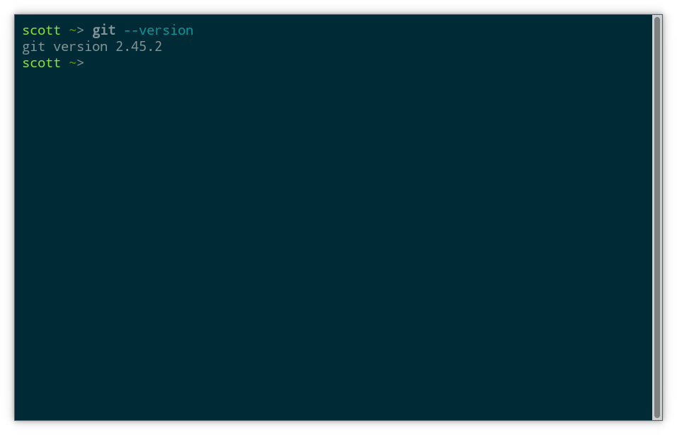
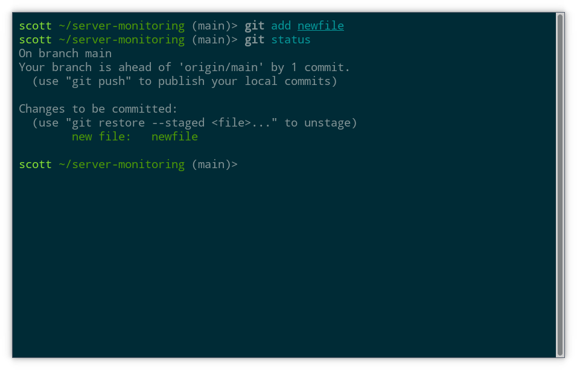
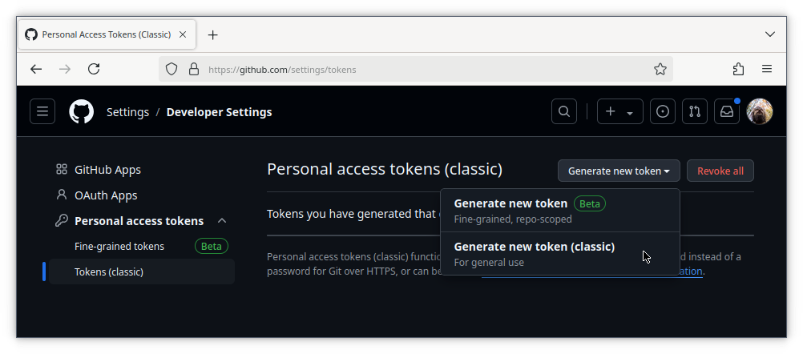
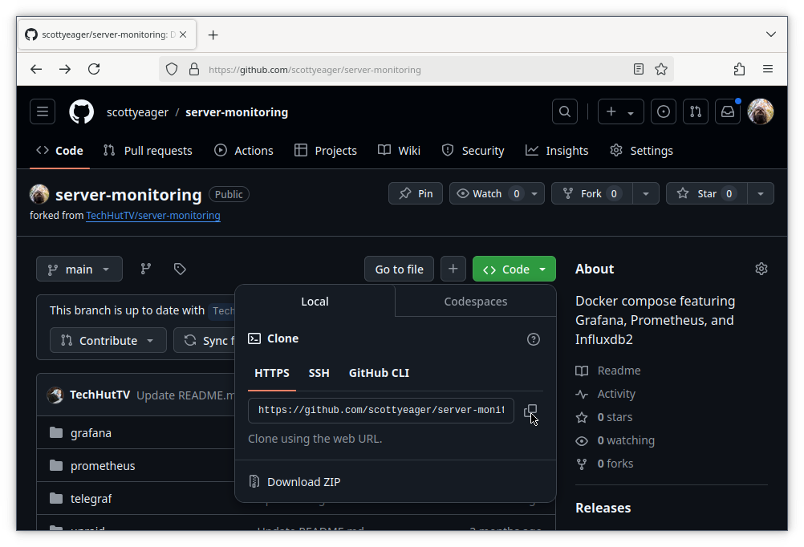
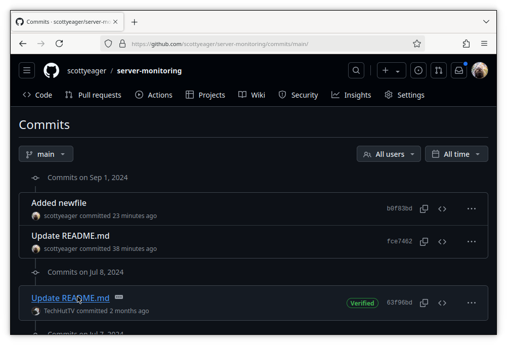
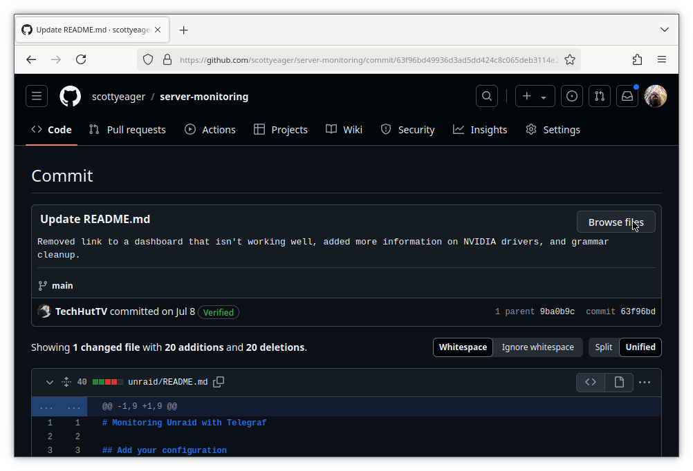

In the software development world, Git has become the default choice for a version control system and most professional programmers use it every day. It’s not just used for handling source code though, but also configuration files, documentation, images, and more. That means that even if you never touch source code, there are still plenty of useful reasons to learn some Git basics.

So this is an introduction to Git for “everyone else”, those of us who aren’t using Git every day as an integral part of our professional workflow. We’ll cover the commands and procedures that are most relevant when using Git on an occasional basis. And hopefully you’ll also get a glimpse into why it can be valuable to commit to learning a even a bit more about this powerful piece of software.

These days it’s hard to say much about Git without also mentioning Github. Like Git itself, Github has also become a de facto standard for software development. You can think of Github as a Git hosting service with additional collaboration features. There are of course alternatives to Github, including open source options that you can self host. To name a few, there’s Gitlab, Gitea, and SourceHut.

For the most part though, Git hosting services all have a similar feature set to Github, with some even sharing a similar visual appearance and layout. So anything you learn about Github is largely transferrable and we’ll use it for showing examples of how to interact with a Git hosting service.

# What is Version Control? Why Git?

_Note: this section has some background information on Git that I’m confident most nerds will find fascinating. However, you can safely skip ahead to the next section where the tutorial begins, if you prefer._

Not everyone knows that Git was originally created by Linus Torvalds for use in developing Linux. At the time, existing version control systems were not open source and there were ongoing disputes over the licensing and restricted use of Git’s predecessors. So in true promethean fashion, Linus went ahead and invented another of the world’s most popular pieces of software and gave it away for free.

Now the rest of us mere mortals can try to learn and understand Git, which to be honest isn’t so easy. Despite being obviously capable and robust, Git has a reputation for being rather complex and not particularly user friendly. There are other open source version control systems that popped up around the same time as Git, such as Mercurial and Fossil. Some people prefer the alternatives and think they are easier to use, but Git is by far the most popular.

So, what exactly can you do with a version control system? The short answer is that it’s essentially an advanced form of the undo and redo buttons found in many applications. If you ever tried collaborating on a document by emailing copies back and forth, or if you ever saved a document with a title like `Essay-Final-v2-ReallyFinal-NotKiddingReallyFinalThisTime.doc`, then you understand the main problems that tools like Git solve.

The version history and collaboration features popularized by Google Docs are an example of the core features of version control software like Git applied in the context of editing documents. However, with Git you have complete control over which versions the system remembers, and rather than just being able to move forward and backward through a single path of changes, it’s possible to create a branching tree of histories.

If you’re already thinking that this is starting to sound complicated, don’t worry–we haven’t even gotten to the parts of Git that users consider too complex when compared to other version control systems. Jokes aside, there’s plenty you can do with Git while keeping it simple and that’s what we’ll focus on here.

# Gitting Started

While it’s actually possible to use Git in a limited fashion entirely within the web UI of Github or another Git hosting service, installing Git is generally the first step when using it.

If you use a Debian based operating system like Ubuntu, installing Git is as simple as `apt install git`. It’s also available via the package managers of all major Linux distributions. For MacOS and Windows, you can find information and links for how to install Git at the [official downloads page](https://git-scm.com/downloads).

Once you completed the relevant steps for your operating system, make sure you have a working install by running this command in a shell:

```git version```

Assuming you see an output with a version number, you are all good.



# Cloning a Git Repository

Rather than starting fresh, I’ll first demonstrate how to take an existing Git repository and make it your own. Now you might rightly be wondering what a repository is. You can think of a repository (or “repo”) as a group of files and folders that are tracked by Git as a logical unit. A repository generally represents a project, such as the code for an, the content of a website, or a book (yes some people use Git to write books).

On your computer, a repository is basically just a folder that contains some special files generated by Git. Any files in this folder or its subfolders can be tracked by Git as part of this repo, but not every file has to be tracked. On the other hand, it’s not possible to add files to the repo which are outside the root folder of the repo.

For this example we will download a copy of a repository we used in a [recent guide](https://www.youtube.com/watch?v=vffhtqK3ZUg) on server monitoring with Grafana. If you’re curious about the contents, go check out that guide next, but otherwise don’t worry these are just some example files to play with.

In Git, copying a repository is called “cloning” and it works like this:

```
git clone https://github.com/TechHutTV/server-monitoring.git
```

Now you have a folder called `server-monitoring` that contains the latest version of what’s hosted in this repository on Github. You can cd in and have a look around:

```
cd server-monitoring
ls
```


Compare to what you see if you visit the [repository on Github](https://github.com/TechHutTV/server-monitoring). Any `.git` link you see that starts with `https` is generally also going to be a link to the repository’s page, when you remove the `.git`. One thing to notice is that this repository has a default branch called “main”. That’s both the first branch we see on Github and also the branch that Git selects when we clone the repo (shown in parenthesis in the screenshot above). Branches are especially useful for collaboration and advanced uses of Git. For the purposes of this tutorial, we’ll just stick with the default branch.

# Making and Committing Edits

Okay, so now we have a copy of this repository on our local machine. Let’s go wild! We can see that there’s a `README.md` file. By convention, any file with this name will get rendered and shown below the file list on Github, both at the top level and subfolders of the repo. Markdown is pretty self explanatory, so we can just jump in here and start editing.

Let’s start by changing the heading. Since this is my repo now, I want to make that clear. Open README.md in your favorite text editor, and add your name to the first line, like this:

```
nano README.md
```


Save the file (ctrl-o, enter, ctrl-x in Nano) and return to a shell within the repository. Now let’s store this change with Git:

```
git add README.md
git commit -m "Update README.md"
```

Depending on your system setup, Git will probably complain that it doesn’t know your name and maybe also your email address. Keep in mind that if you ever share a repository publicly or contribute to a public repository, the email address you use with Git will also become public. You can enter a fake email address if you want–Git doesn’t care, and this feature is really just for attribution and collaboration purposes. These days most conversations about the contents of Git repos happens on Git hosting sites, rather than by email.

Anyway, just follow the directions Git prints on screen to set a global name and email to use with all repositories:

```
git config --global user.email "you@example.com"
git config --global user.name "Your Name"
```

With that, try the commit again:

```git commit -m "Update README.md"```

If all went well this time, Git will print some information about the commit to the screen. That will include some random looking letters and numbers known as the commit hash, which we’ll cover later, the number of files changed, and also the commit message. Here we specified the commit message by writing `-m` and then wrapping the message in quotation marks. It’s also possible to write the commit message into a text editor by shortening the command to `git commit`. Either way, just try to keep commit messages short and sweet.

# A Few Words on Commitment

Alright, that was fun, but what is a commit? A commit is a snapshot of the state of files that are being tracked by Git in the repository. Whenever a new commit is created, it means that some files in the repository changed, new files were added, or some files were moved or removed. When you change files that were previously committed, you then have uncommitted changes. When you have files in the repo folder that have never been committed, those are untracked files.

To get a quick overview of whether there are any uncommitted changes or untracked files in the repository, use this command:

```git status```

The working tree is clean with nothing to commit:


In other words, there have been no changes since the last commit and all files present are committed in their current state. That’s to be expected, because all the files we have are either in the same state as when we cloned them or in the case of `README.md` the changes are committed.

Next let’s create a new file and start tracking it with Git. The `touch` command creates an empty file if no file by the given name exists:

```touch newfile```

Before committing this file, let’s try `git status` again. Now we can see that Git has detected the new file:


Like before, we’ll use `git add` to prepare the file to be committed and then check `git status` again:

```
git add newfile
git status
```



At this point, the new file now appears under Changes to be committed, letting us know it would be included in the next commit we make. If we changed our mind, we could follow the helpful hint Git has printed on screen and use the restore command, but let’s not try that at the moment.

When we use the add command on a file, it enters the staging area. On each commit command, the staged files are included in the commit. It’s a bit more nuanced than that though, because actually it’s the contents of the file at the time the add command was run that go into the commit. If we change a file and want to commit the changes, we need to run the add command again.

For example, let’s write the word “hi” into newfile:

```echo hi > newfile```

This is equivalent to opening the file in a text editor, writing “hi” and saving it. Now we can see that Git has noticed the change if we run `git status` again:


If we want to include the updated file in our next commit, we use add:

```
git add newfile
git commit -m "Added newfile"
```

Now all changes are committed and the working tree is again clean.

# The Log

We’ve made a couple of commits since cloning this repository. Let’s have a look now at Git’s history for this repository:

```git log```

What we see are our two commits at the top, and below that the history of the repo from before when we cloned it. This is a standard pager view, which responds to the arrow keys or vi style navigation with the j and k keys.


Each commit is labeled with a long string of letters and numbers. This is the commit hash, and it’s guaranteed to be unique for every commit in this repo. If you recall, a shorter version of the hash is also shown when creating each commit. In general, it’s okay to substitute an abbreviated version of the hash, as long as it starts from the beginning (left side) and is long enough to still be unique.

Hashes are like version numbers. Every commit has a hash and every hash refers to exactly the contents of one commit. Beside some of the hashes are additional labels. These show the state of both our local copy and the “origin” where we cloned the repo from. We can see intuitively that our local copy is two commits ahead of the version we cloned from GitHub.

# Creating a fork

So far we have only made edits to our local copy of the repository. Syncing those changes back to Github can serve as a backup and also allow us to share them with others. Since we aren’t the owner of the original remote repository on Github, we can’t upload our changes directly. Instead, we’ll need our own repository on our own account.

For this, go ahead and sign into Github if you haven’t already. It’s quick and easy to get a free account that you can do quite a lot with. If you prefer not to use Github, you could also use another Git hosting service with a few changes to the steps below, but I won’t cover that in detail.

Let’s navigate back to the [page for the repository](https://github.com/TechHutTV/server-monitoring) we cloned earlier. We are going to make a fork of this repository, which is essentially just a copy. While cloning a repo makes a copy on our local machine, forking a repo creates a copy on Github. One thing to note is that forks of public repos will always be public in Github. If you prefer a private repo, you can accomplish that in a couple ways, including Github’s import [feature](https://github.com/new/import).

To proceed with a fork, click the _Fork_ button in the upper right hand corner of the page:


You can choose to change the name if you want, but accepting the default here is just fine. Hit the green _Create Fork_ button to continue:


Github will take a moment to prepare your fork and then you’ll automatically end up on the page for your new repository. At this point, the new repository is identical to the original one but we are now able to upload our changes to it. In Git terminology, uploading changes to a remote Git host is called a “push”. Likewise, we can also “pull” changes that exist in the remote copy but not our local copy.

# A Note on Git Authentication

What we’ll do now is configure our local repository to point to the fork we just created instead of the original repo. There’s a bit of a fork in the road here, depending on how you want to authenticate with Github. To push changes, we’ll need to prove our identity somehow.

The best way to authenticate with Github, or any remote Git host for that matter, is SSH using an SSH public key. However, that requires some initial setup on your local machine, which will vary based on your operating system. Setting up SSH is outside the scope of this guide, so instead I’ll show how to authenticate using a token.

If you are already comfortable using SSH with public keys and have that set up on your local system, you could also go add your SSH key to Github now, by following [their docs](https://docs.github.com/en/authentication/connecting-to-github-with-ssh/adding-a-new-ssh-key-to-your-github-account). In that case, skip over the next section and keep an eye out for a note on one small change in the steps that follow.

# Generating a Github Token

Using token based authentication is convenient because we don’t need to worry about setting up SSH, but it’s also more of a developer oriented feature that’s somewhat buried in the Github settings. You can follow [this link](https://github.com/settings/tokens) to go directly to the token management page.

We’ll use Tokens (_Classic_) from the left nav bar for a slightly simpler experience. Then click the Generate new token button and select Generate new token (_Classic_):



Enter a name for your token in the note field, select an expiration date, and check the repo box. This will allow repo based actions, like push, using this token.


Then scroll down and hit the green _Generate Token_ button. Copy the token and store it somewhere secure, like a password manager. You won’t be able to view this particular token again in the future, but you can always generate another one.

# Pushing to the Fork

Back on the Github page of your fork, click the green _Code_ button. Then copy the HTTPS address for the repo. If you’re using SSH, select the SSH tab and copy the address there instead.



Inside the repo folder on your local machine, edit the file .git/config:

```nano .git/config``

You’ll see a URL line with the existing Github address. Just replace the address with the one you copied from your own repository, and save the file.


With that completed, we can now try a push:

```git push```

Enter your username and when prompted for a password, enter the token you generated earlier. Once the push is complete, you can head back to Github to see the result.


Our changes are now hosted on Github. Nice.

We can share the Github link and then anyone can clone the fork or make their own… “subfork”? You get the idea.

Another cool aspect of public repos is that they can also be copied onto other machines with a simple `git clone`. So if you wanted to use these files on a server or VM, just install git, copy the HTTPS link, and clone the repo. Since that’s a read only operation, no authentication is required.

# Accessing History

While sharing files with other people and other computers is cool, Git is after all a version control system. So let’s wrap up by seeing how Git can save our bacon when some change goes awry or allow us to get a feel for how a repository has changed over time.

Git of course has rich command line tools for dealing with history and restoring older versions. However, this (already long) guide isn’t about how to become a Git CLI pro. So instead we’ll just look at how to access history inside of Github (or your Git hosting service of choice, which will have a similar interface).

Visiting the repo page, we see a history button that shows the total number of commits in the current branch.


Clicking that pulls up a display that’s something like `git log`. We see the history of commits and who created them.



Clicking on the title of the commit will show the changes in that commit, versus the one before it. That can be a useful view, but it won’t show us whole files as they were at the point of the commit. To do that, click the browse files button.



Now we are back in the main view of the repo, but the branch name has been replaced with the commit hash of the commit we’re viewing. We can always return to the most recent changes by clicking there and selecting the branch name.

From here we can select files in the repo to see their previous state, as of the selected commit. Github’s toolbar has various options for viewing Markdown files, included preview and code view. There’s also buttons to view or download a copy of the raw text.


So using these features, it’s always possible to revisit the past and retrieve a copy of the files as they were then. You can download or copy these versions onto your local machine and commit their contents into the repository to revert back to a previous state. Again I’ll note that Git has commands for dealing with history and reverting changes, so if you’re curious to explore more, by all means go ahead.

# Conclusion

In this guide we covered the basics of using Git with a Git hosting service like Github to start adding changes to an existing repository and push them to our own fork. This is a solid foundation, but if you’re curious, well, it feels like there’s always more to learn about Git.

What’s next? Maybe you’re feeling inspired to start your own repository from scratch. While we didn’t cover that specifically in this guide, you now have all the tools to do it, and a fresh repo is just a few clicks away in Github. Or, find another repo to fork. The power is yours.
