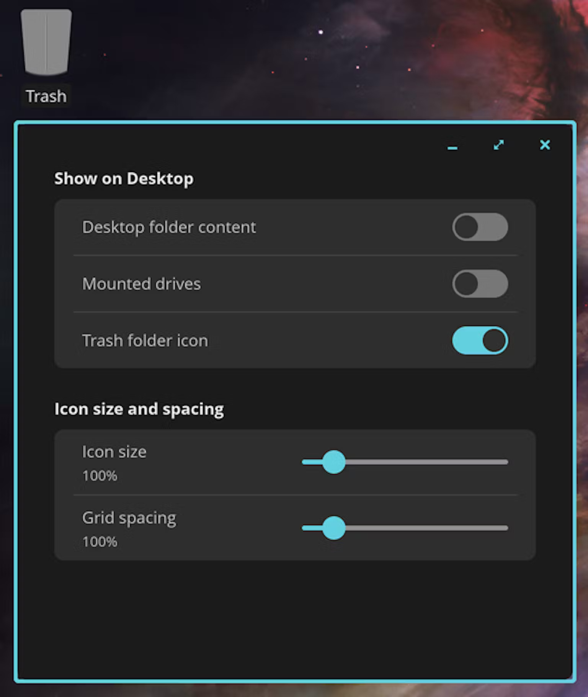
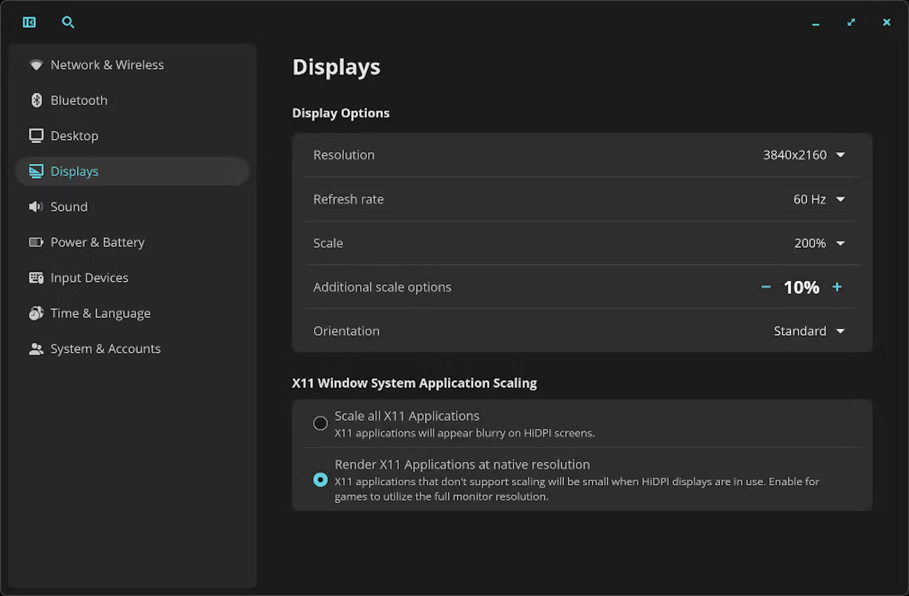
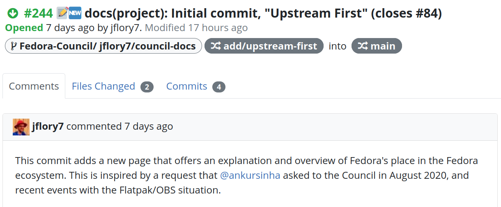
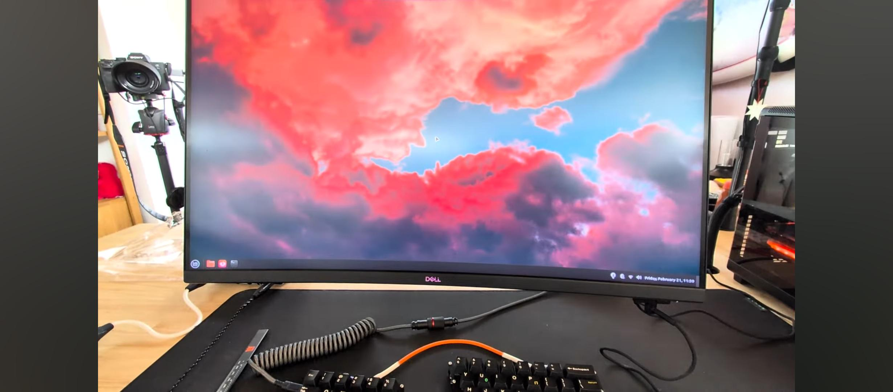
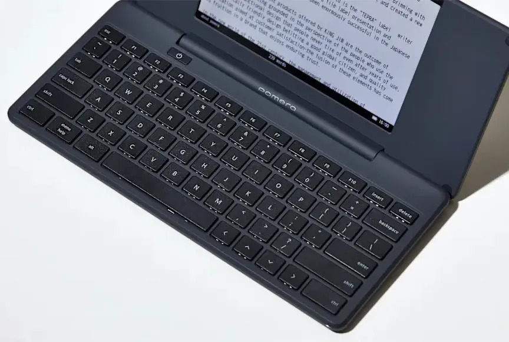

Linus supports Rust in Linux development; COSMIC Alpha 6 adds features like zooming and snapping windows; OBS faces a potential threat from Fedora but resolved it effectively; GNOME may phase out its foot logo based on Cassidy's article; PewDiePie highlights Linux Mint in his video, while the Pomera D250 offers a minimalist writing device. Additionally, minor updates from KDE and GNOME reflect ongoing efforts to enhance their platforms. Lastly, a fun fact about a minor planet named Linux adds an quirky touch to tech lore.

## Linus Torvalds defends Rust for Linux

Firstly, I believe you deserve an update on last week's story about Hector Martin. After he resigned from the Asahi Linux project to preserve his mental health, a new Linux kernel mailing list thread emerged about the R4L project, by Miguel Ojeda.

_The new Linux kernel mailing list thread_

He has published a page about the policies around using Rust in the Linux kernel. This covers many frequently asked questions, such as "Is there support from Linux maintainers for the R4L project?" (yes), "Will Rust be extra work for Linux maintainers?" (also yes), "Is R4L driven forward by the Rust community?" (no).

_The beginning of the Rust kernel policy_

As it was quickly pointed out by developer Hellwig, who is vocally against R4L, this policy webpage resides on the [rust-for-linux.com](rust-for-linux.com) website and has not been agreed upon by any non-R4L maintainer.

He also claimed that the policy contains incorrect information, such as the fact that "some subsystems may decide they do not want to have Rust code for the
time being, typically for bandwidth reasons. This is fine and expected". He then claimed that Linus has privately said that he would merge Rust code even if the maintainer objects, rendering the sentence untrue.

_Some of Hellwig's criticism of the Rust kernel policy_

Eventually, Linus Torvalds stepped in. Firstly, he explained that the patch Hellwig blocked (prompting Martin's resignation) was not introducing any Rust code that Hellwig would've had to maintain, but it was simply adding the option to use Rust elsewhere:

> You are saying that you disagree with Rust - which is fine, nobody has
ever required you to write or read Rust code. But then you take that stance to mean that the Rust code cannot even use or interface to code you maintain. So let me be very clear: if you as a maintainer feel that you control who or what can use your code, YOU ARE WRONG.

He went on to say that if you refuse to learn or use Rust in the Linux codebase, that's your right; but it does also mean that you won't get to have a say on how the Rust interface is implemented by those who do contribute to the R4L project:

> You are not forced to take any Rust code, or care about any Rust code
in the DMA code. You can ignore it. But "ignore the Rust side" automatically also means that you don't have any *say* on the Rust side.

This hopefully concludes the very heated week of R4L/Linux drama. Torvalds has always been publicly supportive of the R4L project, and he even complained that it wasn't moving fast enough, so this reply should not come as a surprise to anyone.

## COSMIC Alpha 6 Released

System76 has published the 6th alpha of the work-in-progress COSMIC desktop environment. This not only brings more stability to the system, but a few new features too, starting with the ability to zoom in on the desktop:

_The Magnifier option in use_

It can be activated in Settings, under the Accessibility section. It allows you to zoom through the Accessibility applet in the tray, or using the shortucts Super + =, Super + -, or Super + Mouse Scroll.

Still in the a8y section, the applet now also has toggles for screen reading and a direct to its Settings page.

_The Accessibility system applet_

You can now have icons on your desktop. A settings page allows to show/hide mounted drives icons, the trash folder, and customize the size and spacing between icons.

_The Desktop View settings page_

The Alpha 6 also introduces new fractional scaling options, but it does so in what seems to me like a rather awkward way. Instead of displaying a scaling slider you get two different options:

_The Scaling settings page_

The "Scale" option allows you to select an _integer-ish_ scaling (such as 125%). Then, you can fine-tune it through the "Additional scaling options", which will simply be added to the previous "Scale" option. As an example, the resulting scaling in the screenshot is 210%.

A few improvements were introduced for the Workspace view: you can now scroll through desktops and clicking on an empty space will exit the workspace view. The previews also now include the name of the desktops. Finally, if you the last two workspaces are empty, the last one will be removed automatically.

_The new Workspace view_

COSMIC also introduces window snapping, which they call "Floating windows gravitate to nearby edges". It simply means that if you drag-and-drop a window near an edge, it will snap to it. You can also now see more than eight options in the launcher:

_I count 10!_

__Checkout the full blogpost: [source](https://blog.system76.com/post/cosmic-alpha-6-big-leaps-forward)__

## OBS threat to sue Fedora retracted

One thing I did _not_ get to talk last week is OBS threat to sue Fedora. If you missed the story, here's a quick recap: Fedora was packaging OBS to a Fedora Flatpak (an alternative to Flathub), but in doing so they broke many functionalities of OBS. Users did not know that, so they started complaining to OBS.

Eventually, OBS developers got fed up and asked to retract the badly packaged flatpak. After being ignored for a few weeks, they decided to threaten legal action had the package not been retracted or rebranded within seven business days.

_The threat by Joel Bethke, OBS developer_

Luckily, Fedora managed to effectively damage control the situation. They immediately started discussions with OBS developers to solve the issues, marked the flatpak as End Of Life, and started a discussion on how to remove it.

After some fruitious discussions between them, OBS felt like there was room for progress in their collaboration, and retracted their request (and associated threat).

_Effective damage control by the Fedora Project Leader and Flatpak SIG_

As a result, the Fedora team is also now working on an explicit upstream-first statement to make sure that requests from packaged projects will be formally given higher priority from now on.

_Proposal of The Upstream First Act_

Nonetheless, the debate sparked much drama. The Fedora Project Leader, Matthew Miller, was interviewed by Brodie Robertson; during the interview, he said that Fedora Flatpaks are necessary since Flathub apps are _barely_ reviewed and are more insecure or less standardized compared to what they offer. This is not entirely true, and the interview did not sit well with everyone. As an example, [a blogpost](https://blogs.gnome.org/alatiera/author/jpetridis/) was published on GNOME blogs by Jordan Petridis called "The Fedora Project Leader is willfully ignorant about Flathub".

__Checkout the GitLab thread: [source](https://gitlab.com/fedora/sigs/flatpak/fedora-flatpaks/-/issues/39?ref=news.itsfoss.com)__

## Cassidy wants to get rid of the GNOME foot logo

Okay, that's a bit of a sensationalized headline. However, Cassidy did publish a great article on the history of the logo, why it's good/bad, and what should GNOME do with it:

_Cassidy's article_

As an example, the complaints are that it does not convey anything about the project, it's an awkward shape that does not fit well into a circle/square, and it's somewhat unappealing (it's a foot!).

Cassidy proposes to phase out the usage of the current logo, commission a designer to create a new one and immortalize the foot as a _mascot_, as a bit of an easter egg.

__Checkout the full article here: [source](https://cassidyjames.com/blog/gnome-foot-logo-rebrand/)__

## A Few Goodies

We recently discovered that PewDiePie uses Linux Mint. He published a video on building a gaming computer, which includes this frame:

_Yes, it's Mint!_

This is solid proof that Linux eventually wins everyone over.

__Checkout the video: [source](https://youtu.be/tsu0Rw3Nqi8)__

If you like distraction-free writing devices, I have seen a few people positively review the "Pomera D250", which has a keyboard and a screen to display what you're writing -- that's it.

_It's pretty barebone, but that's the whole point_

It has just become available internationally, which is why I'm mentioning it.

__Checkout the full article: [source](https://www.theverge.com/news/615854/king-jim-pomera-d250us-distraction-free-writing-tool)__

Finally, both KDE and GNOME published their weekly "What's up this week?" blogposts. Neither contains breathtaking new features, but if you use either desktop environment, you might want to read the corresponding one:

__Checkout the full KDE Plasma article: [source](https://blogs.kde.org/2025/02/22/this-week-in-plasma-refinements-all-around/)__

__Checkout the full GNOME article: [source](https://thisweek.gnome.org/posts/2025/02/twig-188)__

Finally, did you know there's a minor planet called Linux?

_Maybe it's inhabited by penguins!_

__Checkout the full Reddit thread: [source](https://www.reddit.com/r/linux/comments/1iq5p1p/til_there_is_a_minorplanet_called_linux/)__

__Cover image by [Wikimedia Commons](https://commons.wikimedia.org/wiki/File:Linus_Torvalds_at_the_Annual_Meeting_of_the_New_Champions_in_Tianjin,_China_2012.jpg)__
