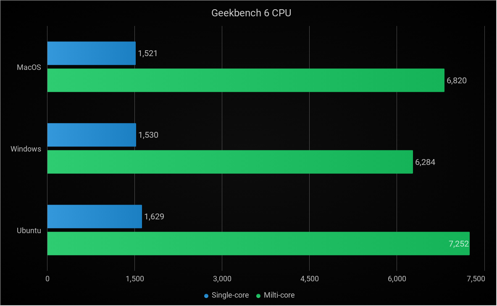
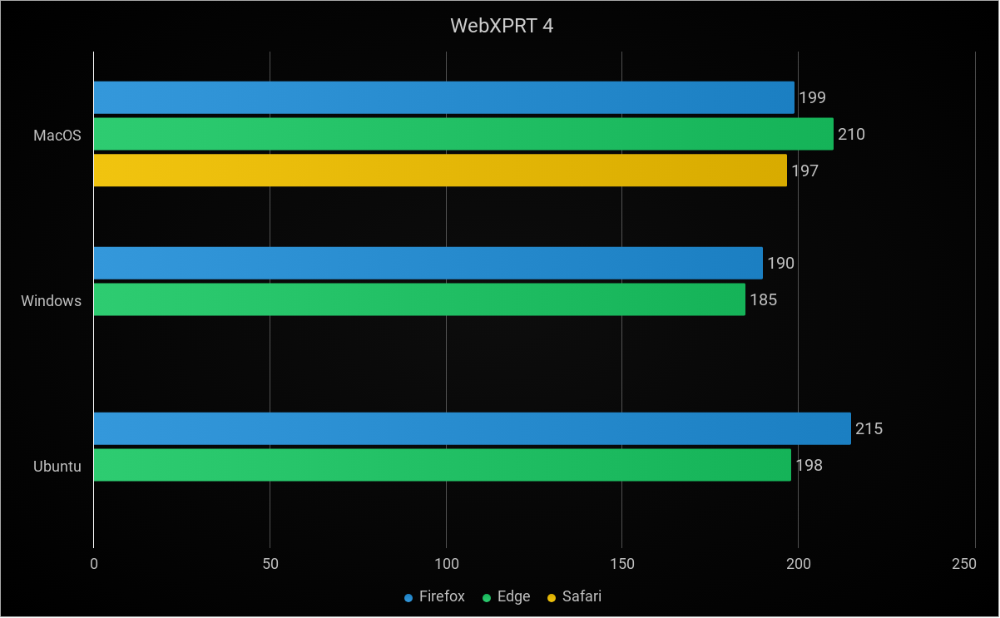

I got a 2019 Macbook Pro, one of the last x86 Macs, which means the last Mac that we could do a direct comparison on for Ubuntu, macOS, and Windows. You would think that macOS would do the best on its own hardware but it is mixed. 

- MacBook Pro Retina 16-inch (2019) - RAM 16GB - SSD 1000GB
- Processor Intel Core i9-9880H 2.3Ghz
- Graphic Card Type AMD Radeon Pro 5500M
- Resolution 3072 x 1920

macOS obviously came preinstalled, but support for macOS on this machine is fading now that the Apple Silicon macs have been out for nearly 5 years now. On the Windows side we are running Windows 10 here because Windows 11 does not support Macs through Bootcamp without tweaks. And Linux was complicated because of the t2 security chip that this Mac has, so we had to use the t2Linux custom kernel and pull drivers from the macOS install.

## Boot Speed Test
Starting with the traditional boot speed test, I started as soon as my finger was released from the power button. Windows booted first at 23 seconds, Ubuntu at a close seconds at 25 seconds, and finally macOS booted in 29 seconds.



## Reboot Speed Test
I personal find myself rebooting more than shutting them down. So starting when I clicked on restart, Ubuntu took 29 seconds to reboot, Windows booting at 31 seconds and macOS taking 36 seconds. I was surprised macOS didn't beat either operating system for the boot or reboot speed test, especially cause it's on Apple hardware.



| Battery Life | Boot  | Reboot |
| ------------ | ----- | ------ |
| MacOS        | 29:40 | 36:28  |
| Windows      | 23:39 | 31:40  |
| Ubuntu       | 25:04 | 29:45  |

## Battery Life Test
For the battery life test we used the default browser on each operating system running with full brightness, medium volume and a 1080p twitch stream. macOS's battery optimization is excellent on Apple hardware and it took a huge lead in the tests going from 100% to 50% on macOS took 180 minutes, Windows took 108 minutes and Ubuntu took 51 minutes. That's more than an hour going from macOS to Windows and more than 2 hours going from macOS to Ubuntu. Going from 100% to 5% macOS took 255 minutes, Windows took 191 minutes, and Ubuntu took 97 minutes. Keep in mind we didn't do any battery optimizations or anything to Ubuntu, and if you tweaked the system you could probably get longer battery life in Ubuntu, but with how big the difference is, it would probably still lose.


| Battery Life | 50%  | 40%  | 30%  | 20%  | 10%  | 5%   |
| ------------ | ---- | ---- | ---- | ---- | ---- | ---- |
| MacOS        | 180  | 196  | 215  | 230  | 245  | 255  |
| Windows      | 108  | 126  | 146  | 165  | 183  | 191  |
| Ubuntu       | 51   | 62   | 73   | 85   | 93   | 97   |

## Geekbench 6
Next up we loaded up Geekbench 6 which is a commonly used performance test. Here we got an Ubuntu win at 1,629 points beating macOS by 108 points and Windows by 99 points for single-core and on multi-core Ubuntu got 7252 points beating macOS by 432 points, beating Windows by 968 points which is almost 1000.

| Geekbench CPU                                           | Single-core | Milti-core |
| ------------------------------------------------------- | ----------- | ---------- |
| [MacOS](https://browser.geekbench.com/v6/cpu/9332803)   | 1521        | 6820       |
| [Windows](https://browser.geekbench.com/v6/cpu/9390869) | 1530        | 6284       |
| [Ubuntu](https://browser.geekbench.com/v6/cpu/9340751)  | 1629        | 7252       |




## Novabench
Novabench is a lighter test, but it gives you a bunch of categories with CPU, GPU, Memory, and Storage. Windows took a lead in the CPU score with 1,470 points, Ubuntu was about 290 points behind at 1,180, and Mac only got 780 points. However for GPU and Storage, macOS was the winner, followed by Windows only slightly behind macOS, followed by Ubuntu slightly behind Windows. However, the memory score, macOS did the worst at 267 points, Windows did 7 points better, and than Ubuntu won with 423 points, which is 156 points ahead of macOS.

| Novabench      | CPU Score | GPU Score | Memory Score | Storage Score |
| -------------- | --------- | --------- | ------------ | ------------- | 
| MacOS          | 780       | 225       | 267          | 280           | 
| Windows        | 1470      | 210       | 274          | 270           | 
| Ubuntu         | 1180      | 200       | 423          | 256           | 


## Sysbench Memory Test
I did think it was weird Ubuntu won the memory test in Novabench by so much, so I decided to make sure it wasn't a bug with Novabench just by running the Sysbench memory test on both macOS and Ubuntu. Ubuntu still did better than macOS but not by the margins in Novabench.

```bash
sysbench --test=memory --num-threads=4 run
```

| memory  | operations/second | transfer speed MiB/s | 
| ------- | ----------------- | -------------------- | 
| MacOS   | 10080107.3        | 9853.85              |
| Ubuntu  | 10911563.3        | 10655.83             |


## Cinebench
This is another very popular benchmarking tool, and while it doens't have a Linux version, I wanted to see macOS against Windows here. macOS did win the CPU single-core score at 1,150 points, 5 points ahead of Windows. But macOS had a wider margin on the multi-core score with a of 9,041 which is 1,171 points ahead of Windows.

| Cinebench R23  | Single Core | Multicore | Ratio |
| -------------- | ----------- | --------- | ----- |
| MacOS          | 1150        | 9041      | 7.86  |
| Windows        | 1145        | 7870      | 6.87  |


## Geekbench GPU
Next up for testing the GPU performance, I ran Geekbenchs GPU test. macOS, Windows, and Linux do use different graphic apis, so macOS had results for Metal (Apple's own API) and OpenCL, Windows had results for Vulkan and OpenCL, and Ubuntu only had results for Vulkan. Windows destroys macOS for OpenCL results, but macOS Metal does slightly beat out Windows Vulkan. But Ubuntu destroys Windows OpenCL and Vulkan, and macOS Metal by a lot. Very impressive score from Ubuntu here which is the clear winner.

| Geekbench GPU | Metal      | Vulkan     | OpenCL     | 
| ------------- | ---------- | ---------- | ------------------------------ |
| MacOS         | [37933](https://browser.geekbench.com/v6/compute/3289995)              |            | [24114](https://browser.geekbench.com/v6/compute/3289934) |
| Windows       |            | [36842](https://browser.geekbench.com/v6/compute/3308764)              | [32920](https://browser.geekbench.com/v6/compute/3308755) |
| Ubuntu        |            | [46962](https://browser.geekbench.com/v6/compute/3292510) |    


## Valley Benchmark
Valley is one of the few benchmarks that work on Windows, macOS, and Linux. The OpenGL test had macOS in the lead, Windows second place, and Ubuntu last, with a 405 point difference between macOS and Ubuntu. However, the Windows DirectX test smoked macOS with a score of 3,881 which is 339 points above macOS. This is an unfair test though because OpenGL is outdated compared to Vulkan and Metal, and DirectX is designed for Windows specifically.


| Valley               | Score | FPS   | 
| -------------------- | ----- | ----- | 
| MacOS (OpenGL)       | 3542  | 84.7  |
| Windows (OpenGL)     | 3162  | 75.6  |
| Windows (DirectX 11) | 3881  | 92.8  |
| Ubuntu (OpenGL)      | 3137  | 75.0  |


## Basemark Web 3.0
Nowadays, maybe 90% of everything I do is in a web browser, so we tested 2 different browsers on all 3 OSes + Safari on macOS. On macOS, Firefox scored the best even beating out Safari, and Edge scored the worst. On Windows, Edge and Firefox were a near tie, but with Edge slightly having an advantage. And on Ubuntu Firefox beat out Edge by about 17 points. However, in terms of the operating system browser performance, macOS had the worst scores, Windows was second and Ubuntu won.

| Basemark Web 3.0 | Firefox | Edge    | Safari   |
| ---------------- | ------- | ------- | -------- |
| MacOS            | 859.59  | 705.9   | 762.87   |
| Windows          | 1093.43 | 1096.69 |          |
| Ubuntu           | 1346.65 | 1329.66 |          |


## WebXPRT 4
Another one of my favorite browser benchmarks that has more real life use cases is WebXPRT 4. Firefox on Ubuntu scored the best here followed by Edge on macOS, but surprisingly Edge on Windows scored the worst.

| WebXPRT 4        | Firefox | Edge    | Safari   |
| ---------------- | ------- | ------- | -------- |
| MacOS            | 199     | 210     | 197      |
| Windows          | 190     | 185     |          |
| Ubuntu           | 215     | 198     |          |




To see raw results, checkout the [Github directory](https://github.com/TechHutTV/techhut.tv/tree/main/content/2025/02/linux-mac-windows-benchmarking) for this post.