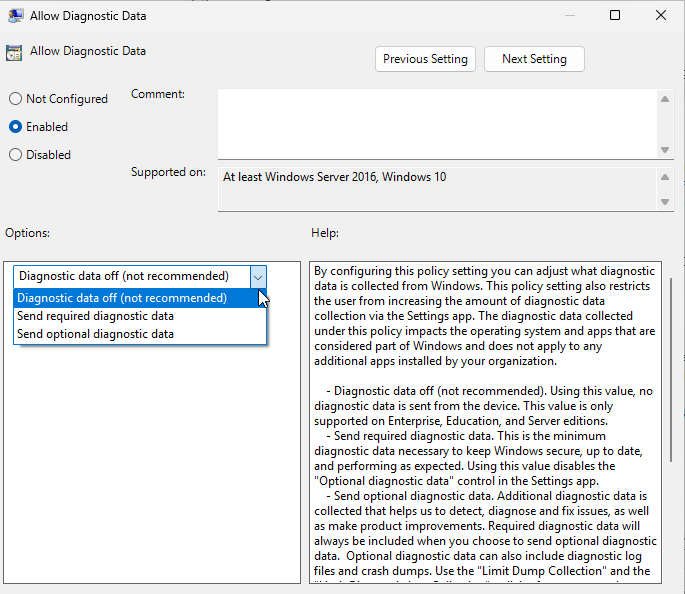

You may have seen one of those Lightweight Windows ISOs out there such as Tiny 11, and AtlasOS. These are custom Windows ISOs that debloat Windows, remove things like Windows 11’s ads and copilot, take up less disk space, RAM, and system resources, So, these custom ISOs like Tiny11 are becoming relatively popular.

BUT. I do not recommend these custom ISOs. For one, many of these ISOs disable core features, for example Tiny11 Core disables Windows Defender, Windows Update, and the WIndows Component Store. That is an extreme example because the Tiny11 developers don’t even recommend using the Core variant of Tiny11, but the point is, these ISOs are usually outdated, break things like Windows Update, and you don’t know what random things people are going to do to these ISOs. On top of that, you’re getting no support at all from Microsoft, and with all the weird mods and hacks they often break. They’re also straight illegal. You probably won’t get in trouble for just installing Tiny11, [but if you are caught distributing it, than don’t be surprised if you find yourself in prison for 15 months](https://www.polygon.com/windows/2018/4/25/17280178/eric-lundgren-windows-restore-disks-microsoft-prison).

# Windows LTSC

But what if I told you Microsoft made a Lite version of Windows itself, that’s right, you don’t need a Tiny11 because Microsoft has an official version that some even may call “Windows Lite”. This is Windows 11 IoT Enterprise LTSC 2024 with LTSC standing for Long-Term Servicing Channel. This is a version of Windows designed to be as stable as possible. It is commonly used in devices like medical systems, air traffic control devices, or ATMs. It is not faster than standard Windows 11, although it does use less resources out of the box since it comes debloated. And, we can make it faster with some modifications. Also, as a bonus, each Windows LTSC build is supported for 10 years, although it’s only security updates and not feature updates. But also the lack of feature updates might be seen as a good thing by some. After all, Windows 11 IoT Enterprise LTSC doesn’t come with all the AI bloat or ads, or anything.

Also, as another bonus, Windows 11 IoT Enterprise LTSC doesn’t have the TPM requirement which means you can run it on your old hardware without doing any weird ISO tricks.

# The Catch

So what’s the catch? Well, it is very difficult for a normal person to legally obtain a copy of Windows 11 IoT Enterprise LTSC. It is only available through Volume Licensing Agreements meaning that you need to be an organization buying Windows licenses in bulk to get it. If you want to go the illegal route, there are websites online that link to official Microsoft download URLs for ISOs that are probably supposed to be hidden behind subscriptions, so through those official links it is possible to obtain a clean copy, but I cannot show you where to find those links. Aldo After getting an ISO, you still need to find a way to activate it too. Reddit may or may not be a good place to find the ISO and activation methods. For this guide, [I am using the official Evaluation copy that you can find on Microsoft’s website](https://www.microsoft.com/en-us/evalcenter/evaluate-windows-11-enterprise). This is free on their website, but you only get a 90 day period to evaluate it. After the 90 days, the desktop background will turn black, you will see a persistent desktop notification indicating that the system is not genuine, and the PC will shut down every hour. If you just want to tinker with this version of Windows for a bit this is the safest way to get an ISO.

Still, even if you are going the illegal route of sailing the Seven Seas, which I do not recommend, it is still safer than using a modified Windows ISO made from someone you don’t know that Microsoft doesn’t officially support, and you don’t 100% know what changes have been made to it.

The other catch is much smaller. They usually only have new release every 3 years, and during that wait time, older hardware is not going to be supported between releases. Also you won’t be getting major feature updates.

# The Perfect “Windows Lite” Installation

The Windows 11 IoT installation is the same as a standard installation, so I am going to skip until the account screen. One of the nice things about this version of Windows is we can use a local account easily.

Just click on Sign In Options than \-\> Domain Join instead.

Also be sure to disable all the Windows telemetry in the Windows setup screen:

Now that it is installed, if we open the start menu, as you can see barely anything is preinstalled, and some of the things that are preinstalled such as the Calculator, Notepad, and Paint  are older Windows 7 apps. But we can do a few tweaks and make this even better.

# Disabling Telemetry

Now, on the privacy side, we are just going to disable telemetry real quick. All we have to do is open the group policy editor, navigate to Local Computer Policy \-\> Computer Configuration \-\> Administrative Templates \-\> Windows Components \-\> Data Collection and Preview Builds. Then double click on “Allow Diagnostic Data”.

In the allow diagnostic data window, we are actually going to click enabled, but than go to the dropdown options and select “Diagnostic data off (not recommended)”.

Now we have telemetry disabled and we can move on to some other improvements.

# Installing The Windows Store & Modern Windows Apps

This version of Windows 11 doesn’t come with the Windows Store, but chances are eventually you probably want to install an app off the Windows Store. And if you plan on doing any gaming, it’s kind of mandatory because of the Xbox app. Luckily it’s very easy to install. Just right click the start menu, and click Windows Powershell (Admin) 
Now inside Powershell just type `wsreset \-i`. It will appear like nothing happened, however after a few minutes you will get a notification that the store was installed, and it should appear.

After installing the Windows Store, we recommend installing the App Installer incase you need to install an AppX or MSIX file. This also installs WinGet which allows you to install apps very quickly in the command line with `winget install \<app\_name\>` such as `winget install Mozilla.Firefox` which can make getting your Windows System up and running fast. To install it, head over to [https://apps.microsoft.com/detail/9nblggh4nns1](https://apps.microsoft.com/detail/9nblggh4nns1) and just click install. It will open it in the Windows Store.

After installing that, you will also be able to install the WIndows 11 versions of systems apps if you prefer. To do so open the command line, and the following commands install different modern apps.

- Windows Camera: `winget install 9WZDNCRFJBBG`
- Modern Calculator: `winget install 9WZDNCRFHVN5`
- Windows 11 Clock: `winget install 9WZDNCRFJ3PR`
- Modern Mail and Calendar: `winget install 9WZDNCRFHVQM`
- Windows Maps: `winget install 9WZDNCRDTBVB`
- Modern Media Player: `winget install 9WZDNCRFJ3PT`
- Movies and TV: `winget install 9WZDNCRFJ3P2`
- Microsoft News: `winget install 9WZDNCRFHVFW`
- Modern Notepad: `winget install 9MSMLRH6LZF3`
- Modern Paint: `winget install 9PCFS5B6T72H`
- Microsoft People `winget install 9NBLGGH10PG8`
- Modern Photos App: `winget install 9WZDNCRFJBH4`
- Windows 11 Snipping Tool: `winget install 9MZ95KL8MR0L`
- Microsoft Sticky Notes: `winget install 9NBLGGH4QGHW`
- Windows Sound Recorder: `winget install 9WZDNCRFHWKN`
- Windows Terminal:  `winget install 9N0DX20HK701`
- Microsoft To Do `winget install 9NBLGGH5R558`
- Microsoft Whiteboard:`winget install 9MSPC6MP8FM4`
- MSN Weather: `winget install 9WZDNCRFJ3Q2`

If you want to remove the legacy apps after installing a modern app, you can go to Settings \-\> System \-\> and Optional Features.

Also if you plan on doing any gaming I highly recommend installing the Xbox app because several games need it: `winget install 9MV0B5HZVK9Z`

While we are at it, winget is an excellent way to easily install any other apps you need, including apps not on the Windows Store. I like to use the https://winstall.app/ website, where you select all the apps you want from the winget repository and it generates a command you can copy and paste which installs all your apps.

# \# Extra Tweaks

Now, let’s make a couple more tweaks to make it snappier. First off, let's remove Edge from the startup. So, let’s hit Control-Shift-ESC to open task manager, head over to startup, and remove Edge from the startup.

Now, lets disable a bunch of animations and things just to make Windows 11 Super Snappy and make everything feel instant. Open the start menu, type “adjust the appearance and performance of Windows” and open that. Now, I’m going to click on “Adjust for best performance which will uncheck everything, but than I’m going to check a few extra options just so Windows doesn’t look like crap.

Additionally, let’s go into Windows Settings and just turn off animations and transparency in Accessibility \-\> Visual effects.

Disabling Animations just speed things up cause you don’t have to wait for the slight delay of the animation itself, and disabling transparency will use less of your computer’s graphics.
