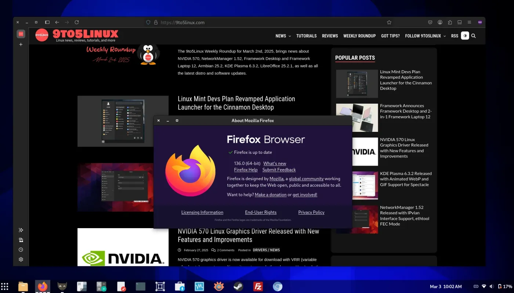

This week we saw the release of Firefox and Thunderbird 136 and Godot 4.4. I'll also talk about a couple of new features in the Desktop Environment world, and a really weird AI phone.

## Mozilla Firefox 136 released with Vertical Tabs and ARM64

Going back from last week's controversies to software development, I'm happy to share that Firefox 136 has been released. This update includes official Linux binary packages for the ARM64 architecture, but also hardware video decoding for AMD GPUs.

  
*The new Vertical layout, by 9to5Linux.*

The biggest feature, though, is vertical tabs; when enabling that layout, you'll be able to access bookmarks and tabs from other devices, too:

*Sidebar settings for the vertical layout.*

Other tools include history and a handy AI chatbot, if you're into that. Interestingly, the settings now allow you to opt in or out of "studies", where Mozilla will roll out experimental features to a subset of people to see if they work well or not.

**Checkout the full article: [source](https://9to5linux.com/mozilla-firefox-136-is-out-with-vertical-tabs-and-official-arm64-linux-binaries) **

Since we're talking about Mozilla already, it's worth noting that they also released an updated statement about last week's Terms of Use controversy. The new wording of the ToU is the following:

> *It also includes a nonexclusive, royalty-free, worldwide license for the purpose of doing as you request with the content you input in Firefox. This does not give Mozilla any ownership in that content.*

You'll be the judge of whether this is something you'd deem more acceptable. They also gave some further context into why they deleted the "we won't sell your data" promise:

> In order to make Firefox commercially viable, there are a number of places where we collect and share some data with our partners, including our optional ads on New Tab and providing sponsored suggestions in the search bar. We set all of this out in our [Privacy Notice](https://www.mozilla.org/privacy/firefox/). Whenever we share data with our partners, we put a lot of work into making sure that the data that we share is stripped of potentially identifying information, or shared only in the aggregate, or is put through our privacy preserving technologies (like [OHTTP](https://support.mozilla.org/kb/ohttp-explained)). 

And:

> The reason we’ve stepped away from making blanket claims that “We never sell your data” is because, in some places, the LEGAL definition of “sale of data” is broad and evolving. As an example, the California Consumer Privacy Act (CCPA) defines “sale” as the “selling, renting, releasing, disclosing, disseminating, making available, transferring, or otherwise communicating orally, in writing, or by electronic or other means, a consumer’s personal information by \[a\] business to another business or a third party” in exchange for “monetary” or “other valuable consideration.”  

That is, the sending of interaction data with ads in the new tab page / search bar is technically considered "selling user data" in those jurisdictions. It's worth noting that the Privacy Notice points out exactly what kind of (aggregated) data is sent to advertisers, and it's only a subset of all collected data (e.g. only interaction data, clicks, time spent on ads, and so on).

**Checkout the full announcement here: [source](https://blog.mozilla.org/en/products/firefox/update-on-terms-of-use/)**

## Thunderbird 136 released with new Appearance controls

Thunderbird announced a move to monthly releases by default, and they seem to be synced with Firefox releases too! So, what's new?

Firstly, messages will auto-adapt to dark-mode, though you can turn that on/off in the message header if you dislike that.

*The new dark message mode.*

There's also a new Appearance subsection, which allows you to select whether you want unthearded, threaded, or grouped by Sort messages in the Message List. You can also select the default sort and sorting order:

*The new Appearance settings page.*

**Checkout the full article here: [source](https://www.omgubuntu.co.uk/2025/03/thunderbird-136-release-adds-new-appearance-controls)**

## Huawei might be releasing Linux laptops soon

Previously, Huawei had announced laptops running their custom HarmonyOS NEXT operating system, running a micro-kernel supposedly "3x more efficient than Linux" (what does that mean? Your guess is as good as mine).  

*The leak by UncleKanshan.*

However, a leak by Weibo user "UncleKanshan" showed their new line of laptops to be running Linux instead. However, this would only be for the Chinese market; still, it's a big deal to have a major hardware manufacturer to be selling a device running Linux out of the box.

Checkout the full article here: [source](https://www.omgubuntu.co.uk/2025/03/huawei-matebook-laptops-linux-leak)

## This Week in Desktops

Well, both KDE Plasma and GNOME released their weekly newsletters, so I propose to quickly go through them!

On the KDE side of things, it's now possible to toggle on/off the titlebar of any application from the Task Manager itself:

*The new "No Titlebar and Frame" context menu option.*

Last week, there were also *a ton* of bug fixes, a grand total of 136. The number of 15-minute bugs went down from 27 to 24 in the same span of time.

**Checkout the full article here: [source](https://blogs.kde.org/2025/03/08/this-week-in-plasma-a-very-fixy-week/)**

On the GNOME side of things instead, the GTK Android backend gained preliminary support for OpenGL, which should bring noticeable performance improvements to those apps. MacOS applications will also use native window controls, though this behavior is opt-in:

*The new macOS native window controls.*

## Godot 4.4 released

Yes, it's been a very release-y week. The latest version of Godot includes "Jolt Physics" directly integrated into the game engine, interactive in-game editing, Android support for XR devices, Ubershader support, 3D physics interpolation, AgX tone mapping, and more. I would like to dive deeper into this, but I hardly understand any of the terms I've just used; I'll just recommend reading the entire announcement if you're a Godot user.

**Checkout the full article here: [source](https://www.phoronix.com/news/Godot-4.4-Released) **

## The weirdest AI phone idea I've ever seen

Ok, tell me if this doesn't sound dystopic; quoting The Verge:

> Newnal’s AI phone trains an AI model on *you*, so it needs lots of your information. The idea is that you go around downloading your personal data history from websites like Meta and Google, and also stuff like your medical records and financial data, then feed it to Newnal’s AI.

Now, even if we accept all of that, the design on this "AI phone" is quite weird, with the top part of the screen constantly showing you a ... 3D AI model of yourself. You can talk to it and ask it to interact with the phone on your behalf. 

*What a bold design!*

Would you use a phone like this? I'll go ahead and guess that you wouldn't.

**Checkout the full article here: [source](https://www.theverge.com/tech/624508/newnal-ai-os-phone-blockchain-mwc-2025)**
