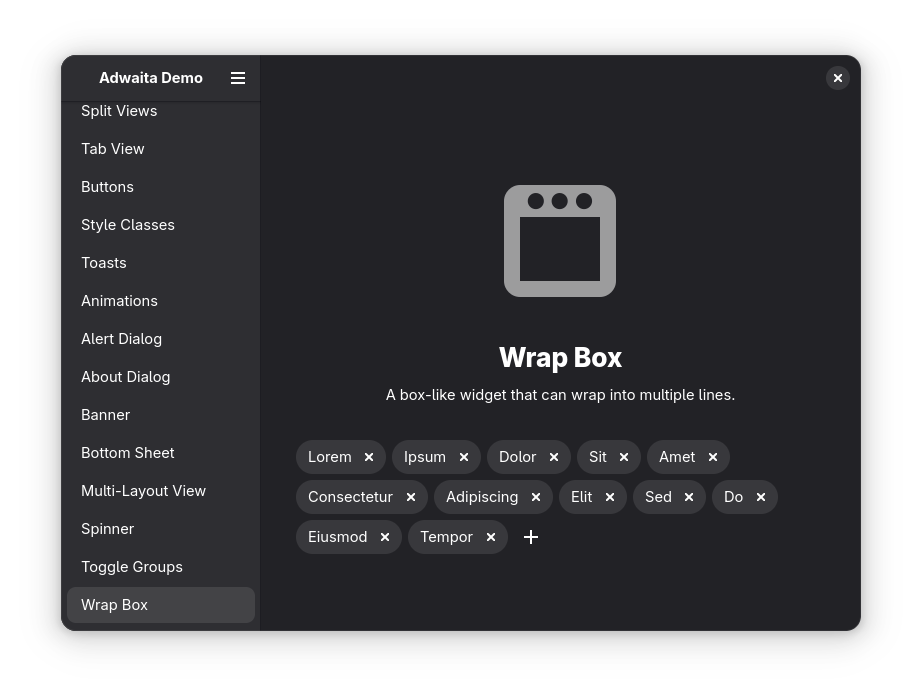

This week is mostly about desktops! There's a new release of Libadwaita, a mobile GNOME markdown application, a new for-profit KDE company, and more! I will also briefly touch Mozilla latest issues with Google's contract, and an interesting job offer in the Open Source world!

## Libadwaita 1.7 released

A new Libadwaita version has been released, featuring some new graphical components that will now be used consistently throughout GNOME applications. The first one is the Toggle Group, which replaces the usage of multiple Toggle Buttons in a box. I particularly like the "rounded" version, which looks neat:

*The new Toggle Groups component*

Similarly enough, there's also an "inline view switch" to, well, switch between views- but that can be embedded within cards, sidebars, or in the middle of a boxed list page:

*The new Inline View Switch component*

Another new improvement that I love is the "Wrap box", which places the elements line-by-line, but not in a grid-like manner. When used in combination with, as an example, tag-like elements, this is what you get:

*The new Wrap Box component*

On top of all of the new components, Libadwaita also introduced a whole new "preview" application, which allows to - ehm - *preview* a certain application on a given device. This is similar to the functionality that you'd find when inspecting any webpage. You can select the resolution of the device, its orientation, the type of shell, whether window controls are shown, and more.

*The new Preview functionality (I love it!)*

These are only a few of the changes that you'll find in Libadwaita 1.7. I have to say, as a KDE developer, I am extremely impressed!

**Check out the full announcement here: [source](https:/nyaa.place/blog/libadwaita-1-7/)**

## There's a new KDE Plasma for-profit, and some new features too

Well, now that I've allowed an entire section about Libadwaita, I think it's only fair to show off what the developers on "my" side of things are doing. Before getting to the software side of things, let's talk business: KDE e.V. board member Nate Graham has founded a new for-profit company offering Plasma development!

The company is called Techpaladin Software, it replaces Blue Systems (bonus points if you already knew this company), and inherits the Valve contract; that is, Techpaladin will maintain the desktop mode of the Steamdeck.

**Check out the full announcement here: [source](https:/pointieststick.com/2025/03/10/personal-and-professional-updates-announcing-techpaladin-software/)**

I promised a software side of things, too. KDE developers are implementing graphs for file transfer notifications! Look how pretty these are:

*The new file copy progress graph*

You might've noticed the broken left padding and some other UI element to refine, but fear not: the developers are aware of these UI issues and they are being worked on so that everything will be looking pretty when this feature is released.

But that's not all! Another new feature implemented just this week is that you can now disable system tray elements provided by third party applications. However, disabling the tray element from the application itself is always preferable.

*The new disable tray items functionality (use with caution!)*

Finally, if I may mention something I fixed myself, I'm happy to report that KDE Plasma side panels are now drawn on top of the panels. The status quo was to draw them *next* to them, which could potentially look broken in various setups.

*The new look for the sidebar (there's a left-aligned panel hidden)*

Still this week, I've also made panel applets appear mid-panel when they're larger than the panel itself; previously, they would be left-aligned, which looked off. There's another merge request in the works that will also center-align dialogs if you center-aligned their applet icon in the panel! They're just few tiny details, but I'm proud of them.

*A center-aligned panel applet*

**Check out the full article here: [source](https:/blogs.kde.org/2025/03/15/this-week-in-plasma-file-transfer-progress-graphs/)**

Oh, before we run to the next topic, I also wanted to tell you that Dedoimedo has released a new review of KDE Plasma. I only know Dedoimedo because he occasionally writes these reviews, which are often a bit more critical compared to most online "reviews" (which only end up being walkthrough of new features of a given release!).

Well, Dedoimedo's opinion of KDE Plasma 6.3 is: slick, fast and buggy. Well, two out of three is a good score, I think! Still, maybe we should look at why the Firefox icon disappeared from his application menu…

*Dedoimedo's application launcher screenshot (looks like it's missing an icon!)*

**Check out the full review here: [source](https:/www.dedoimedo.com/computers/plasma-6-3-review.html)**

## This Week in GNOME

Yes, I have decided to *sandwich* the KDE section between two GNOME ones in order to be seen as more impartial (even though I'm not). During the last week, Apostrophe's main developer has started working on mobile support. Apostrophe is a markdown editing app (WYSIWYG), which makes a phone version of the application particularly cool:

*Apostrophe on mobile*

There's also a new "stateless password manager, compatible with LessPass", called LPTK. It's a completely offline tool that generates passwords and does not store any information of any kind. Basically, when you give it the same input (website URL and username), it will always give you the same output. It's also possible to connect it to a password server.

*LPTK interface*

**Check out the full article here: [source](https:/thisweek.gnome.org/posts/2025/03/twig-191/)**

Mozilla is again panicking over its Google contract

Okay, that was clickbait-y, but I feel confident it's also an accurate title. As you might know by now, the US Department of Justice has ruled that Google's deal with Firefox (to be their default search engine) is to be considered monopolistic behavior, and wants to force Google to end the partnership.

The issue: this contract is 80% of Mozilla's revenue. Funnily enough, a ruling about how monopolistic Google is might turn into a death sentence for the developers of Firefox. Not literally; they're probably going to survive this, but they might get fired, which is bad.

Mozilla has thus released an article called "Mozilla's response to proposed remedies in U.S. v. Google", where they beg for mercy through juridical terminology.

Check out the full article here: [source](https:/blog.mozilla.org/en/mozilla/internet-policy/proposed-remedies-browsers/)

## Job offer: Technical Writer with Cryptographic Expertise

Well, if you fit the above description, I'm happy to report that the Common Caretakers are looking for you. CC is an organization that works with the NGI Zero grantees, and offers them some extra help to reach their goals; it seems like they need someone who's able to write technical things about cryptography. I'd send the CV over, but I'm afraid my introductory class to cryptography (with a barely passing grade) won't hold under much scrutiny!

**Check out the job offer here: [source](https:/cloud.nicco.love/apps/files/?dir=/TechHut/15%20Mar&openfile=283983)**
