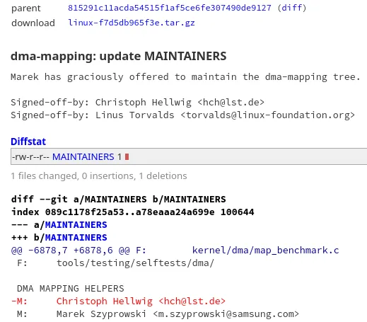
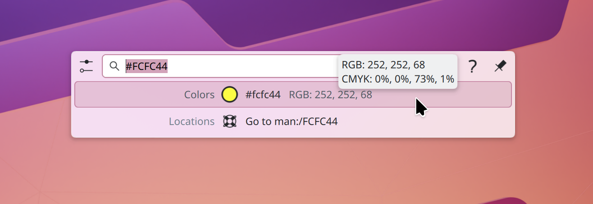
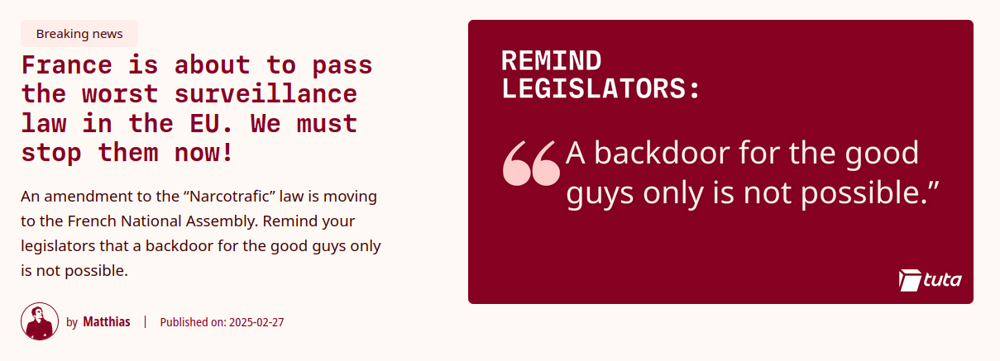

This week, the most popular and discussed story was about a worrying change in the Terms of Use for Firefox; I hope you'll forgive me if I spend a few more words than usual to clear up what happened. Then, our menu offers: a quick update on the Rust on Linux drama, a new release of Fish Shell, a few GNOME and Plasma improvements, and the worst surveillance law in the EU! Hungry yet?

## Mozilla introduces new controversial Terms of Use

Thursday morning I woke up and took a quick look at the trending threads on r/linux (I do that sometimes, to see what people are interested in). One of the most popular posts read: "Introducing terms of use and updated privacy notice for Firefox".

Could that be something worth talking about? I scanned the comments. Some were worried, but the consensus was that this was nothing newsworthy. Reassured, I discarded it and eventually settled for another video topic.

Well, I shouldn't have. Less than 24 hours later, this legal change is everywhere: people are claiming that the new terms of use give Mozilla all of your data, that they disallow pornography, that AI is going to be trained with it, and more.

Let's clarify some things, shall we?

The first controversial change was the following:

> You give Mozilla all rights necessary to operate Firefox, including processing data as we describe in the Firefox Privacy Notice, as well as acting on your behalf to help you navigate the internet. When you upload or input information through Firefox, you hereby grant us a nonexclusive, royalty-free, worldwide license to use that information to help you navigate, experience, and interact with online content as you indicate with your use of Firefox.

Which has since then been rephrased to:

> You give Mozilla the rights necessary to operate Firefox. This includes processing your data as we describe in the Firefox Privacy Notice. It also includes a nonexclusive, royalty-free, worldwide license for the purpose of doing as you request with the content you input in Firefox. This does not give Mozilla any ownership of that content.

Both Chrome and Edge (and many other non-browser apps) have similar statements in their terms of use. According to Firefox, this clause is required for the browser to interact in _any way_ with the data you're sharing. Note also that this does not give them the right to do whatever they want with the data you license them: they also have to abide by the Privacy Notice, which is somehow strict and well documented.

In particular, the following types of data are shared with commercial partners (all in an aggregated way): what OS and browser version you're using, what country/city you are in, your language, browser settings, system performance, how many tabs you have open, how many searches you've performed, and excerpts from those searches.

This is because the new tab page might have advertisements (I'm not sure if this is opt-in).

The issue is: even though this data is only shared in an aggregated way since Mozilla earns from those ads, this could technically be classified as "selling your data" under some jurisdictions (such as California's). To protect themselves from false advertising lawsuits, Mozilla thus decided to entirely drop their "We do not sell your data" statement from their FAQ page, replacing it with "We do not sell your data in the sense that's commonly attributed to it".

As they put it:

> In order to make Firefox commercially viable, there are a number of places where we collect and share some data with our partners, including our optional ads on New Tab and providing sponsored suggestions in the search bar. We set all of this out in our Privacy Notice. Whenever we share data with our partners, we put a lot of work into making sure that the data that we share is stripped of potentially identifying information, shared only in the aggregate, or is put through our privacy-preserving technologies (like OHTTP).

Of course, the fact that Mozilla was backing out from "We don't sell your data" was widely shared on the web, lacking the context behind the decision or the new phrasing of it. Still, this does not inspire confidence in Firefox either.

Regarding pornography, the new Terms also linked to an "Acceptable Use Policy". This did _not_ apply to Firefox, but rather to Mozilla services (such as their VPN). This policy disallowed anything illegal _and_ violent content and pornography. Again, other VPN providers have similar wording in their Terms of Use.

Mozilla has since then updated the page to make it more clear that the Acceptable Use Policy does not apply to Firefox.

Overall, I believe that Mozilla might have some more legal footing compared to what most people believe, but they certainly did not communicate these changes correctly, and they are fully responsible for the public pushback they obtained.

__Checkout the full blogpost: [source](https://blog.mozilla.org/en/products/firefox/update-on-terms-of-use/)__

## Christoph Hellwig steps down from DMA-mapping maintainer

As a quick update to last week's Rust for Linux drama, Hellwig (the maintainer who was highly critical of introducing Rust in the DMA, and who drove Hector Martin to resign from the Asahi project) also decided to step down as a maintainer following Linus Torvalds' reply to him. You can find the full context in last week's newsletters.

_Resignation patch by Hellwig and Torvalds_

As the patch says, Marek Szyprowski - the remaining maintainer - has "graciously offered to maintain the DMA-mapping tree". As Phoronix points out,

> Hellwig will continue to be (co)maintainer for the NVMe driver, NVMe target driver, personality handling, and the FreeVXFS file-system areas of the kernel.

__Checkout the full article: [source](https://www.phoronix.com/news/Hellwig-DMA-Helpers-Removed)__

## Fish shell 4.0 released

This is another topic that I learned about thanks to r/linux: the new release contains 2731 by over 200 people and introduces a variety of new changes. There are "Bind Notation and Improved Key Chord Support", Commandline and Abbreviations improvements, self-installable builds, the ability to ignore commands in history, and scripting features. I will avoid making a deep dive into each section as - I have to admit it - I've never used fish and I would certainly get my facts wrong.

However, you can

__Checkout the full release notes: [source](https://fishshell.com/blog/new-in-40/)__

## This Week in Desktops

As usual, we have both This Week in Plasma and This Week in GNOME blogposts.

In the latter, the major story is that the GNOME desktop portal now supports the Global Shortcuts interface. This means that applications can register desktop-wide shortcuts, and users can edit and revoke them through system settings.

There are also accessibility improvements: Orca shortcuts will now work, "including Caps lock as the Orca key", under Wayland; this was one of the last major blockers for a full transition from X11.

__Checkout the full article: [source](https://thisweek.gnome.org/posts/2025/02/twig-189/)__

Moving onto Plasma, KRunner is now aware of various types of color codes, and it will display both the color and the RGB/CMYK codes next to it.

_The new color code KRunner result_

Spectacle, the KDE screenshot application, also received a complete redesign: now you can select a screen region as soon as it launches, and you'll be able to edit/save/copy the image directly from that interface. You can watch the video in the following article if my words weren't clear.

__Checkout the full article: [source](https://blogs.kde.org/2025/03/01/this-week-in-plasma-great-stuff-for-6.4/)__

# The worst surveillance law in the EU

This is not something I have researched yet, but it's something people should be aware of nonetheless. Tuta, a secure e-mail provider (featuring end-to-end encryption out of the box), is warning us of an amendment to French law.

_The heading of the Tuta article_

The law is a "Narcotrafic" one, but the amendment would require "implementing backdoors for law enforcement". Tuta describes this as "the worst surveillance law in the EU".

Checking the correctness of these claims is the first element of my to-do list starting next week; I can thus promise you that I'll keep you updated on whether this law is the privacy nightmare that Tuta claims it is.

__Checkout the full article: [source](https://tuta.com/blog/france-surveillance-nacrotrafic-law)__
